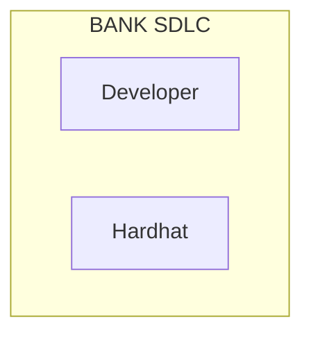
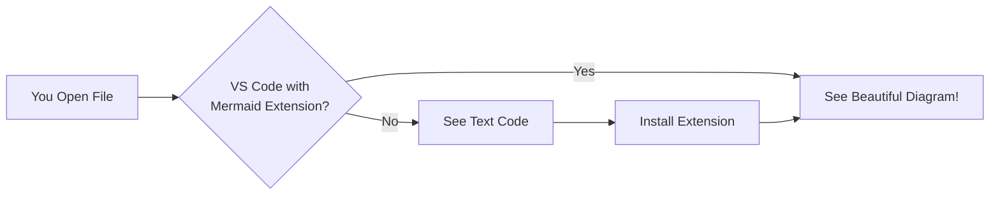

# HOW TO VIEW MERMAID DIAGRAMS

## THE PROBLEM

Mermaid diagrams are written in **text format** (like code). They need to be **rendered** to show as actual visual diagrams.

**What you're seeing:**
```
graph TB
    A[Start] --> B[Process]
    B --> C[End]
```

**What you SHOULD see:**
A visual flowchart with boxes and arrows.

---

## SOLUTION 1: View in GitHub (Easiest)

1. **Upload these documents to GitHub**
2. GitHub automatically renders Mermaid diagrams
3. Open any `.md` file → Diagrams display beautifully

**Example:** Push to GitHub repo, then view `docs/architecture/SYSTEM_CONTEXT_DIAGRAM.md`

---

## SOLUTION 2: VS Code with Extension

1. **Install VS Code** (if not already): https://code.visualstudio.com/
2. **Install Mermaid Extension:**
   - Open VS Code
   - Go to Extensions (Cmd+Shift+X or Ctrl+Shift+X)
   - Search: "Markdown Preview Mermaid Support"
   - Click Install

3. **View Diagrams:**
   - Open any `.md` file
   - Right-click → "Open Preview" (or Cmd+Shift+V)
   - Diagrams will render!

---

## SOLUTION 3: Online Mermaid Live Editor

1. Go to: https://mermaid.live/
2. Copy Mermaid code from documents
3. Paste into left panel
4. Visual diagram appears on right
5. Export as PNG/SVG

**Example:**
```
Copy this from HARDHAT_VISUAL_GUIDE.md:



Paste into mermaid.live → See visual diagram!
```

---

## SOLUTION 4: Convert to PowerPoint/Lucidchart

For **executive presentations**, convert diagrams to professional tools:

### Option A: Export from Mermaid Live
1. Go to https://mermaid.live/
2. Paste Mermaid code
3. Click "Export" → PNG or SVG
4. Import into PowerPoint

### Option B: Recreate in Lucidchart
1. Open Lucidchart (https://lucidchart.com)
2. Use Mermaid diagram as reference
3. Recreate with Lucidchart's polished shapes
4. Export as PDF for presentations

### Option C: I Can Create PowerPoint Versions
If you need professional diagrams for presentations, tell me and I'll:
- Create simplified ASCII art (displays in any text editor)
- Or provide instructions for specific diagram conversions
- Or create a separate PowerPoint-ready format

---

## SOLUTION 5: Confluence (If Your Bank Uses It)

1. Install "Mermaid for Confluence" plugin
2. Paste Mermaid code into Confluence page
3. Diagrams render automatically

---

## RECOMMENDED APPROACH

**For Development Teams (Technical):**
✅ Use GitHub or VS Code (Mermaid renders perfectly)

**For Executives/Regulators (Non-Technical):**
✅ Convert to PowerPoint or Lucidchart (polished, professional)

**For Documentation (Long-Term):**
✅ Keep Mermaid in docs (version-controlled, easy to update)
✅ Export to PNG/PDF for static snapshots

---

## QUICK TEST

Try this in VS Code with Mermaid preview:



If you see boxes and arrows → **SUCCESS!** ✅
If you see text code → Install extension or use GitHub

---

## NEED HELP?

Tell me:
1. **Where will you view these docs?** (GitHub, VS Code, PowerPoint, Confluence, etc.)
2. **Who is the audience?** (Developers vs. Executives)
3. **Do you need me to create alternative formats?** (ASCII art, PowerPoint instructions, etc.)

I can adapt the diagrams to your specific needs!

---

## ALTERNATIVE: ASCII ART DIAGRAMS

If you need diagrams that display in **ANY text editor**, I can create ASCII art versions like this:

```
┌──────────┐         ┌──────────┐         ┌──────────┐
│ Customer │────────▶│   Bank   │────────▶│Blockchain│
└──────────┘         └──────────┘         └──────────┘
     │                     │                     │
     │   1. Buy Request    │                     │
     │────────────────────▶│                     │
     │                     │   2. Debit USD      │
     │                     │   3. Allocate USDC  │
     │                     │────────────────────▶│
     │                     │                     │
     │   4. Confirmation   │                     │
     │◀────────────────────│                     │
```

**Would you like me to convert diagrams to ASCII art?**
