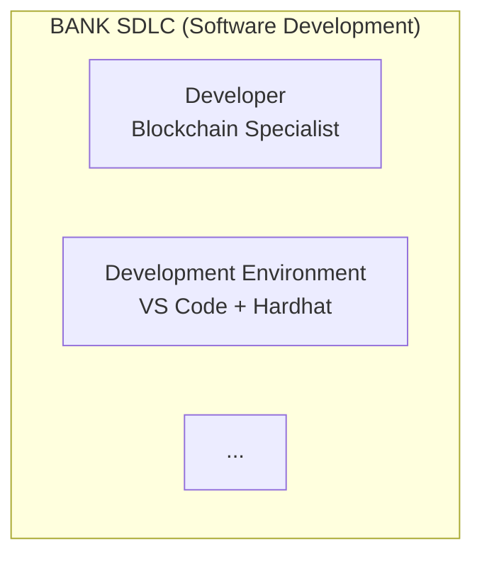

# QUICK START: View Your Diagrams in 2 Minutes

## 🎯 FASTEST METHOD: Use Mermaid Live (No Installation)

### What You'll Do:
1. Open Mermaid Live in your browser
2. Copy one diagram from your docs
3. Paste and see the visual

---

## Step-by-Step Example

### 1. Open Mermaid Live Editor

**Go to:** https://mermaid.live/

You'll see:
- Left panel: Code editor (empty)
- Right panel: Visual preview (empty)

---

### 2. Get a Diagram from Your Docs

**Open this file:** `hardhat-docs/HARDHAT_VISUAL_GUIDE.md`

**Find this section** (Diagram 1):

```
### Visual Representation


```

---

### 3. Copy ONLY the Mermaid Code

**Copy THIS part** (between the ```mermaid and ```):

```
graph TB
    subgraph "BANK SDLC (Software Development)"
        Dev[Developer<br/>Blockchain Specialist]
        IDE[Development Environment<br/>VS Code + Hardhat]
        Git[Source Control<br/>GitHub Enterprise]
        CI[CI/CD Pipeline<br/>GitHub Actions / Jenkins]
        Test[Test Environment<br/>Ethereum Testnet Sepolia]
        Prod[Production<br/>Ethereum Mainnet]
    end

    subgraph "HARDHAT ROLE (Build-Time Only)"
        HH[Hardhat Framework]
        Compile[Compile Smart Contracts<br/>Solidity → Bytecode]
        UnitTest[Run Unit Tests<br/>Test Edge Cases]
        Deploy[Deploy to Blockchain<br/>Publish Contract]
        Verify[Verify on Etherscan<br/>Public Audit]
    end

    subgraph "RUNTIME (Production - NO HARDHAT)"
        Customer[Customer]
        Portal[Banking Portal]
        Backend[Backend Services]
        Blockchain[Ethereum Mainnet<br/>Smart Contracts Live Here]
    end

    Dev -->|Writes Code| IDE
    IDE -->|Uses| HH
    IDE -->|Commits Code| Git
    Git -->|Triggers| CI
    CI -->|Runs| Compile
    CI -->|Runs| UnitTest
    CI -->|If Tests Pass| Deploy
    Deploy -->|Publishes to| Test
    Deploy -->|After Approval| Prod
    Deploy -->|Confirms| Verify

    Customer -->|Transaction| Portal
    Portal -->|Calls| Backend
    Backend -->|Interacts with| Blockchain

    style HH fill:#e1f5ff
    style Compile fill:#e1f5ff
    style UnitTest fill:#e1f5ff
    style Deploy fill:#e1f5ff
    style Verify fill:#e1f5ff

    style Customer fill:#ffe1e1
    style Portal fill:#ffe1e1
    style Backend fill:#ffe1e1
    style Blockchain fill:#ffe1e1

    classDef hardhat fill:#e1f5ff,stroke:#0066cc,stroke-width:3px
    classDef runtime fill:#ffe1e1,stroke:#cc0000,stroke-width:3px

    class HH,Compile,UnitTest,Deploy,Verify hardhat
    class Customer,Portal,Backend,Blockchain runtime
```

---

### 4. Paste into Mermaid Live

1. **Go to:** https://mermaid.live/
2. **Click in the left panel** (clear any existing code)
3. **Paste** the code you copied
4. **Watch the magic!** 🎨

**You'll see:**
- Beautiful flowchart with boxes and arrows
- Color-coded sections (blue for Hardhat, red for Runtime)
- Clear visual separation showing Hardhat is NOT in customer flow

---

### 5. Export the Diagram

**Click "Actions" menu** (top right) → Choose:
- **Download PNG** (for PowerPoint, Word)
- **Download SVG** (for scaling/editing)
- **Copy URL** (share with team)

---

## 🎯 Try These 3 Diagrams Right Now!

### Diagram 1: Hardhat in SDLC
**File:** `hardhat-docs/HARDHAT_VISUAL_GUIDE.md`
**Section:** "DIAGRAM 1 — WHAT HARDHAT IS (MENTAL MODEL)"
**Shows:** Where Hardhat fits in development lifecycle

### Diagram 2: Buy Stablecoin Flow
**File:** `docs/flows/BUY_FLOW_DETAILED.md`
**Section:** Look for ```mermaid sequenceDiagram
**Shows:** Step-by-step customer buying USDC

### Diagram 3: System Context
**File:** `docs/architecture/SYSTEM_CONTEXT_DIAGRAM.md`
**Section:** "HIGH-LEVEL SYSTEM CONTEXT"
**Shows:** All systems and how they connect

---

## ✅ Success Checklist

After following the steps above, you should see:

- [ ] Visual diagram with boxes/arrows (not code text)
- [ ] Colors and styling (blue, red, etc.)
- [ ] Clickable "Download PNG" button
- [ ] Ability to zoom in/out on the diagram

**If you see the visual diagram:** 🎉 SUCCESS! You can now render all your Mermaid diagrams!

**If you still see code:** Check that you:
1. Copied ONLY the mermaid code (not the \`\`\`mermaid markers)
2. Pasted into the LEFT panel (not right)
3. Used https://mermaid.live/ (not a different site)

---

## 📱 Mobile/Tablet?

**Yes, Mermaid Live works on phones/tablets too!**
1. Open https://mermaid.live/ in your mobile browser
2. Copy code from your docs
3. Paste into Mermaid Live
4. See visual diagram!

---

## Need Help?

If diagrams still don't render, tell me:
1. **What do you see?** (code, blank screen, error?)
2. **Which browser?** (Chrome, Safari, Firefox?)
3. **Which diagram?** (file name and section)

I'll troubleshoot with you!

---

## 🚀 NEXT: Make This Permanent

Once you confirm diagrams render in Mermaid Live:

**Option A:** Use VS Code (diagrams render automatically in preview)
**Option B:** Push to GitHub (diagrams render on GitHub website)
**Option C:** Export all to PNG (I can help automate this)

Which would you prefer?
