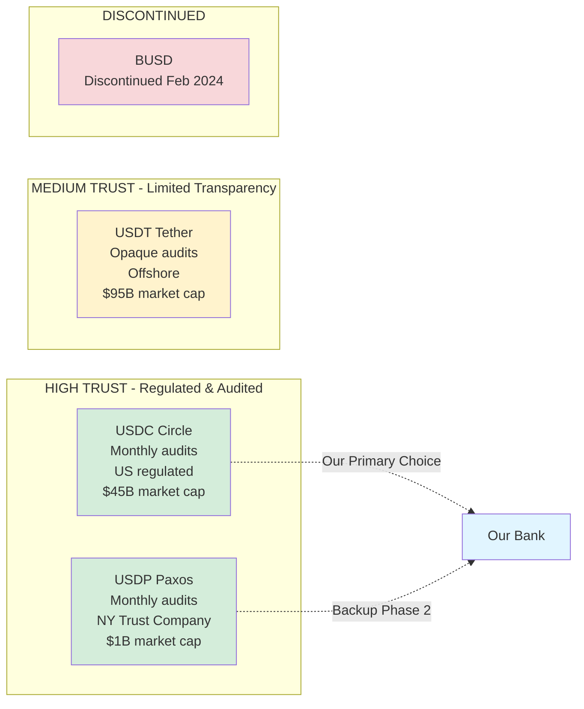
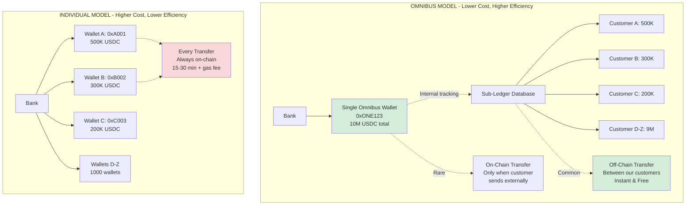
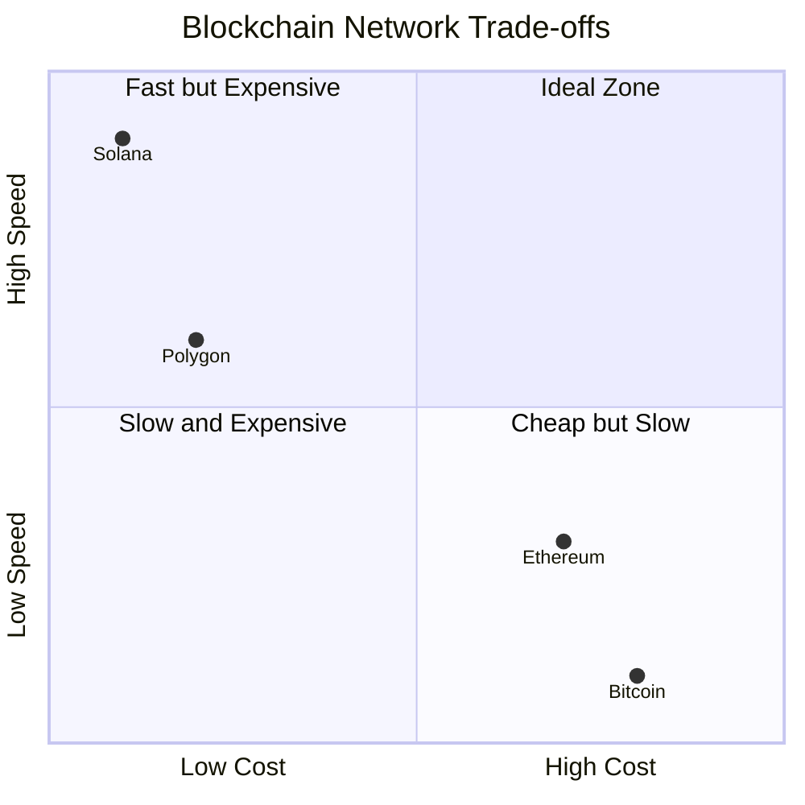
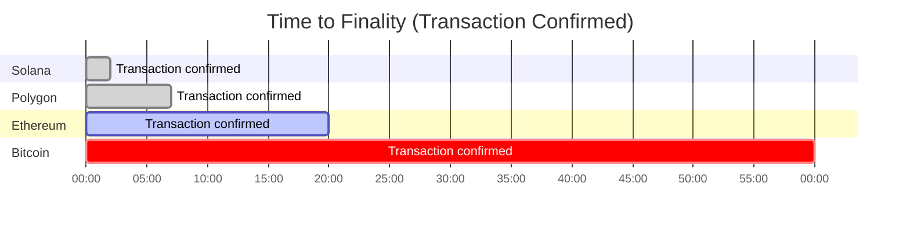
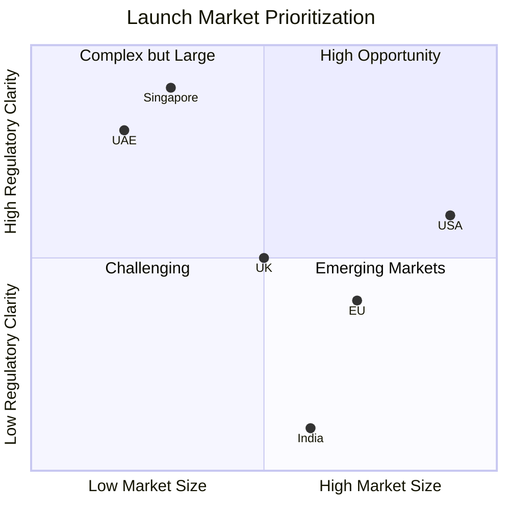
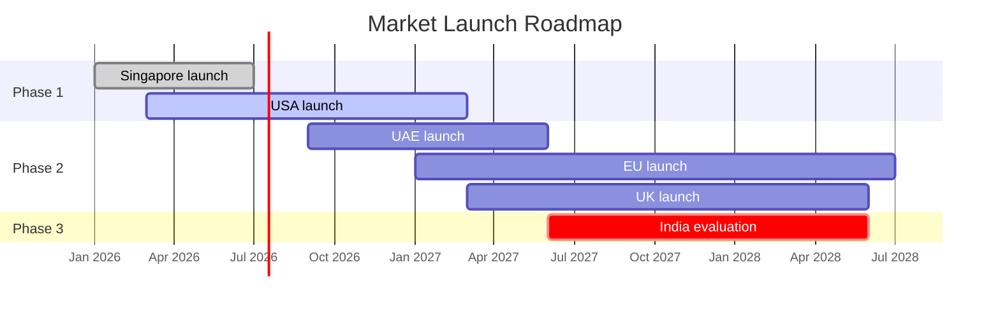

# COMPARISON TABLES
## Stablecoin vs Traditional Banking

**Last Updated:** February 2026

---

## 📖 PURPOSE

This document provides **side-by-side comparisons** to help stakeholders understand the advantages and trade-offs of stablecoin solutions vs traditional banking methods.

---

## 💸 COMPARISON 1: STABLECOIN TRANSFER VS WIRE TRANSFER

**Visual Timeline Comparison:**

```mermaid
gantt
    title Transaction Speed: USDC vs Wire Transfer
    dateFormat HH:mm
    axisFormat %H:%M

    section USDC Transfer
    Customer initiates        :done, usdc1, 09:00, 1m
    AML screening            :done, usdc2, after usdc1, 2m
    Blockchain confirmation  :active, usdc3, after usdc2, 20m
    Recipient receives       :milestone, usdc4, after usdc3, 0m

    section Wire Transfer
    Customer initiates       :done, wire1, 09:00, 1h
    Bank processing         :done, wire2, after wire1, 3h
    Correspondent bank 1    :crit, wire3, after wire2, 8h
    Correspondent bank 2    :crit, wire4, after wire3, 8h
    Recipient bank          :crit, wire5, after wire4, 4h
    Recipient receives      :milestone, wire6, after wire5, 0m
```

| Attribute | **USDC Transfer (Stablecoin)** | **Wire Transfer (Traditional)** |
|-----------|--------------------------------|----------------------------------|
| **Settlement Time** | 15-30 minutes | 1-2 business days (T+1 or T+2) |
| **Operating Hours** | 24/7/365 | Business hours only (Mon-Fri, 9-5) |
| **Cost per Transaction** | $25 flat fee (0.01%) | $45 + 2-3% FX markup |
| **Minimum Amount** | $100 | Often $1,000+ |
| **Maximum Amount** | $10M per transaction (Phase 1) | Unlimited (but subject to holds) |
| **Transparency** | Viewable on blockchain (real-time) | Opaque (no visibility until settled) |
| **Reversibility** | Irreversible (once confirmed) | Reversible (chargebacks, fraud claims) |
| **Intermediaries** | 0 (peer-to-peer on blockchain) | 2-5 (correspondent banks) |
| **Currency Support** | Digital USD (USDC) | 180+ fiat currencies |
| **Compliance** | AML/Travel Rule (automated) | AML/SWIFT codes (manual) |
| **Failure Rate** | <0.5% (network issues) | 2-5% (incorrect details, delays) |
| **Tracking** | Blockchain explorer (tx hash) | SWIFT MT103 (bank confirms) |

**Winner:** Stablecoin for speed, cost, transparency. Wire for regulatory acceptance, broad currency support.

---

## 🌍 COMPARISON 2: CROSS-BORDER PAYMENTS

### Scenario: US company paying $100,000 to Singapore supplier

| Method | Duration | Total Cost | Customer Experience |
|--------|----------|------------|---------------------|
| **USDC Transfer** | 30 minutes | $25 | ⭐⭐⭐⭐⭐ Excellent (instant, transparent) |
| **Wire Transfer (SWIFT)** | 1-2 days | $5,045 ($45 + 2% FX + $5K markup) | ⭐⭐ Poor (expensive, opaque) |
| **PayPal International** | 1-3 days | $5,099 (5% + $0.99) | ⭐⭐⭐ Good (convenient, but expensive) |
| **TransferWise/Wise** | 1 day | $2,000 (2%) | ⭐⭐⭐⭐ Very Good (transparent, but slower) |

**Cost Savings with Stablecoin:** 98.5% vs PayPal, 99.5% vs Wire, 98.75% vs Wise

---

## 🏦 COMPARISON 3: STABLECOIN ISSUERS

**Visual: Issuer Trust Spectrum**

| Feature | **USDC (Circle)** | **USDT (Tether)** | **USDP (Paxos)** | **BUSD (Binance/Paxos)** |
|---------|-------------------|-------------------|------------------|---------------------------|
| **Issuer** | Circle Internet Financial | Tether Limited | Paxos Trust Company | Paxos (discontinued Feb 2024) |
| **Backing** | 1:1 USD reserves | Claims 1:1 (disputed) | 1:1 USD reserves | N/A (discontinued) |
| **Transparency** | ✅ Monthly audits (Grant Thornton) | ⚠️ Opaque (no regular audits) | ✅ Monthly audits (regulated) | N/A |
| **Regulation** | ✅ US state licenses | ❌ Offshore (no license) | ✅ NY Trust Company (NYDFS) | N/A |
| **Market Cap (2026)** | $45B | $95B | $1B | N/A |
| **Blockchain Support** | Ethereum, Polygon, Solana, Avalanche | Ethereum, Tron, BSC, Polygon | Ethereum | N/A |
| **Institutional Adoption** | ✅ High (BlackRock, banks) | ⚠️ Moderate (exchanges) | ✅ High (regulated institutions) | N/A |
| **Bank Settlement** | BNY Mellon, Citizens Bank | Unknown (offshore banks) | BNY Mellon (custodian) | N/A |
| **Our Choice** | ✅ **PRIMARY (Phase 1)** | ❌ Not considered (compliance risk) | ✅ **BACKUP (Phase 2)** | N/A |

**Why USDC?**
- Regulatory compliance (US-regulated)
- Transparent reserves (monthly audits)
- Institutional trust (BlackRock partnership)
- Best ecosystem support (Ethereum + Layer 2s)

---

## ⚖️ COMPARISON 4: OMNIBUS WALLET VS INDIVIDUAL WALLETS

**Visual Architecture Comparison:**

| Attribute | **Omnibus Wallet Model (Our Choice)** | **Individual Wallet Model** |
|-----------|----------------------------------------|-----------------------------|
| **Setup** | 1 wallet for all customers | 1 wallet per customer |
| **Complexity** | Low (1 wallet to manage) | High (1,000+ wallets to manage) |
| **Blockchain Visibility** | All customer funds in 1 address | Each customer has separate address |
| **Gas Costs** | Low (batch transactions) | High (separate tx per customer) |
| **Reconciliation** | Requires sub-ledger (internal DB) | Blockchain = source of truth |
| **Privacy** | High (customer balances not public) | Low (anyone can see wallet balance) |
| **Risk** | Custody risk (single point of failure) | Operational risk (key management) |
| **Regulatory View** | Preferred (better AML controls) | Acceptable (more transparency) |
| **Speed (On-Us Transfers)** | Instant (no blockchain needed) | Requires on-chain tx (15-30 min) |
| **Speed (External Transfers)** | 15-30 min (on-chain tx) | 15-30 min (on-chain tx) |

**Our Decision:** Omnibus wallet for Phase 1 (simpler, cheaper, faster for most transactions). May offer individual wallets in Phase 3 for premium customers.

---

## 🔐 COMPARISON 5: HOT WALLET VS COLD WALLET

| Attribute | **Hot Wallet (Online)** | **Cold Wallet (Offline)** |
|-----------|-------------------------|---------------------------|
| **Connectivity** | Connected to internet | Air-gapped (no internet) |
| **Access Speed** | Instant (automated) | Slow (manual procedures) |
| **Security Risk** | Higher (hackable) | Very Low (physically secure) |
| **Use Case** | Daily operations (customer transactions) | Long-term storage (reserves) |
| **Typical Balance** | 5-10% of total USDC | 90-95% of total USDC |
| **Access Control** | API keys + HSM | Physical presence (2+ authorized personnel) |
| **Recovery Time** | Instant | 4-24 hours (manual process) |
| **Cost** | Low (software-based) | High (hardware + secure facility) |

**Our Strategy:**
- Hot wallet: $5M - $10M (sufficient for daily volume)
- Cold wallet: $50M+ (bulk reserves)
- Daily sweep: Move excess from hot → cold overnight

---

## 📊 COMPARISON 6: BLOCKCHAIN NETWORKS

**Visual: Speed vs Cost vs Security Trade-offs**

**Transaction Confirmation Time Comparison:**

| Feature | **Ethereum Mainnet** | **Polygon (Matic)** | **Solana** |
|---------|---------------------|---------------------|------------|
| **Transaction Speed** | 12-25 minutes (12 blocks) | 5-10 minutes (fast blocks) | 1-2 minutes (very fast) |
| **Gas Fees (2026)** | $5-$50 per tx | $0.01-$0.50 per tx | $0.001-$0.01 per tx |
| **USDC Support** | ✅ Native (Circle) | ✅ Bridged + Native | ✅ Native (Circle) |
| **Liquidity** | Highest ($20B+ USDC) | High ($2B+ USDC) | Growing ($500M+ USDC) |
| **Finality** | 12 blocks (~20 min) | ~100 blocks (~5 min) | 1 block (~400ms) |
| **Decentralization** | Very High (1M+ validators) | Medium (100+ validators) | Medium (2,000+ validators) |
| **Security Track Record** | ✅ Excellent (10+ years) | ✅ Good (4+ years, Ethereum security) | ⚠️ Moderate (network outages in past) |
| **Regulatory View** | ✅ Widely accepted | ✅ Accepted (Ethereum sidechain) | ⚠️ Scrutiny (FTX association) |
| **Our Usage (Phase 1)** | ✅ **PRIMARY** | ✅ **SECONDARY (large txs)** | ❌ Not yet |
| **Our Usage (Phase 2+)** | Continue as primary | Expand for high-volume | Evaluate for speed-critical use cases |

**Decision Rationale:**
- **Ethereum:** Most trusted, highest liquidity, best institutional adoption (slower, more expensive)
- **Polygon:** Cost-effective for high-volume transactions, still Ethereum-compatible
- **Solana:** Very fast, but security/regulatory concerns → Phase 3 evaluation

---

## 💼 COMPARISON 7: CUSTOMER SEGMENTS

| Segment | **Corporate (>$500M revenue)** | **SME ($5M-$500M)** | **Retail (Individual)** |
|---------|--------------------------------|---------------------|-------------------------|
| **Phase 1 Target** | ✅ YES (Primary) | ⚠️ Select customers only | ❌ NO (Phase 3) |
| **Average Transaction Size** | $1M - $50M | $10K - $1M | $100 - $10K |
| **Transaction Frequency** | Weekly | Daily | Monthly |
| **Primary Use Case** | Cross-border payments, treasury | Supplier payments, payroll | P2P transfers, savings |
| **Compliance Burden** | High (enhanced due diligence) | Medium (standard KYC) | Low (simplified KYC) |
| **Onboarding Duration** | 5-10 days | 2-5 days | 1-2 days |
| **Support Level** | Dedicated relationship manager | Email + phone support | Self-service + chatbot |
| **Pricing Model** | Custom (volume discounts) | Tiered (based on volume) | Fixed fee per transaction |
| **Revenue Potential** | $50K-$500K/year per customer | $5K-$50K/year per customer | $100-$1K/year per customer |

**Phase 1 Focus:** 50 corporate customers → $5M-$10M annual revenue
**Phase 2 Expansion:** 500 SMEs → $10M-$25M additional revenue
**Phase 3 Retail:** 10,000+ individuals → $1M-$10M revenue (high volume, low margin)

---

## 🌐 COMPARISON 8: LAUNCH MARKETS (PHASE 1)

**Visual: Regulatory Clarity vs Market Size**

**Phase Rollout Timeline:**

| Country | **Singapore** | **United States** | **UAE** | **European Union** |
|---------|---------------|-------------------|---------|-------------------|
| **Launch Priority** | ✅ **PRIMARY (Phase 1)** | ✅ **PRIMARY (Phase 1)** | ⚠️ Phase 2 | ⚠️ Phase 2 |
| **Regulatory Clarity** | ✅ Excellent (MAS framework) | ⚠️ Moderate (state-by-state) | ✅ Good (VARA in ADGM/DIFC) | ⚠️ Complex (MiCA) |
| **Licensing Required** | Payment institution license | State MTL (50 states) | VARA license (free zones) | MiCA license (1 passport) |
| **Timeline to Launch** | 6-9 months | 12-18 months (multi-state) | 6-12 months | 12-24 months |
| **Compliance Complexity** | Low | High | Low | Very High |
| **Market Opportunity** | $500B crypto market cap | $2T+ crypto market cap | $50B+ crypto market cap | $1T+ crypto market cap |
| **Corporate Demand** | Very High (APAC hub) | Very High (global HQ) | High (trading hub) | High (institutional) |
| **Travel Rule Threshold** | All transfers | $3,000+ | $1,000+ | €1,000+ |
| **Tax Treatment** | No capital gains tax | Complex (IRS reporting) | 0% corporate tax (free zones) | VAT exempt, income taxable |

**Why Singapore First?**
- Clear regulatory framework (MAS Payment Services Act)
- Business-friendly (fast approvals)
- Strategic APAC hub (corporate customers)
- No capital gains tax (attractive to customers)

**Why US Also Phase 1?**
- Largest market opportunity ($2T+)
- Most corporate demand (Fortune 500 treasury needs)
- First-mover advantage (fewer competitors)

---

## 📈 COMPARISON 9: REVENUE MODELS

| Model | **Transaction Fees (Our Choice)** | **Spread Model** | **Subscription Model** |
|-------|-----------------------------------|------------------|------------------------|
| **Revenue Source** | Fixed % of transaction value | Buy/sell price difference | Monthly/annual fee |
| **Pricing Example** | 0.01% per transaction ($25 min) | Buy at $1.005, Sell at $0.995 (1% spread) | $5,000/month for unlimited txs |
| **Customer Perception** | ✅ Transparent | ⚠️ Hidden cost | ✅ Predictable |
| **Revenue Predictability** | Low (volume-dependent) | Medium (volume + spread) | High (recurring) |
| **Competitive Position** | ✅ Lower than competitors | ⚠️ Standard market practice | ✅ Attractive for high-volume |
| **Scalability** | High (automated) | High (automated) | Medium (requires segmentation) |
| **Implementation Complexity** | Low | Low | High (need multiple tiers) |
| **Phase 1 Choice** | ✅ **PRIMARY** | ❌ Not used (too opaque) | ✅ **OPTIONAL (for enterprises)** |

**Our Hybrid Approach (Phase 2+):**
- **Retail/SME:** Transaction fees (0.01% per tx)
- **Enterprise (>$1B volume/year):** Subscription ($50K/year unlimited) OR volume discount (0.005%)

---

## 🔄 COMPARISON 10: RECONCILIATION APPROACHES

| Approach | **Three-Way Reconciliation (Our Choice)** | **Two-Way Reconciliation** | **Blockchain as Single Source** |
|----------|-------------------------------------------|----------------------------|--------------------------------|
| **Data Sources** | Sub-Ledger ↔ Blockchain ↔ ATLAS | Sub-Ledger ↔ Blockchain | Blockchain only |
| **Complexity** | High (3 systems to match) | Medium (2 systems) | Low (1 system) |
| **Accuracy** | Highest (triple-check) | High (double-check) | Moderate (single source) |
| **Reconciliation Frequency** | Daily (automated) | Daily | Real-time (no recon needed) |
| **Break Detection** | Fastest (multiple checkpoints) | Fast | Delayed (no cross-check) |
| **Audit Trail** | Excellent (3 independent records) | Good (2 records) | Limited (blockchain only) |
| **Operational Overhead** | High (manage 3 systems) | Medium | Low |
| **Suitable For** | Banks (regulatory requirements) | Fintechs (balance simplicity vs compliance) | Crypto-native (no fiat integration) |

**Why Three-Way?**
- Regulatory requirement (banks must reconcile fiat accounting)
- Fraud detection (discrepancies caught across 3 systems)
- Audit-ready (triple verification for regulators/auditors)

---

## 🎯 KEY TAKEAWAYS BY STAKEHOLDER

### For Executives
- **Stablecoins save 98%+ on cross-border payment costs** vs wires
- **30-minute settlement** vs 1-2 days traditional
- **Phase 1: 50 corporate customers → $5M-$10M revenue**

### For Compliance Officers
- **USDC (Circle) is most compliant** (regulated, audited, transparent)
- **Omnibus wallet model preferred** by regulators (better AML controls)
- **Singapore + US Phase 1** (clearest regulations)

### For Technical Teams
- **Ethereum primary blockchain** (security, liquidity, maturity)
- **Polygon for cost savings** (low gas fees for high volume)
- **Three-way reconciliation required** (sub-ledger ↔ blockchain ↔ ATLAS)

### For Finance/Treasury
- **Transaction fee model (0.01%)** most transparent
- **Hot wallet: 5-10% daily operations**, Cold wallet: 90-95% reserves
- **Daily reconciliation** (detect breaks <$100 immediately)

---

## 🔗 RELATED DOCUMENTS

- [Real-World Scenarios](./REAL_WORLD_SCENARIOS.md) - Practical examples with numbers
- [Regulatory Matrix](./compliance/REGULATORY_MATRIX_6_COUNTRIES.md) - Country-by-country analysis
- [Customer Journey Map](./CUSTOMER_JOURNEY_MAP.md) - End-to-end lifecycle

---

**Document Owner:** Business Analysis Team
**Version:** 1.0
