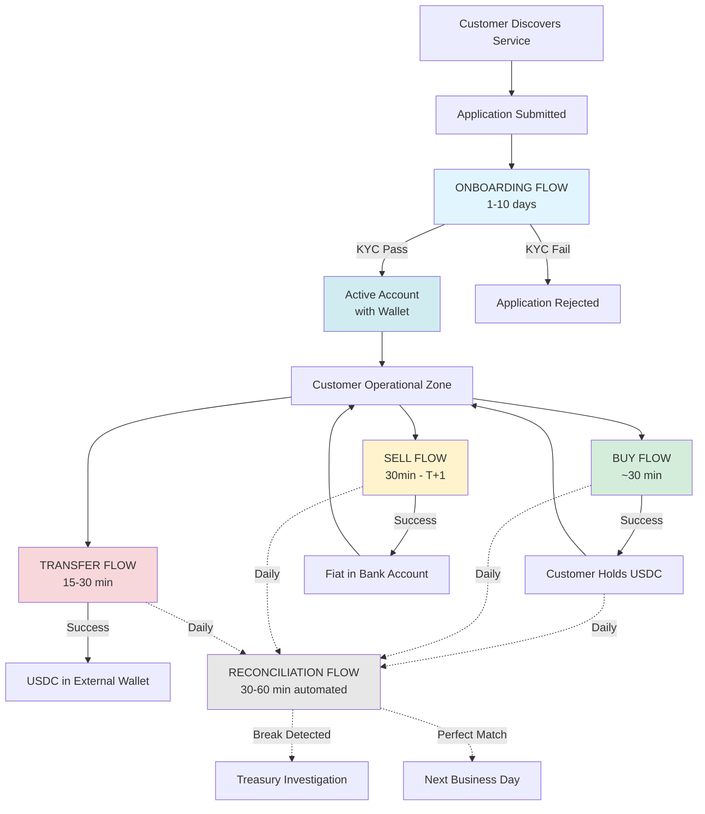
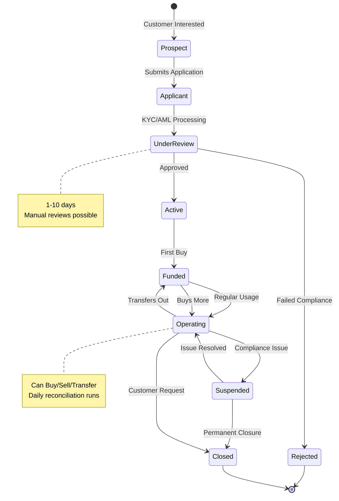
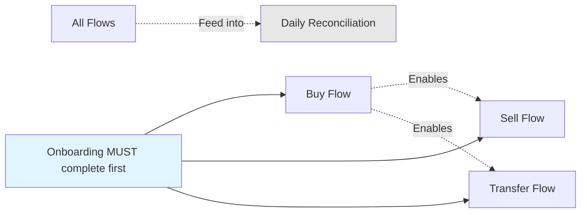

# CUSTOMER JOURNEY MAP
## Bank-Grade Stablecoin Platform

**Last Updated:** February 2026

---

## OVERVIEW

This document provides a **single visual map** showing how all customer and operational flows connect throughout the customer lifecycle.

---

## 🗺️ COMPLETE CUSTOMER LIFECYCLE



---

## 📊 FLOW INTERACTION MATRIX

| Customer Action | Triggers Flow | Duration | Next Possible Actions |
|----------------|---------------|----------|----------------------|
| **Apply for service** | Onboarding | 1-10 days | Buy, Sell, Transfer (once approved) |
| **Deposit fiat → Get USDC** | Buy | ~30 min | Hold, Sell, Transfer |
| **Redeem USDC → Get fiat** | Sell | 30 min - T+1 | Buy more (if needed) |
| **Send USDC externally** | Transfer | 15-30 min | Buy more (if needed) |
| **(Background operation)** | Reconciliation | 30-60 min | None (automated) |

---

## 🔄 CUSTOMER STATES & TRANSITIONS



---

## 📅 TYPICAL CUSTOMER JOURNEY TIMELINE

### Day 1: Application
```
Hour 0  →  Customer submits application via portal
Hour 1  →  Automated pre-checks (sanctions, basic validation)
Hour 2  →  KYC document submission (passport, proof of address)
```

### Day 2-3: Verification
```
Day 2   →  KYC provider (Jumio) verifies identity
Day 2   →  AML screening (Chainalysis, World-Check)
Day 3   →  Manual compliance review (if flagged)
```

### Day 4-5: Approval & Setup
```
Day 4   →  Compliance approval granted
Day 4   →  ATLAS account created
Day 4   →  Wallet provisioned (custody service)
Day 5   →  Customer notified → Account active
```

### Day 6+: Operational Phase
```
Customer can now:
├─ Buy USDC (fiat → stablecoin)
├─ Sell USDC (stablecoin → fiat)
└─ Transfer USDC (send to external wallet)

Bank operations:
└─ Daily reconciliation (every 11:59 PM)
```

---

## 🎯 CUSTOMER TOUCHPOINTS

| Touchpoint | Flow | Customer Action Required | Bank Response Time |
|-----------|------|--------------------------|-------------------|
| **Portal - Application** | Onboarding | Submit docs (5-10 min) | KYC review: 1-3 days |
| **Portal - Buy Order** | Buy | Confirm amount | ~30 minutes |
| **Portal - Sell Order** | Sell | Confirm redemption | 30 min - T+1 |
| **Portal - Transfer** | Transfer | Enter recipient address | 15-30 minutes |
| **Email - Status Updates** | All flows | None (informational) | Real-time notifications |
| **Support - Issue Escalation** | All flows | Contact customer service | 4-24 hours |

---

## 🔁 FLOW DEPENDENCIES



**Key Rules:**
- ❌ Cannot Buy/Sell/Transfer without completing Onboarding first
- ❌ Cannot Sell if no USDC balance
- ❌ Cannot Transfer if no USDC balance
- ✅ Reconciliation runs independently (no customer action needed)

---

## 🚦 DECISION POINTS IN CUSTOMER JOURNEY

### Entry Point Decision
```
Customer applies → Is customer eligible?
├─ YES → Continue to KYC
└─ NO → Reject (country restrictions, sanctioned entity)
```

### During Onboarding
```
KYC/AML screening → Any red flags?
├─ NO → Auto-approve (fast track: 1-2 days)
└─ YES → Manual review (slower: 5-10 days)
    ├─ Cleared → Approve
    └─ Not cleared → Reject
```

### During Buy Flow
```
Customer wants to buy USDC → Check balance
├─ Sufficient fiat? → YES → Process buy
└─ Insufficient fiat? → NO → Reject (customer must deposit first)
```

### During Sell Flow
```
Customer wants to sell USDC → Check liquidity
├─ Bank has liquidity? → YES → Instant settlement (30 min)
└─ No liquidity? → NO → Request redemption from issuer (T+1)
```

### During Transfer Flow
```
Customer wants to transfer USDC → Screen recipient address
├─ Clean address? → YES → Process transfer
└─ High-risk address? → NO → Block + alert compliance
```

---

## 📈 VOLUME PATTERNS (Typical Corporate Customer)

```
Month 1 (Post-Onboarding):
├─ Buy: 5-10 transactions ($1M-$5M total)
├─ Sell: 1-2 transactions ($100K-$500K)
└─ Transfer: 10-20 transactions (supplier payments)

Month 2-6 (Steady State):
├─ Buy: 10-20 transactions/month
├─ Sell: 5-10 transactions/month
└─ Transfer: 30-50 transactions/month

Annual Pattern:
└─ Most activity: Q4 (year-end payments)
└─ Lowest activity: Q3 (summer holidays)
```

---

## 🔄 RECONCILIATION CADENCE

**Daily Reconciliation happens in the background:**

```
Every Day at 11:59 PM:
├─ Extract data from:
│   ├─ Sub-Ledger (internal database)
│   ├─ Blockchain (Ethereum/Polygon)
│   └─ ATLAS (core banking)
├─ Compare balances
├─ Generate report
└─ Alert treasury if breaks detected

Next Morning (9 AM):
└─ Treasury reviews report → Investigate breaks if any
```

**Customer Impact:** ZERO (fully automated, no downtime)

---

## 🎨 CUSTOMER EXPERIENCE SUMMARY

| Phase | Customer Perspective | Duration | Satisfaction Drivers |
|-------|---------------------|----------|---------------------|
| **Discovery** | Learns about service | N/A | Clear value proposition |
| **Onboarding** | "When will I be approved?" | 1-10 days | Fast KYC, clear communication |
| **First Buy** | "How long until I see USDC?" | 30 min | Real-time status updates |
| **Regular Use** | "Seamless transactions" | 15-30 min avg | Reliability, speed |
| **Support** | "I need help" | 4-24 hours | Responsive customer service |

---

## 🏆 SUCCESS METRICS BY JOURNEY STAGE

| Stage | Key Metric | Target | Red Flag |
|-------|-----------|--------|----------|
| **Onboarding** | Time to approval | <3 days (80% of customers) | >10 days |
| **Buy Flow** | Success rate | >99.5% | <95% |
| **Sell Flow** | Instant settlement % | >80% (bank liquidity) | <50% |
| **Transfer Flow** | On-time completion | >99% | <95% |
| **Reconciliation** | Break rate | <0.1% | >1% |

---

## 🔗 RELATED DOCUMENTS

- [Individual Flow Details](./flows/ALL_FLOWS_INDEX.md)
- [System Architecture](./architecture/SYSTEM_CONTEXT_DIAGRAM.md)
- [Regulatory Requirements](./compliance/REGULATORY_MATRIX_6_COUNTRIES.md)

---

**Document Owner:** Business Analysis Team
**Version:** 1.0
