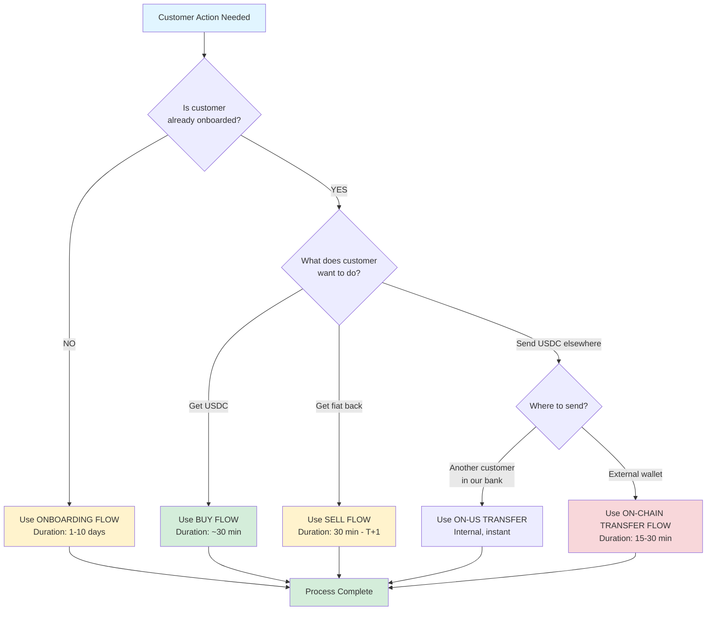
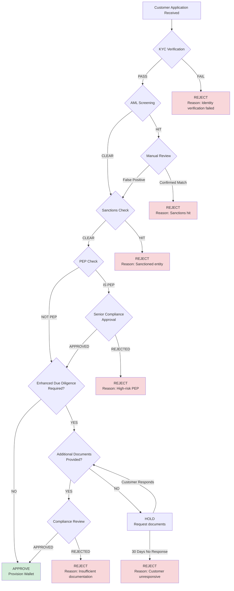
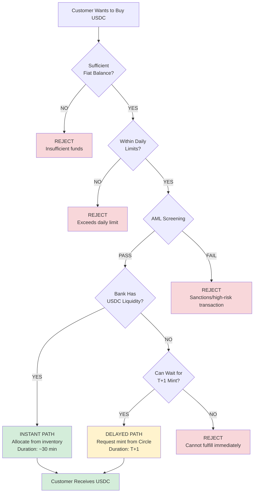
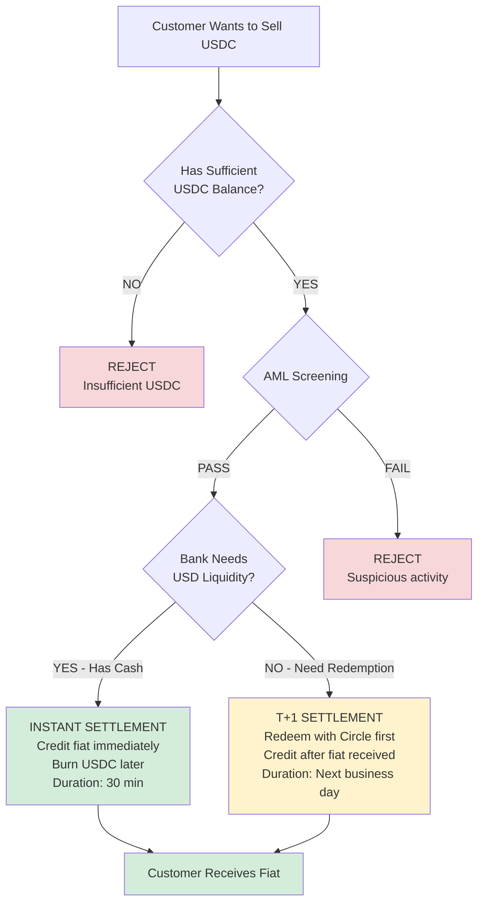
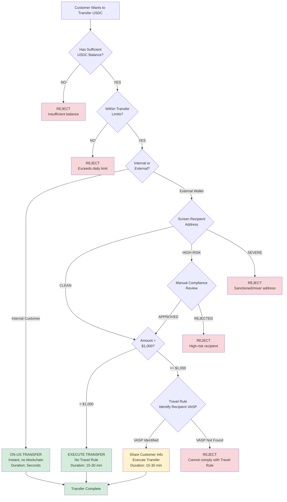
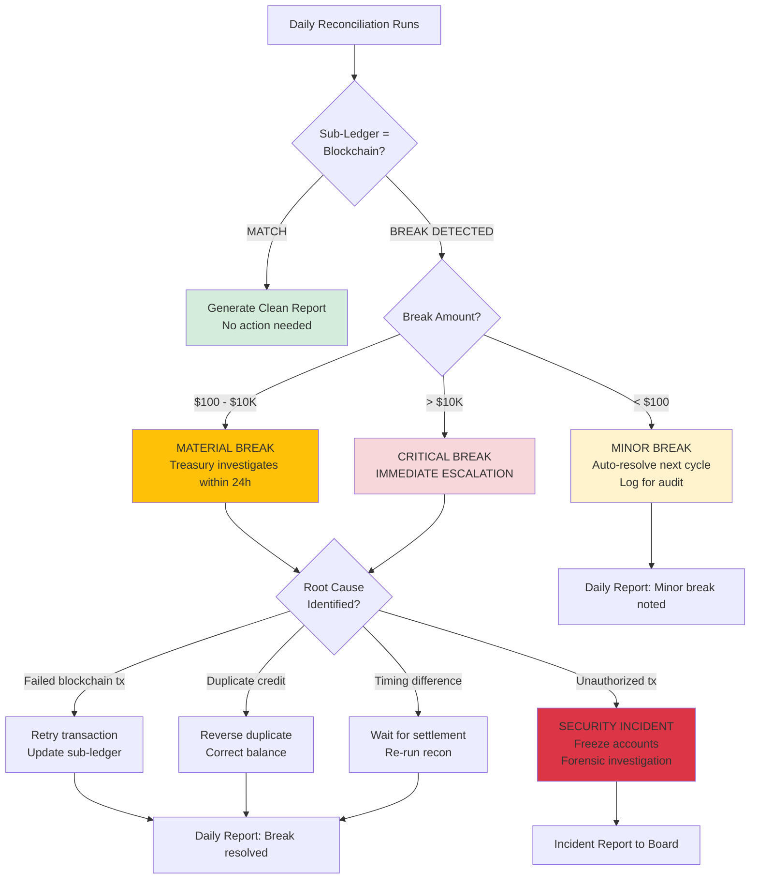
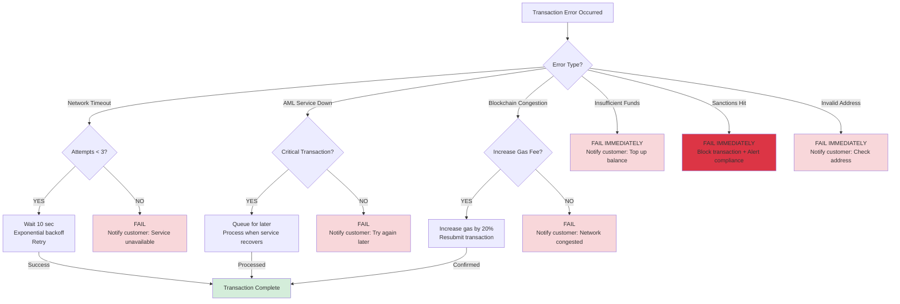
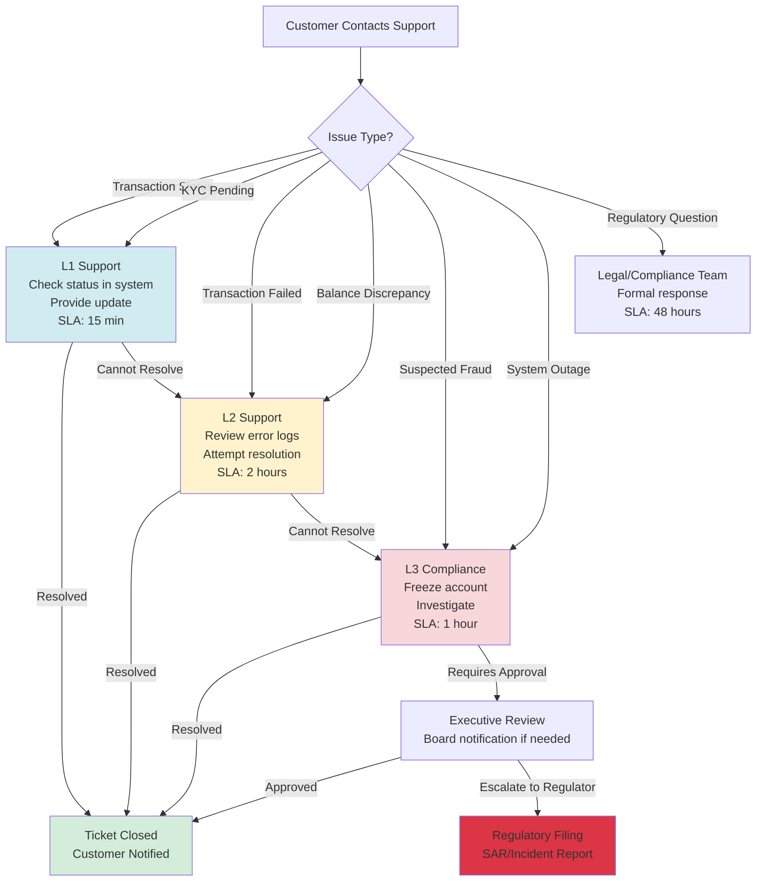

# DECISION TREES & FLOWCHARTS
## Quick Decision Guides for Common Scenarios

**Last Updated:** February 2026

---

## 📖 PURPOSE

This document provides **visual decision trees** to help users quickly determine the right action path for common scenarios.

---

## 🎯 DECISION 1: WHICH FLOW SHOULD I USE?

---

## 🚦 DECISION 2: ONBOARDING - APPROVE OR REJECT?

**Rejection Reasons Summary:**
- **Identity Failed:** Document fraud, poor quality images, name mismatch
- **Sanctions Hit:** OFAC, UN, EU sanctions lists
- **High-Risk PEP:** Government official from high-risk country
- **Insufficient Docs:** Cannot verify source of funds

---

## 💰 DECISION 3: BUY FLOW - INSTANT OR DELAYED?

**Business Rules:**
- **Daily Limit (Phase 1):** $10M per customer per day
- **Liquidity Threshold:** Bank maintains 20% buffer (if <20%, request mint)
- **AML Auto-Block:** Sanctioned addresses, high-risk jurisdictions

---

## 🔄 DECISION 4: SELL FLOW - SETTLEMENT TIMING

**Business Logic:**
- **Instant Settlement:** Bank has sufficient fiat reserves (80%+ of sell orders)
- **T+1 Settlement:** Large redemptions, end-of-day liquidity shortfall (20% of sell orders)

---

## 📤 DECISION 5: TRANSFER FLOW - RISK ASSESSMENT

**Risk Categories (Chainalysis):**
- **CLEAN (0-30):** Retail wallets, known exchanges → Auto-approve
- **MEDIUM (31-70):** New addresses, high-volume → Flag for review
- **HIGH (71-90):** Indirect mixer exposure → Compliance approval required
- **SEVERE (91-100):** Direct sanctions match, mixers → Auto-block

---

## 🔍 DECISION 6: RECONCILIATION - BREAK HANDLING

**Break Response SLAs:**
- **Minor (<$100):** Review within 48 hours, no immediate action
- **Material ($100-$10K):** Investigate within 24 hours, resolve within 48 hours
- **Critical (>$10K):** Immediate escalation (within 1 hour), resolve within 24 hours

---

## ⚠️ DECISION 7: ERROR HANDLING - RETRY OR FAIL?

**Error Categories:**
- **Retryable:** Network issues, service timeouts, congestion
- **Non-Retryable:** Compliance failures, invalid input, insufficient balance
- **Escalate:** Security incidents, critical system failures

---

## 🎯 DECISION 8: CUSTOMER SUPPORT - ESCALATION PATH

**Support Tiers:**
- **L1:** Customer service (routine inquiries, status checks)
- **L2:** Operations (technical issues, transaction troubleshooting)
- **L3:** Compliance/Security (fraud, suspicious activity, critical errors)
- **Legal:** Regulatory questions, legal disputes

---

## 📊 QUICK REFERENCE: COMMON SCENARIOS

| Scenario | Decision Path | Expected Outcome | Duration |
|----------|--------------|------------------|----------|
| **New customer applies** | Onboarding flow → KYC → AML → Approve | Account active | 1-10 days |
| **Customer buys $100K USDC** | Buy flow → Bank has liquidity → Instant | USDC credited | 30 min |
| **Customer sells $50K USDC** | Sell flow → Bank redeems with Circle → T+1 | Fiat credited next day | T+1 |
| **Customer sends to Coinbase** | Transfer flow → Screen address (CLEAN) → Execute | USDC arrives at Coinbase | 15-30 min |
| **Customer sends to mixer** | Transfer flow → Screen address (SEVERE) → Block | Transaction rejected | Instant |
| **Reconciliation finds $5K break** | Material break → Investigate → Failed tx identified → Retry | Break resolved | 24 hours |
| **Transaction fails 3 times** | Retry exhausted → Fail → Notify customer | Manual intervention | Immediate |

---

## 🔗 RELATED DOCUMENTS

- [Process Flows](./flows/ALL_FLOWS_INDEX.md) - Detailed flow documentation
- [Customer Journey Map](./CUSTOMER_JOURNEY_MAP.md) - End-to-end lifecycle
- [Glossary](./GLOSSARY.md) - Term definitions

---

**Document Owner:** Business Analysis Team
**Version:** 1.0
