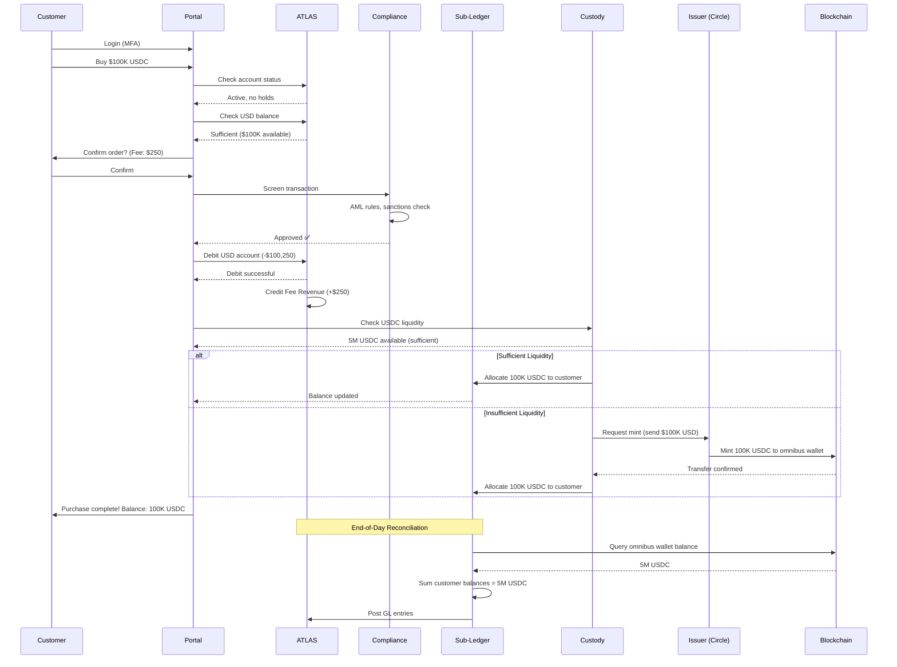
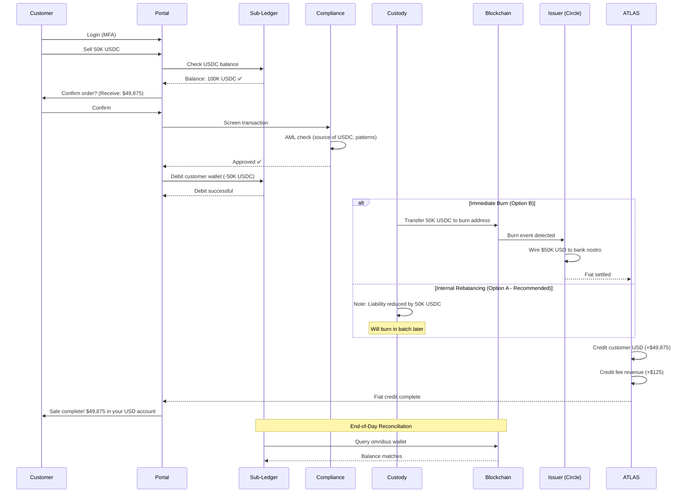

# ENTERPRISE STABLECOIN IMPLEMENTATION GUIDE (PART 2)
## Sections 4-15

---

<a name="section-4"></a>
# SECTION 4 — PHASE-1 SCOPE vs OUT-OF-SCOPE

## 4.1 Phasing Strategy

### Guiding Principles

1. **Regulatory Approval First:** Only launch features with explicit or implicit regulatory clearance
2. **Institutional Before Retail:** Prove model with sophisticated customers who understand risks
3. **Single Jurisdiction Before Multi-Jurisdiction:** Master compliance in one market before expanding
4. **Limited Currencies:** Start with USDC (most liquid, regulatory clarity)
5. **Custody Control:** Bank-custodied wallets only (no self-custody in Phase-1)
6. **Closed-Loop First:** On-us transfers only (no off-chain transfers in Phase-1 MVP)

---

## 4.2 Phase-1 Scope (MVP - 6-Month Target)

### IN-SCOPE

| Feature | Description | Rationale | Complexity |
|---------|-------------|-----------|------------|
| **Customer Onboarding (Corporate)** | KYC/AML for 20-50 corporate customers only | Controlled pilot, strong relationships | Medium |
| **Buy USDC (USD → USDC)** | Customers can buy USDC with USD wire transfers | Core functionality, low risk | Medium |
| **Sell USDC (USDC → USD)** | Customers can redeem USDC for USD | Core functionality, low risk | Medium |
| **Custody (Bank-Held Wallets)** | Bank holds private keys; hot/cold wallet split | Regulatory requirement, customer expectation | High |
| **On-Us Transfers** | Send USDC between customers within our system | Demonstrates utility without blockchain exposure | Low |
| **View Balance & Transaction History** | Customer portal showing wallet balance, transaction log | Basic customer experience | Low |
| **AML Transaction Monitoring** | Real-time screening, sanctions checks | Regulatory requirement | High |
| **Daily Reconciliation** | ATLAS ↔ Blockchain reconciliation | Financial control requirement | Medium |
| **Customer Support (Tier-1)** | Email/phone support for basic inquiries | Customer service expectation | Low |
| **Monthly Statements** | PDF statements emailed to customers | Regulatory requirement | Low |
| **Regulatory Reporting (US Only)** | SAR, CTR filings to FinCEN | Regulatory requirement | Medium |
| **API Access (Read-Only)** | Corporates can query balances, transaction history via API | Corporate customer requirement | Medium |
| **Single Currency (USDC)** | USD-pegged stablecoin only | Focus, liquidity, regulatory clarity | N/A |
| **Single Jurisdiction (US)** | Serve US-based customers only | Regulatory simplicity | N/A |

**Target Metrics (Phase-1):**
- Customers: 20-50 corporate clients
- Transaction Volume: $500M in first 6 months
- Uptime: 99.5% (allowing for maintenance windows)
- Regulatory Approvals: FinCEN MSB, State MTLs (already in place)
- Break-Even: Not expected (investment phase)

---

## 4.3 Phase-2 Scope (12-18 Months Post-Launch)

### ADDITIONS TO PHASE-1

| Feature | Description | Rationale | Complexity |
|---------|-------------|-----------|------------|
| **Multi-Currency (EURC, GBPT)** | Euro and GBP stablecoins | Customer demand for cross-border | High |
| **FX Conversion** | USDC ↔ EURC on-chain swaps | Enable cross-border use cases | High |
| **Off-Us Transfers (Limited)** | Send to external wallets (whitelist-only) | Customer demand, controlled risk | High |
| **SME Onboarding** | Extend to small-medium enterprises | Revenue growth | Medium |
| **Travel Rule Integration** | Comply with Travel Rule for off-us transfers | Regulatory requirement for off-us | High |
| **Enhanced API (Write Operations)** | Corporates can initiate buys/sells/transfers via API | Automation, treasury integration | High |
| **Multi-Jurisdiction (EU, UK, Singapore)** | Expand to additional markets | Growth, diversification | Very High |
| **Blockchain Analytics** | Integrate Chainalysis/TRM for advanced risk scoring | Enhanced compliance | Medium |
| **Warm Wallet Tier** | Introduce semi-offline wallet for medium-sized transactions | Operational efficiency | Medium |
| **Mobile App** | iOS/Android app for customers | User experience, competitive parity | High |

**Target Metrics (Phase-2):**
- Customers: 200-500 (corporate + SME)
- Transaction Volume: $5B cumulative
- Uptime: 99.9%
- Regulatory Approvals: EU MiCA compliance, FCA authorization, MAS license
- Break-Even: Target by Month 18

---

## 4.4 Phase-3 Scope (18-36 Months Post-Launch)

### ADDITIONS TO PHASE-2

| Feature | Description | Rationale | Complexity |
|---------|-------------|-----------|------------|
| **Retail Customers (HNW)** | Onboard high-net-worth individuals | Diversified customer base | Medium |
| **Self-Custody Option** | Allow customers to withdraw to their own wallets | Customer demand, decentralization ethos | High |
| **Stablecoin Lending (Collateralized)** | Offer USD loans against USDC collateral | New revenue stream | Very High |
| **Yield Products** | Interest on stablecoin balances (via DeFi or treasury) | Competitive feature | Very High |
| **White-Label Platform** | Partner FIs can offer stablecoins under their brand | B2B2C strategy | Very High |
| **Multi-Chain Support** | Support Solana, Polygon, Avalanche (beyond Ethereum) | Liquidity, customer choice | Very High |
| **Programmable Payments** | Smart contracts for conditional payments (escrow, subscriptions) | Innovation, differentiation | Very High |
| **India, UAE Expansion** | Enter emerging markets (subject to regulatory clarity) | Growth | Very High |
| **Carbon-Neutral Operations** | Offset blockchain carbon footprint | ESG compliance | Low |

**Target Metrics (Phase-3):**
- Customers: 5,000+ (corporate + SME + retail)
- Transaction Volume: $50B+ cumulative
- Uptime: 99.99%
- Regulatory Approvals: Global expansion (10+ jurisdictions)
- Profitability: $50M+ annual revenue

---

## 4.5 Explicitly OUT-OF-SCOPE (All Phases)

### PERMANENTLY OUT-OF-SCOPE

| Feature | Reason | Alternative |
|---------|--------|-------------|
| **Stablecoin Issuance** | Regulatory complexity, capital lock-up, different business model | Partner with established issuers (Circle, Paxos) |
| **Cryptocurrency Trading (BTC, ETH)** | Speculative, high risk, not aligned with banking model | Refer customers to exchanges |
| **DeFi Yield Farming (Uncollateralized)** | Smart contract risk, regulatory grey area | Only institutional-grade DeFi (if at all) |
| **Algorithmic Stablecoins** | High risk of de-peg (see Terra/Luna collapse) | Only asset-backed stablecoins |
| **Anonymous Transactions (Privacy Coins)** | AML/regulatory non-compliant | Only KYC'd, traceable transactions |
| **Margin Trading / Leverage** | Gambling behavior, not banking | N/A |
| **NFT Services** | Speculative, reputational risk | Out of scope |
| **Token Issuance Platform (ICO/IEO)** | Securities risk, regulatory complexity | Out of scope |
| **Unregulated Jurisdictions** | Countries with weak AML or sanctioned | Stick to FATF-compliant jurisdictions |

### PHASE-DEPENDENT OUT-OF-SCOPE (May Reconsider Later)

| Feature | Why Out-of-Scope Now | Potential Future |
|---------|----------------------|------------------|
| **Mass Retail (Non-HNW)** | Customer service cost, AML complexity, small balances | Phase 4+ (if economics work) |
| **Real-Time Gross Settlement (RTGS) Integration** | Requires central bank partnership | Phase 4+ (if CBDCs interoperate) |
| **Cross-Chain Atomic Swaps** | Technology immaturity, smart contract risk | Phase 3+ (when standards mature) |
| **Fractional Reserve Stablecoins** | Regulatory uncertainty, risk of bank run | Never (unless regulations change) |
| **Peer-to-Peer Lending** | Regulatory licensing (not a bank activity in all jurisdictions) | Phase 3+ (separate entity) |

---

## 4.6 Feature Prioritization Matrix

### Scoring Methodology

Each feature scored on:
- **Business Value (1-5):** Revenue potential, customer demand
- **Regulatory Risk (1-5):** 1=low risk, 5=high risk
- **Complexity (1-5):** 1=easy, 5=very hard
- **Dependency (1-5):** 1=standalone, 5=requires many other features
- **Priority Score = (Business Value × 2) - Regulatory Risk - Complexity - Dependency**

### Phase-1 Prioritization

| Feature | Business Value | Regulatory Risk | Complexity | Dependency | Priority Score | Phase |
|---------|----------------|-----------------|------------|------------|----------------|-------|
| Buy USDC | 5 | 2 | 3 | 1 | 4 | **P0 (Day-1)** |
| Sell USDC | 5 | 2 | 3 | 1 | 4 | **P0 (Day-1)** |
| Custody | 5 | 3 | 5 | 1 | 1 | **P0 (Day-1)** |
| On-Us Transfers | 4 | 1 | 2 | 2 | 4 | **P0 (Day-1)** |
| AML Monitoring | 3 | 5 | 4 | 1 | -5 (mandatory) | **P0 (Day-1)** |
| Reconciliation | 2 | 4 | 3 | 1 | -4 (mandatory) | **P0 (Day-1)** |
| Off-Us Transfers | 4 | 4 | 4 | 3 | -3 | **P1 (Phase-2)** |
| Multi-Currency | 4 | 3 | 4 | 3 | -2 | **P1 (Phase-2)** |
| Self-Custody | 3 | 4 | 4 | 2 | -4 | **P2 (Phase-3)** |
| Lending | 5 | 5 | 5 | 5 | -10 | **P3 (Phase-3+)** |

---

<a name="section-5"></a>
# SECTION 5 — BUY / SELL FLOW DIAGRAMS

## 5.1 BUY Flow (Fiat → Stablecoin)

### Step-by-Step Narrative

#### Actors
- **Customer:** Corporate client wanting to buy USDC
- **Portal:** Web/mobile application
- **ATLAS:** Core banking system (fiat ledger)
- **Compliance Engine:** AML/sanctions screening system
- **Issuer (Circle):** Stablecoin issuer
- **Blockchain:** Ethereum network
- **Sub-Ledger:** Internal stablecoin wallet database
- **Custody:** Hot/cold wallet management system

---

#### Detailed Flow

**STEP 1: Customer Initiates Buy Order**
- Customer logs into portal (MFA required)
- Navigates to "Buy Stablecoin"
- Selects currency: "USDC"
- Enters amount: $100,000 USD
- System displays:
  - Amount to receive: 100,000 USDC
  - Fee: $250 (0.25%)
  - Exchange rate: 1 USD = 1 USDC
  - Estimated time: 30 minutes
- Customer confirms order

**STEP 2: System Validations (Pre-Flight Checks)**
- **Account Status Check:**
  - ✅ Account is active (not suspended/closed)
  - ✅ KYC is current (not expired)
  - ✅ No compliance holds
- **Balance Check:**
  - Option A: Debit existing USD account (if sufficient balance)
  - Option B: Provide wire instructions (if new funds needed)
- **Limits Check:**
  - ✅ Daily limit: $500K (customer is within limit)
  - ✅ Single transaction limit: $250K (customer is within limit)
- **Regulatory Check:**
  - ✅ No CTR threshold breach (customer has not exceeded $10K cash equivalent today)

**STEP 3: Fiat Receipt & Compliance Screening**
- If Option B (wire), customer sends wire transfer to bank
  - Bank account: [Bank Name] ABA: 123456789, Account: Stablecoin Buy Orders, Reference: [Order ID]
- ATLAS receives wire (+$100,000 USD)
- **AML Screening Triggered:**
  - Check: Is sender on sanctions list? ❌ No match
  - Check: Is this a structured transaction (just below reporting threshold)? ❌ No
  - Check: Source of funds consistent with customer profile? ✅ Yes (customer is manufacturing company, this is trade finance)
  - Check: Geographic risk? ✅ Low (domestic wire)
  - **Result:** Transaction approved
- **Sanctions Screening:**
  - Query: OFAC SDN, EU Sanctions, UN List
  - **Result:** No match ✅

**STEP 4: Reserve Check & Mint Instruction**
- Bank checks internal USDC liquidity:
  - Current omnibus wallet balance: 5,000,000 USDC
  - Customer order: 100,000 USDC
  - Remaining after fulfillment: 4,900,000 USDC
  - ✅ Sufficient (no need to request mint from issuer)
- If insufficient, bank would:
  - Send mint request to Circle API
  - Transfer $100,000 to Circle's reserve account
  - Wait for Circle to mint 100,000 USDC to our omnibus wallet (15-30 min)

**STEP 5: Blockchain Transfer (Omnibus → Customer Sub-Allocation)**
- **Internal Allocation Model (Recommended for Phase-1):**
  - Customer does NOT have unique on-chain wallet initially
  - Bank maintains omnibus wallet on-chain
  - Bank credits customer's sub-ledger (internal database)
  - Customer sees balance in portal: "100,000 USDC"
  - **Advantages:** Lower gas fees, instant, no blockchain delays, easier reconciliation
  - **Future:** Customer can request on-chain withdrawal (Phase-2)

- **Alternative: On-Chain Wallet Model:**
  - Bank initiates on-chain transfer:
    - From: Bank Omnibus Wallet (0xABC...DEF)
    - To: Customer Wallet (0x123...789)
    - Amount: 100,000 USDC
    - Gas Fee: 0.005 ETH (~$10)
  - Sign transaction with HSM
  - Broadcast to Ethereum network
  - Wait for confirmations (12 blocks ≈ 3 minutes)
  - Update customer record: "Transaction confirmed"

**STEP 6: Customer Notification & Accounting**
- **Customer Notification:**
  - Email: "Your purchase of 100,000 USDC is complete"
  - SMS: "USDC balance: 100,000"
  - Portal: Green checkmark, transaction ID, blockchain link (if on-chain)
- **Accounting (ATLAS):**
  - Debit: Customer USD Account ($100,250 including fee)
  - Credit: Fee Revenue ($250)
  - Memo: "Buy USDC Order #12345"
- **Sub-Ledger Update:**
  - Customer ID: 7890
  - Wallet ID: W-7890
  - Balance: 100,000 USDC
  - Transaction Log: [{type: "buy", amount: 100000, timestamp: "2026-02-01T10:30:00Z"}]

**STEP 7: Reconciliation (End-of-Day)**
- Automated job runs at midnight:
  - Sum all customer sub-ledger balances: 5,000,000 USDC
  - Query on-chain omnibus wallet balance: 5,000,000 USDC
  - ✅ Match → Generate reconciliation report
  - If mismatch → Alert treasury team

---

### Buy Flow - Sequence Diagram (Mermaid)



---

### Buy Flow - Failure Scenarios

#### Scenario 1: Sanctions Hit During AML Screening

```
STEP 3 Alternative Path:
- Wire received from customer
- AML screening detects: Wire originated from sanctioned entity
- **ACTION:**
  - Immediately freeze funds
  - Do NOT issue USDC
  - File SAR (Suspicious Activity Report) with FinCEN within 30 days
  - Return funds to sender (minus mandatory hold period per OFAC)
  - Suspend customer account pending investigation
  - Notify senior compliance officer
```

#### Scenario 2: Insufficient USDC Liquidity + Issuer Delay

```
STEP 4 Alternative Path:
- Bank omnibus wallet has only 50K USDC (customer wants 100K)
- Bank sends mint request to Circle
- Circle's API responds: "Mint request queued, estimated time 2 hours" (due to manual review for large amounts)
- **ACTION:**
  - Notify customer: "Your order is processing; USDC will be available in 2-4 hours"
  - Treasury team monitors Circle's response
  - Once mint completes, resume from Step 5
  - If Circle delays >24 hours → Escalate to Circle account manager
  - If Circle unable to mint → Refund customer + apologize
```

#### Scenario 3: Blockchain Network Congestion (If On-Chain Model)

```
STEP 5 Alternative Path:
- Bank broadcasts transaction to Ethereum
- Gas fee spikes from $10 to $100 (network congestion)
- Transaction is pending for 1 hour (not confirming)
- **ACTION:**
  - Option A: Wait for congestion to clear (inform customer of delay)
  - Option B: Replace transaction with higher gas fee (if customer approves added cost)
  - Option C: Cancel transaction, refund customer, retry later
  - Update customer: "Due to blockchain congestion, your transaction is delayed. We're monitoring."
```

---

## 5.2 SELL Flow (Stablecoin → Fiat)

### Step-by-Step Narrative

**STEP 1: Customer Initiates Sell Order**
- Customer logs into portal
- Navigates to "Sell Stablecoin"
- Selects: "Sell USDC"
- Enters amount: 50,000 USDC
- System displays:
  - Amount to receive: $49,875 USD (50,000 - 0.25% fee)
  - Fee: $125
  - Exchange rate: 1 USDC = 1 USD
  - Estimated time: 30 minutes (or T+1 if fiat settlement delayed)
- Customer confirms order

**STEP 2: System Validations**
- **Balance Check:**
  - Customer sub-ledger balance: 100,000 USDC
  - Requested sell: 50,000 USDC
  - ✅ Sufficient
- **Account Status:**
  - ✅ Active
  - ✅ No disputes on wallet
  - ✅ No pending withdrawals
- **Limits Check:**
  - ✅ Daily sell limit: $250K (within limit)

**STEP 3: Debit Customer Wallet & Compliance Screening**
- Sub-ledger debits customer: -50,000 USDC
- Customer's new balance: 50,000 USDC
- **AML Screening:**
  - Check: Has customer recently received USDC from high-risk source? ❌ No
  - Check: Is this a rapid in-out pattern (potential layering)? ❌ No (customer held for 30 days)
  - Check: Amount consistent with customer profile? ✅ Yes
  - **Result:** Approved

**STEP 4: On-Chain Burn (or Omnibus Rebalancing)**

**Option A: Internal Rebalancing (Recommended Phase-1)**
- No on-chain transaction
- Bank's omnibus wallet balance remains unchanged
- Bank's internal liability to customer reduced by 50,000 USDC
- Bank can later burn excess USDC with issuer (batch, end-of-day)

**Option B: Immediate On-Chain Burn**
- Bank transfers 50,000 USDC from omnibus wallet to Circle's burn address
- Circle detects burn event on-chain
- Circle's API confirms: "Burn acknowledged"
- Circle wires $50,000 to bank's nostro account (T+0 or T+1)

**STEP 5: Fiat Settlement**
- Circle credits bank's nostro account: +$50,000 USD (if Option B)
- Or bank uses existing fiat liquidity (if Option A)
- ATLAS credits customer's USD account: +$49,875 USD
- ATLAS credits bank's fee revenue: +$125 USD

**STEP 6: Customer Notification**
- Email: "Your sale of 50,000 USDC is complete. $49,875 credited to your USD account."
- Portal: Transaction confirmed, new balances displayed

**STEP 7: Reconciliation**
- Sub-ledger: -50,000 USDC
- On-chain (if burned): -50,000 USDC
- ATLAS: +$49,875 customer, +$125 revenue

---

### Sell Flow - Sequence Diagram (Mermaid)



---

### Sell Flow - Failure Scenarios

#### Scenario 1: Customer Attempts to Sell USDC Received from Sanctioned Wallet

```
STEP 3 Alternative Path:
- Customer's 50K USDC was recently received from wallet address 0xBAD...123
- Blockchain analytics (Chainalysis) flags 0xBAD...123 as "High Risk - Darknet Market"
- **ACTION:**
  - Block sell transaction
  - Freeze customer's wallet (prevent further transactions)
  - Escalate to compliance team for investigation
  - Request customer to provide:
    - Source of USDC (who sent it, why?)
    - Supporting documentation (invoice, contract)
  - If customer cannot prove legitimate source:
    - File SAR
    - May seize funds per legal authority
    - Close customer account
  - If customer proves legitimate source (e.g., they sold goods to someone who unknowingly used tainted funds):
    - Risk-based decision: Allow sell (with enhanced monitoring) OR require customer to return funds to sender
```

#### Scenario 2: Circle (Issuer) Fails to Settle Fiat

```
STEP 5 Alternative Path:
- Bank burns 50K USDC on-chain
- Circle acknowledges burn
- Circle promises to wire $50K within 24 hours
- 24 hours pass → No wire received
- **ACTION:**
  - Treasury team contacts Circle: "Where is our $50K?"
  - Circle responds: "Bank holiday in US, will send tomorrow" OR "Technical issue, resolving"
  - Bank has two choices:
    - Option A: Wait for Circle (customer sees "Pending" status)
    - Option B: Credit customer immediately from bank's own funds (absorb the timing risk)
  - **Recommended:** Option B (customer doesn't wait, bank manages issuer relationship)
  - If Circle delays >5 days → Escalate to legal, consider switching issuer
```

---

<a name="section-6"></a>
# SECTION 6 — SYSTEM CONTEXT & ARCHITECTURE

## 6.1 System Context Diagram

### High-Level System Context

```
┌────────────────────────────────────────────────────────────────────┐
│                         EXTERNAL ACTORS                            │
├────────────────────────────────────────────────────────────────────┤
│                                                                    │
│  ┌──────────┐    ┌──────────┐    ┌───────────┐   ┌────────────┐ │
│  │CUSTOMERS │    │REGULATORS│    │  ISSUERS  │   │  BLOCKCHAIN│ │
│  │- Corp    │    │- FinCEN  │    │  (Circle) │   │  (Ethereum)│ │
│  │- SME     │    │- ECB     │    │  (Paxos)  │   │  (Polygon) │ │
│  │- HNW     │    │- FCA/MAS │    │           │   │            │ │
│  └─────┬────┘    └────┬─────┘    └─────┬─────┘   └──────┬─────┘ │
│        │              │                 │                │       │
└────────┼──────────────┼─────────────────┼────────────────┼───────┘
         │              │                 │                │
         │              │                 │                │
    ┌────▼──────────────▼─────────────────▼────────────────▼─────┐
    │                                                              │
    │              STABLECOIN BANKING PLATFORM                    │
    │              (Our Bank's System)                            │
    │                                                              │
    │  ┌──────────────────────────────────────────────────────┐  │
    │  │           API GATEWAY & SECURITY LAYER               │  │
    │  │  - Authentication (OAuth 2.0)                        │  │
    │  │  - Rate Limiting                                     │  │
    │  │  - DDoS Protection (Cloudflare)                     │  │
    │  └──────────────────┬───────────────────────────────────┘  │
    │                     │                                       │
    │  ┌──────────────────▼───────────────────────────────────┐  │
    │  │         APPLICATION LAYER (Microservices)           │  │
    │  │                                                      │  │
    │  │  ┌────────────┐  ┌────────────┐  ┌──────────────┐  │  │
    │  │  │ Customer   │  │Transaction │  │  Compliance  │  │  │
    │  │  │ Management │  │ Processing │  │  Engine      │  │  │
    │  │  └────────────┘  └────────────┘  └──────────────┘  │  │
    │  │                                                      │  │
    │  │  ┌────────────┐  ┌────────────┐  ┌──────────────┐  │  │
    │  │  │  Custody   │  │Reconcile   │  │  Reporting   │  │  │
    │  │  │  Service   │  │ Engine     │  │  Service     │  │  │
    │  │  └────────────┘  └────────────┘  └──────────────┘  │  │
    │  └──────────────────┬───────────────────────────────────┘  │
    │                     │                                       │
    │  ┌──────────────────▼───────────────────────────────────┐  │
    │  │            DATA & INTEGRATION LAYER                  │  │
    │  │                                                      │  │
    │  │  ┌─────────┐  ┌──────────┐  ┌────────┐  ┌────────┐ │  │
    │  │  │ ATLAS   │  │Sub-Ledger│  │Blockchain│ │Data    │ │  │
    │  │  │ (Core   │  │ (Wallet  │  │  Node   │  │Warehouse│ │  │
    │  │  │ Banking)│  │  DB)     │  │(Alchemy)│  │(Snowflk)│ │  │
    │  │  └─────────┘  └──────────┘  └────────┘  └────────┘ │  │
    │  └──────────────────────────────────────────────────────┘  │
    │                                                              │
    │  ┌──────────────────────────────────────────────────────┐  │
    │  │           INFRASTRUCTURE LAYER                       │  │
    │  │  - HSM (Hardware Security Module - Key Management)   │  │
    │  │  - Multi-Sig Wallets (Gnosis Safe)                  │  │
    │  │  - Monitoring (Datadog, PagerDuty)                  │  │
    │  │  - Backup & DR (AWS S3, Multi-Region)               │  │
    │  └──────────────────────────────────────────────────────┘  │
    │                                                              │
    └──────────────────────────────────────────────────────────────┘
```

---

## 6.2 Logical Architecture

### Architecture Principles

1. **Separation of Concerns:** Fiat operations (ATLAS) separate from crypto operations (Sub-Ledger + Blockchain)
2. **API-First:** All services expose RESTful APIs (internal + external)
3. **Event-Driven:** Use message queue (Kafka) for async operations (e.g., compliance screening, reconciliation)
4. **Immutable Audit Trail:** All state changes logged to append-only ledger
5. **Defense in Depth:** Multiple layers of security (API gateway, application-level auth, HSM, network segmentation)
6. **Resilience:** No single point of failure; active-active data centers; <5 min RTO (Recovery Time Objective)

---

### Architecture Layers

#### Layer 1: **Presentation Layer**

**Components:**
- **Customer Portal (Web App):** React.js, hosted on AWS CloudFront (CDN)
  - Features: Dashboard, buy/sell, transaction history, wallet management, support tickets
  - Authentication: OAuth 2.0 + MFA (SMS, authenticator app)
  - Session management: JWT tokens, 15-minute timeout

- **Mobile App (iOS/Android):** React Native (Phase-2)

- **Corporate API:** RESTful API for programmatic access
  - Endpoints: GET /balance, POST /buy, POST /sell, POST /transfer, GET /transactions
  - Authentication: API keys + OAuth 2.0 client credentials flow
  - Rate limiting: 100 requests/minute per client

- **Internal Admin Panel:** For bank employees (customer support, compliance, treasury)
  - Role-based access (RBAC): Support agents see limited data, compliance officers see full audit trail

---

#### Layer 2: **API Gateway & Security**

**Components:**
- **API Gateway:** Kong or AWS API Gateway
  - Routes requests to microservices
  - Enforces authentication, rate limiting, logging
  - SSL/TLS termination

- **Web Application Firewall (WAF):** Cloudflare or AWS WAF
  - Blocks SQL injection, XSS, DDoS

- **DDoS Protection:** Cloudflare (CDN + DDoS mitigation)

- **Identity & Access Management (IAM):** Okta or Auth0
  - Centralized user directory (customers + employees)
  - MFA enforcement
  - SSO for internal tools

---

#### Layer 3: **Application Layer (Microservices)**

**Microservice Architecture**

| Service Name | Responsibility | Tech Stack | Persistence | API Endpoints |
|--------------|----------------|------------|-------------|---------------|
| **customer-service** | KYC, onboarding, profile management | Node.js (Express) | PostgreSQL | POST /onboard, GET /customer/:id, PUT /customer/:id |
| **transaction-service** | Buy, sell, transfer orchestration | Java (Spring Boot) | PostgreSQL + Kafka | POST /buy, POST /sell, POST /transfer, GET /transaction/:id |
| **compliance-service** | AML, sanctions, Travel Rule | Python (FastAPI) | PostgreSQL + ElasticSearch | POST /screen, POST /sar, GET /case/:id |
| **custody-service** | Wallet provisioning, key management, hot/cold sweeps | Go | PostgreSQL + HSM | POST /wallet, POST /sweep, GET /wallet/:id/balance |
| **reconciliation-service** | ATLAS ↔ Blockchain daily recon | Python | PostgreSQL + S3 (reports) | POST /reconcile, GET /report/:date |
| **reporting-service** | Statements, regulatory reports, dashboards | Node.js | PostgreSQL + Data Warehouse | GET /statement/:customerId/:month, POST /sar |
| **notification-service** | Email, SMS, push notifications | Node.js | MongoDB (queue) | POST /send-email, POST /send-sms |
| **fee-service** | Fee calculation, billing | Java | PostgreSQL | POST /calculate-fee, GET /invoice/:id |

**Inter-Service Communication:**
- **Synchronous:** REST (for simple request-response)
- **Asynchronous:** Kafka (for event-driven workflows)
  - Topics: `transaction.created`, `transaction.completed`, `compliance.flagged`, `wallet.credited`

**Example Flow (Buy USDC):**
1. Customer calls `POST /buy` → **transaction-service**
2. **transaction-service** publishes event: `transaction.initiated` → Kafka
3. **compliance-service** consumes event → screens transaction → publishes `compliance.approved` or `compliance.rejected`
4. **transaction-service** consumes `compliance.approved` → calls **custody-service** → `POST /allocate-usdc`
5. **custody-service** updates wallet → publishes `wallet.credited`
6. **notification-service** consumes `wallet.credited` → sends email to customer
7. **transaction-service** updates status to "completed"

---

#### Layer 4: **Data Layer**

**Databases:**

| Database | Purpose | Technology | Backup Frequency |
|----------|---------|------------|------------------|
| **ATLAS (Core Banking)** | Fiat accounts, GL, customer master | Proprietary (ATLAS DB) | Real-time replication |
| **Sub-Ledger (Wallet DB)** | Stablecoin wallet balances, transaction log | PostgreSQL (primary), Read Replicas (3x) | Every 15 minutes |
| **Customer Data** | KYC documents, compliance cases | PostgreSQL | Daily |
| **Audit Log** | Immutable audit trail (all API calls, state changes) | AWS S3 (append-only) + ElasticSearch | Real-time |
| **Data Warehouse** | Analytics, reporting, ML models | Snowflake | Daily ETL from PostgreSQL |
| **Cache** | Hot data (wallet balances, FX rates) | Redis (in-memory) | N/A (ephemeral) |

**Blockchain Node:**
- **Managed Node Provider:** Alchemy or Infura (Ethereum, Polygon)
  - Redundancy: Fallback to Infura if Alchemy down
- **Alternative:** Self-hosted Ethereum node (Geth or Erigon) for Phase-2+ (full control, no reliance on third-party)

---

#### Layer 5: **Integration Layer**

**External Integrations:**

| System | Purpose | Integration Method | SLA | Fallback |
|--------|---------|-------------------|-----|----------|
| **Circle API** | Mint/burn, reserve attestation | REST API (webhook for events) | 99.9% | Queue requests; manual intervention |
| **ATLAS** | Fiat ledger, GL posting | SOAP/REST (depends on ATLAS version) | 99.99% | Batch retry; manual reconciliation |
| **KYC Provider (Jumio)** | Identity verification | REST API | 99.5% | Manual document review |
| **AML Screening (Dow Jones)** | Sanctions, PEP screening | REST API | 99.9% | Cached lists (24h stale acceptable) |
| **Blockchain Analytics (Chainalysis)** | Wallet risk scoring | REST API | 99.5% | Manual review for high-value transactions |
| **HSM (Thales or Fireblocks)** | Key signing | REST API (Fireblocks) or PKCS#11 (Thales) | 99.99% | Backup HSM; offline signing for cold wallet |
| **SWIFT Network** | Fiat wires (incoming/outgoing) | SWIFT MT103 messages | 99.95% | Manual wire entry |
| **Data Warehouse (Snowflake)** | Analytics, reporting | ETL (Fivetran or custom) | 99.9% | Daily batch; reports delayed but not lost |

**Event Bus:**
- **Kafka:** Centralized message broker for inter-service communication and event sourcing
  - Topics: 50+ (e.g., `transactions`, `compliance`, `wallets`, `audit`)
  - Retention: 30 days (compliance), 7 days (operational)

---

#### Layer 6: **Infrastructure Layer**

**Cloud Provider:** AWS (primary) + Azure (DR, multi-cloud strategy)

**Components:**

| Component | Technology | Purpose | Redundancy |
|-----------|------------|---------|------------|
| **Compute** | AWS EKS (Kubernetes) | Run microservices containers | Multi-AZ (3 availability zones) |
| **Load Balancer** | AWS ALB (Application Load Balancer) | Distribute traffic | Active-active across AZs |
| **HSM** | AWS CloudHSM or Thales Luna HSM | Key storage, transaction signing | 3-of-5 HSM cluster |
| **Secrets Management** | AWS Secrets Manager + HashiCorp Vault | API keys, DB passwords | Encrypted at rest + in transit |
| **Monitoring** | Datadog + PagerDuty | Metrics, logs, alerts | 24/7 SOC |
| **Backup** | AWS S3 (cross-region replication) | Database backups, audit logs | 3 regions (US-East, US-West, EU) |
| **Disaster Recovery** | Active-passive (Azure) | Failover if AWS region down | RTO: 5 min, RPO: 15 min |
| **Logging** | ELK Stack (ElasticSearch, Logstash, Kibana) | Centralized logging, audit queries | 7-year retention |

---

## 6.3 Component Responsibilities

### Custody Service (Deep Dive)

**Responsibilities:**
1. Generate and store private keys (via HSM)
2. Provision wallets for customers
3. Sign blockchain transactions
4. Manage hot/cold wallet split
5. Execute daily sweeps (hot → cold)
6. Monitor wallet balances and gas fees
7. Provide wallet balance APIs to other services

**Technology Stack:**
- **Language:** Go (for performance, concurrency)
- **HSM Integration:** Fireblocks API (Phase-1) or Thales Luna HSM (Phase-2)
- **Multi-Sig:** Gnosis Safe smart contracts (3-of-5 for cold wallet)
- **Blockchain Interaction:** ethers.js library (for Ethereum)

**Key Management Strategy:**
- **Hot Wallet (5% of AUM):**
  - Single-sig (bank-controlled)
  - Private key stored in AWS CloudHSM (FIPS 140-2 Level 3)
  - Used for customer transactions (<$50K)
  - Daily sweep to cold wallet

- **Warm Wallet (15% of AUM, Phase-2):**
  - 2-of-3 multi-sig
  - Used for medium transactions ($50K-$500K)
  - Weekly sweep to cold wallet

- **Cold Wallet (80% of AUM):**
  - 3-of-5 multi-sig (Gnosis Safe)
  - Signers: CFO, CTO, Head of Treasury, Head of Compliance, External Custodian (BitGo)
  - Private keys stored offline (hardware wallets in bank vaults, geographically distributed)
  - Used for large transactions (>$500K) or customer withdrawals (batched weekly)

**Security Controls:**
- **Access Control:** Only `custody-service` can call HSM; no direct human access
- **Audit Logging:** Every signing operation logged (who requested, amount, destination, approvers)
- **Threshold Alerts:** If hot wallet balance >$10M → Alert treasury team
- **Intrusion Detection:** 24/7 SOC monitoring; anomaly detection on signing patterns
- **Penetration Testing:** Quarterly by third-party (e.g., Trail of Bits, NCC Group)

---

### Compliance Service (Deep Dive)

**Responsibilities:**
1. Real-time AML transaction screening
2. Sanctions screening (OFAC, UN, EU)
3. PEP (Politically Exposed Person) checks
4. Blockchain analytics (wallet risk scoring)
5. Travel Rule compliance (collect + share data)
6. SAR/CTR generation and filing
7. Case management (investigations)

**Technology Stack:**
- **Language:** Python (FastAPI for APIs, Pandas for data analysis)
- **AML Engine:** NICE Actimize or SAS AML (vendor) + custom rules
- **Sanctions Data:** Dow Jones, Refinitiv World-Check (subscriptions)
- **Blockchain Analytics:** Chainalysis Reactor + KYT (Know Your Transaction)
- **Travel Rule:** Notabene or Sygna Bridge

**AML Rule Examples:**

| Rule ID | Rule Description | Threshold | Action |
|---------|------------------|-----------|--------|
| R001 | Structuring (multiple transactions just below $10K) | 3+ transactions in 24h, each $9K-$9.9K | Alert (manual review) |
| R002 | Rapid movement (funds in, immediately out) | <1 hour between buy and transfer-out | Alert (potential layering) |
| R003 | High-risk geography (transfer to sanctioned country) | Any amount | Block + SAR |
| R004 | Large cash equivalent (CTR threshold) | >$10K in 24h | File CTR |
| R005 | Mixer/tumbler usage | Transfer to known mixer address | Block + SAR |
| R006 | Unusual pattern (customer normally $10K/month, suddenly $1M) | 10x increase | Alert |

**Integration with Blockchain Analytics:**
- Every external transfer → Query Chainalysis API:
  - Input: Recipient wallet address (0x123...)
  - Output: Risk score (0-100), risk factors (e.g., "Associated with ransomware")
- Decision:
  - Score 0-30 (Low): Auto-approve
  - Score 31-70 (Medium): Manual review
  - Score 71-100 (High): Block + investigate

---

### Reconciliation Service (Deep Dive)

**Responsibilities:**
1. Daily reconciliation: Sub-ledger ↔ Blockchain ↔ ATLAS
2. Break investigation and resolution
3. Generate daily reconciliation reports
4. Alert treasury team of discrepancies
5. Provide audit trail for external auditors

**Reconciliation Types:**

**Type 1: Sub-Ledger ↔ Blockchain (Omnibus Wallet)**
- **Frequency:** Hourly (real-time monitoring) + Daily (formal report)
- **Logic:**
  ```
  Sub-Ledger Total = SUM(all customer wallet balances)
  Blockchain Balance = Query on-chain omnibus wallet balance

  IF Sub-Ledger Total == Blockchain Balance:
      Status = PASS
  ELSE:
      Status = FAIL
      Difference = Sub-Ledger Total - Blockchain Balance
      Alert = TRUE
  ```

**Type 2: ATLAS ↔ Sub-Ledger (Fiat vs. Stablecoin)**
- **Frequency:** Daily
- **Logic:**
  ```
  Customer Fiat Balance (ATLAS) = $500K
  Customer USDC Balance (Sub-Ledger) = 300K USDC (~$300K)
  Total Customer Assets = $800K

  Check: Does customer's transaction history explain balances?
  - If customer deposited $500K, bought $300K USDC, should have $200K fiat + $300K USDC
  - If discrepancy → Investigate (did a transaction fail to post?)
  ```

**Type 3: Bank Reserves ↔ Issuer's On-Chain Supply**
- **Frequency:** Daily (and before each mint/burn)
- **Logic:**
  ```
  Fiat Reserves Held for Issuer (ATLAS) = $100M
  Issuer's On-Chain Supply (Blockchain) = 100M USDC

  IF Fiat == On-Chain Supply:
      Status = PASS (1:1 backing confirmed)
  ELSE:
      CRITICAL ALERT → Escalate to CFO, Legal, Regulators
  ```

**Break Handling:**
- Difference <$100: Auto-resolve (assume rounding)
- Difference $100-$10K: Investigate within 24h (likely timing mismatch)
- Difference >$10K: CRITICAL → Halt new transactions until resolved

---

## 6.4 Mapping ATLAS to Blockchain

### Challenge: Two Ledgers, One Source of Truth

**ATLAS (Fiat Ledger):**
- Records fiat deposits, withdrawals, fees
- Double-entry accounting (debits, credits)
- Finality: Immediate (within ATLAS)

**Blockchain (Crypto Ledger):**
- Records stablecoin transfers, mints, burns
- Single-entry (transaction log, UTXOs or account balances)
- Finality: Probabilistic (12 blocks ≈ 3 minutes for Ethereum)

**Sub-Ledger (Reconciliation Layer):**
- Purpose: Map ATLAS customer accounts to blockchain wallet addresses
- Stores: Customer ID → Wallet Address, Customer ID → USDC Balance
- Acts as "source of truth" for customer's stablecoin holdings

### Integration Pattern: **Omnibus + Sub-Ledger Model (Recommended)**

```
CUSTOMER VIEW (Portal):
┌──────────────────────────┐
│ Your Balances:           │
│ - USD: $50,000           │ ◄── ATLAS
│ - USDC: 100,000          │ ◄── Sub-Ledger
└──────────────────────────┘

BANK'S BACKEND:
┌─────────────────────────────────────────────┐
│ ATLAS (Fiat Ledger):                        │
│ Customer 123:                               │
│   Account 456: $50,000 USD                  │
└─────────────────────────────────────────────┘

┌─────────────────────────────────────────────┐
│ Sub-Ledger (Internal DB):                   │
│ Customer 123:                               │
│   Wallet ID: W-123                          │
│   USDC Balance: 100,000                     │
└─────────────────────────────────────────────┘

┌─────────────────────────────────────────────┐
│ BLOCKCHAIN (Ethereum):                      │
│ Omnibus Wallet: 0xABC...DEF                 │
│   Balance: 5,000,000 USDC                   │
│   (Represents all customers' USDC)          │
└─────────────────────────────────────────────┘

RECONCILIATION:
SUM(Sub-Ledger all customer balances) = 5,000,000 USDC
Blockchain Omnibus Wallet Balance = 5,000,000 USDC
✅ Match
```

**Alternative: Individual On-Chain Wallets**
- Each customer gets unique on-chain wallet address
- Pro: True self-sovereignty, customer can use with any VASP
- Con: High gas fees (every transaction on-chain), complex reconciliation
- **Recommendation:** Offer as opt-in feature in Phase-2

---

## 6.5 Smart Contract Layer

### Smart Contracts Used (Bank Does NOT Deploy)

**USDC Smart Contract (Deployed by Circle):**
- Address: `0xA0b86991c6218b36c1d19D4a2e9Eb0cE3606eB48` (Ethereum Mainnet)
- Functions bank interacts with:
  - `transfer(address to, uint256 amount)` → Send USDC
  - `balanceOf(address account)` → Query balance
  - `approve(address spender, uint256 amount)` → Approve spending (for DEX swaps)
- **Bank's Role:** Call these functions via custody service (sign with HSM)

**Gnosis Safe (Multi-Sig Wallet for Cold Storage):**
- Deployed by bank (or use Gnosis Safe factory)
- 3-of-5 multi-sig
- Requires 3 signatures to execute any transaction
- **Bank's Role:** Signers use hardware wallets (Ledger, Trezor) to approve transactions

**No Custom Smart Contracts in Phase-1:**
- Reason: Reduce smart contract risk; leverage battle-tested code (USDC contract has $30B+ TVL, heavily audited)
- Phase-2: May deploy custom proxy contract for additional features (e.g., whitelisting, spend limits)

---

<a name="section-7"></a>
# SECTION 7 — HARDHAT & SMART CONTRACT DESIGN

## 7.1 What is Hardhat? (For Beginners)

### Simple Definition

**Hardhat** is a developer tool for building, testing, and deploying smart contracts on Ethereum and compatible blockchains.

**Banking Analogy:**
Think of Hardhat as:
- **Your IDE:** Like Visual Studio for C# or IntelliJ for Java
- **Your Test Environment:** Like a UAT (User Acceptance Testing) environment where you can test transactions without real money
- **Your Deployment Tool:** Like a CI/CD pipeline (Jenkins, GitLab) that deploys code to production

### What Hardhat Does

1. **Local Blockchain:** Spin up a test Ethereum network on your laptop (no real money, instant blocks)
2. **Smart Contract Compilation:** Convert Solidity code (smart contract language) into bytecode (what runs on blockchain)
3. **Testing:** Write automated tests (like unit tests in traditional software)
4. **Deployment Scripts:** Automate deployment to test networks (Goerli, Sepolia) and mainnet
5. **Debugging:** Trace transactions, inspect state changes

### Example Hardhat Workflow

```bash
# Install Hardhat
npm install --save-dev hardhat

# Initialize project
npx hardhat

# Write smart contract (contracts/StablecoinVault.sol)
# Write tests (test/StablecoinVault.test.js)

# Run tests on local network
npx hardhat test

# Deploy to testnet (Sepolia)
npx hardhat run scripts/deploy.js --network sepolia

# Verify contract on Etherscan
npx hardhat verify --network sepolia 0x123... <constructor args>
```

---

## 7.2 Why Banks Use Hardhat

### Reasons for Enterprise Adoption

| Reason | Benefit | Banking Context |
|--------|---------|-----------------|
| **Industry Standard** | Most widely used Ethereum dev tool | Developers easy to hire; extensive documentation |
| **Testing Framework** | Built-in testing (Mocha, Chai) | Audit requirement: Must demonstrate thorough testing |
| **Mainnet Forking** | Test against live blockchain state | Can test "what if Circle pauses USDC?" without affecting real funds |
| **Gas Optimization** | Reports gas usage per transaction | Critical for cost management (gas fees = operational expense) |
| **CI/CD Integration** | Works with GitHub Actions, GitLab CI | Automated testing before deployment (SOX compliance) |
| **Extensible** | Plugins for Etherscan verification, gas reporting, contract size checks | Regulatory requirement: Verify deployed code matches audited code |
| **TypeScript Support** | Type-safe smart contract interactions | Reduces bugs in production code |

### Alternatives (Why Not Chosen for Phase-1)

| Tool | Pros | Cons | Verdict |
|------|------|------|---------|
| **Truffle** | Older, mature | Less active development, slower | ❌ Hardhat more modern |
| **Foundry** | Faster tests (written in Solidity) | Smaller ecosystem, steeper learning curve | ⏸️ Consider for Phase-2 |
| **Remix** | Browser-based, beginner-friendly | Not suitable for production, no CI/CD | ❌ For prototyping only |

---

## 7.3 Smart Contract Design (Phase-1: Minimal Custom Contracts)

### Phase-1 Approach: **Use Existing Contracts Only**

**Rationale:**
- USDC contract (by Circle) is battle-tested ($30B+ TVL, 5+ years in production)
- Gnosis Safe (multi-sig) is audited and widely used
- Custom contracts = smart contract risk (bugs, exploits)
- Bank is distributor, not protocol developer

**Contracts Bank Interacts With (But Doesn't Deploy):**

1. **USDC Contract (Circle):**
   - Functions: `transfer`, `balanceOf`, `approve`, `transferFrom`
   - Pausable: Circle can pause all transfers (emergency kill switch)
   - Blacklistable: Circle can blacklist addresses (e.g., if law enforcement requests)

2. **Gnosis Safe (Multi-Sig):**
   - Bank deploys ONE instance for cold storage
   - 3-of-5 signers
   - Used for large withdrawals, hot→cold sweeps

---

## 7.4 Future Smart Contract Design (Phase-2+)

### When Bank Might Deploy Custom Contracts

**Use Case 1: Proxy Contract (Whitelist Enforcement)**
- **Problem:** Bank wants to enforce whitelist (customers can only send to pre-approved addresses)
- **Solution:** Deploy proxy contract that wraps USDC transfers:
  ```solidity
  contract StablecoinVault {
      mapping(address => bool) public whitelist;

      function transfer(address to, uint256 amount) public {
          require(whitelist[to], "Recipient not whitelisted");
          USDC.transfer(to, amount);
      }
  }
  ```
- **Benefit:** On-chain enforcement (customer cannot bypass bank's controls)

**Use Case 2: Programmable Payments (Escrow)**
- **Problem:** Corporate customer wants conditional payments (e.g., pay supplier only if goods delivered)
- **Solution:** Deploy escrow contract:
  ```solidity
  contract TradeFinanceEscrow {
      function depositUSDC(uint256 amount) public { /* lock USDC */ }
      function releaseUSDC(address supplier) public onlyOracle { /* release on confirmation */ }
  }
  ```
- **Benefit:** Automate trade finance, reduce manual reconciliation

**Use Case 3: Time-Locked Withdrawals**
- **Problem:** Mitigate insider threat (rogue employee cannot instantly drain hot wallet)
- **Solution:** Deploy time-lock contract:
  ```solidity
  contract TimeLock {
      function queueWithdrawal(address to, uint256 amount) public {
          // Withdrawal can execute after 24 hours
      }
  }
  ```
- **Benefit:** 24-hour buffer to detect and stop unauthorized transactions

---

## 7.5 Smart Contract Security Controls

### If Bank Deploys Custom Contracts (Phase-2+)

**Mandatory Steps:**

| Step | Description | Vendor/Tool | Cost | Timeline |
|------|-------------|-------------|------|----------|
| **1. Formal Specification** | Write human-readable spec (what contract should do) | Internal or Certora | $50K | 2 weeks |
| **2. Development** | Write Solidity code + tests | Internal (Solidity devs) | $100K | 4 weeks |
| **3. Internal Audit** | Review by senior devs + security team | Internal | $20K | 1 week |
| **4. External Audit** | Third-party security audit | Trail of Bits, OpenZeppelin, ConsenSys Diligence | $100-300K | 4-6 weeks |
| **5. Formal Verification** | Prove contract matches spec (math proof) | Certora, Runtime Verification | $200K | 6 weeks |
| **6. Bug Bounty** | Public incentive for finding bugs | Immunefi, HackerOne | $50K-$1M (bounty pool) | 4 weeks (pre-launch) |
| **7. Testnet Deployment** | Deploy to Goerli/Sepolia, test for 1 month | Internal | Gas fees (~$100) | 4 weeks |
| **8. Mainnet Deployment** | Deploy to Ethereum mainnet | Internal | Gas fees (~$1K) | 1 day |
| **9. Monitoring** | Real-time monitoring (unusual transactions, gas spikes) | Tenderly, Defender | $5K/year | Ongoing |
| **10. Insurance** | Smart contract insurance | Nexus Mutual, InsurAce | $50K/year (0.5% of TVL) | Ongoing |

**Total Cost (One-Time):** $500K-$700K
**Total Timeline:** 6-9 months (before launch)

---

### Key Security Features (If Deploying Custom Contracts)

**1. Upgradability (with Governance Delay)**
- Use proxy pattern (UUPS or Transparent Proxy)
- Upgrades require:
  - 3-of-5 multi-sig approval
  - 48-hour time-lock (allows community to detect malicious upgrade)
  - On-chain governance vote (if decentralized governance in future)

**2. Emergency Pause (Circuit Breaker)**
- Admin can pause all transactions if exploit detected
- Requires 2-of-3 emergency multi-sig (faster response than 3-of-5 for upgrades)
- Automatically un-pauses after 7 days (prevents indefinite freeze)

**3. Rate Limiting**
- Limit withdrawals to $10M per day (prevents full drain in case of hack)
- Configurable by governance

**4. Whitelist (Phase-Dependent)**
- Only whitelisted addresses can interact with contract
- Updated by compliance team (via multi-sig)

**5. Role-Based Access Control (RBAC)**
- Roles: `ADMIN`, `COMPLIANCE_OFFICER`, `TREASURY`, `CUSTOMER`
- Example:
  - `ADMIN`: Can pause, upgrade
  - `COMPLIANCE_OFFICER`: Can whitelist/blacklist
  - `TREASURY`: Can move funds between hot/cold
  - `CUSTOMER`: Can transfer within limits

---

<a name="section-8"></a>
# SECTION 8 — INTEGRATION CONTRACTS

## 8.1 Integration Overview

### External/Internal Systems

| System | Type | Criticality | Integration Complexity |
|--------|------|-------------|------------------------|
| ATLAS (Core Banking) | Internal | P0 (Critical) | High |
| KYC/AML System | External (SaaS) | P0 (Critical) | Medium |
| Sanctions Screening | External (SaaS) | P0 (Critical) | Medium |
| Custody Provider / HSM | External (Managed) or Internal | P0 (Critical) | High |
| Blockchain Node Provider | External (Alchemy, Infura) | P0 (Critical) | Low |
| Issuer API (Circle) | External | P0 (Critical) | Medium |
| Payments (SWIFT / RTGS) | External (Network) | P1 (High) | Medium |
| Blockchain Analytics | External (SaaS) | P1 (High) | Low |
| Data Warehouse | Internal | P2 (Medium) | Low |
| Reporting / BI | Internal | P2 (Medium) | Low |

---

## 8.2 ATLAS (Core Banking) Integration

### Integration Points

| Function | Direction | Protocol | Frequency | Data Volume |
|----------|-----------|----------|-----------|-------------|
| **Customer Master Data** | ATLAS → Stablecoin Platform | REST API or DB View | Real-time | Low |
| **Fiat Deposit (Buy USDC)** | ATLAS → Stablecoin Platform | REST API or Event (Kafka) | Real-time | Medium |
| **Fiat Withdrawal (Sell USDC)** | Stablecoin Platform → ATLAS | REST API | Real-time | Medium |
| **GL Posting (EOD)** | Stablecoin Platform → ATLAS | Batch File (CSV) or REST API | Daily | High |
| **Fee Billing** | Stablecoin Platform → ATLAS | REST API | Real-time | Low |
| **Reconciliation** | Bi-directional | Batch Report | Daily | Medium |

---

### API Contract: Fiat Deposit Notification

**Endpoint:** `POST /stablecoin/notify-deposit`

**Request (from ATLAS):**
```json
{
  "customer_id": "CUST123456",
  "transaction_id": "TX-2026-02-01-00123",
  "amount": 100000.00,
  "currency": "USD",
  "reference": "USDC Buy Order 789",
  "timestamp": "2026-02-01T10:30:00Z",
  "source_account": "ACC-456789"
}
```

**Response (from Stablecoin Platform):**
```json
{
  "status": "accepted",
  "stablecoin_order_id": "SC-ORD-123",
  "estimated_completion": "2026-02-01T10:45:00Z"
}
```

**Error Scenarios:**
- **400 Bad Request:** Invalid customer_id (customer not onboarded for stablecoins)
- **403 Forbidden:** Customer account has compliance hold
- **500 Internal Server Error:** Stablecoin platform unavailable → ATLAS retries (exponential backoff)

**Idempotency:**
- Use `transaction_id` as idempotency key
- If ATLAS sends same `transaction_id` twice (network retry), platform returns same `stablecoin_order_id` (does not double-credit)

---

### API Contract: GL Posting (End-of-Day)

**Endpoint:** `POST /atlas/gl/post-batch`

**Request (from Stablecoin Platform):**
```json
{
  "batch_id": "GL-BATCH-2026-02-01",
  "posting_date": "2026-02-01",
  "entries": [
    {
      "account": "1100-CUSTOMER-USDC-WALLET",
      "debit": 0,
      "credit": 100000,
      "currency": "USD-EQUIVALENT",
      "description": "Customer buy USDC",
      "reference": "SC-ORD-123"
    },
    {
      "account": "2100-USDC-OMNIBUS-WALLET",
      "debit": 100000,
      "credit": 0,
      "currency": "USD-EQUIVALENT",
      "description": "Omnibus wallet allocation",
      "reference": "SC-ORD-123"
    },
    {
      "account": "4500-FEE-REVENUE",
      "debit": 0,
      "credit": 250,
      "currency": "USD",
      "description": "USDC buy fee",
      "reference": "SC-ORD-123"
    }
  ]
}
```

**Response (from ATLAS):**
```json
{
  "status": "posted",
  "batch_id": "GL-BATCH-2026-02-01",
  "atlas_batch_id": "ATLAS-GL-56789",
  "posted_at": "2026-02-02T00:05:00Z"
}
```

**Error Handling:**
- If ATLAS rejects (e.g., invalid account code), stablecoin platform logs error → Alerts accounting team → Manual correction → Retry next day

**Retry Logic:**
- Retry up to 3 times (exponential backoff: 1 min, 5 min, 15 min)
- If still fails → Create ops ticket → Manual GL entry

---

## 8.3 KYC / AML System Integration

### System: Jumio (Identity Verification) + Dow Jones (Sanctions/PEP)

**Integration Points:**

| Function | API | Frequency |
|----------|-----|-----------|
| **Identity Verification (IDV)** | Jumio REST API | Per onboarding |
| **Document Upload** | Jumio SDK (web/mobile) | Per onboarding |
| **Sanctions Screening** | Dow Jones REST API | Real-time (per transaction) + Daily batch (re-screen all customers) |
| **PEP Screening** | Dow Jones REST API | Per onboarding + Annual re-certification |

---

### API Contract: Identity Verification

**Endpoint:** `POST /jumio/initiate-verification`

**Request:**
```json
{
  "user_reference": "CUST123456",
  "callback_url": "https://bank.com/kyc/callback",
  "country": "USA",
  "document_type": "PASSPORT"
}
```

**Response:**
```json
{
  "verification_id": "JUM-456789",
  "redirect_url": "https://jumio.com/verify?token=abc123",
  "status": "pending"
}
```

**Callback (Jumio → Bank):**
```json
{
  "verification_id": "JUM-456789",
  "user_reference": "CUST123456",
  "status": "approved",
  "extracted_data": {
    "full_name": "John Doe",
    "date_of_birth": "1985-05-15",
    "nationality": "USA",
    "document_number": "P123456789"
  },
  "similarity_score": 95
}
```

**Error Scenarios:**
- `status = "rejected"` (document not readable) → Request customer to re-submit
- `status = "fraud"` (document tampered) → Decline application + File SAR

---

### API Contract: Sanctions Screening

**Endpoint:** `POST /dowjones/screen`

**Request:**
```json
{
  "entity_type": "person",
  "name": "John Doe",
  "date_of_birth": "1985-05-15",
  "country": "USA"
}
```

**Response:**
```json
{
  "match_status": "no_match",
  "matches": []
}
```

**If Match:**
```json
{
  "match_status": "potential_match",
  "matches": [
    {
      "match_id": "DJ-789456",
      "name": "John Doe",
      "lists": ["OFAC-SDN"],
      "score": 85,
      "details": "Sanctioned individual, last known address: Iran"
    }
  ]
}
```

**Bank's Response:**
- Match score >90: Automatic decline + SAR
- Match score 70-90: Manual review by compliance analyst
- Match score <70: Approve (likely false positive)

---

## 8.4 Custody Provider / HSM Integration

### System: Fireblocks (MPC-based custody) or Thales Luna HSM

**Integration Points:**

| Function | API/Protocol | Frequency |
|----------|--------------|-----------|
| **Wallet Creation** | Fireblocks REST API | Per customer onboarding |
| **Transaction Signing** | Fireblocks REST API (MPC co-signing) | Per transaction |
| **Balance Query** | Blockchain RPC (via Alchemy) | Real-time |
| **Hot→Cold Sweep** | Fireblocks REST API + Multi-Sig | Daily |

---

### API Contract: Create Wallet

**Endpoint:** `POST /fireblocks/wallets`

**Request:**
```json
{
  "wallet_name": "Customer CUST123456",
  "asset": "USDC_ETH"
}
```

**Response:**
```json
{
  "wallet_id": "FB-WALLET-789",
  "address": "0x1234567890abcdef...",
  "status": "active"
}
```

---

### API Contract: Sign Transaction

**Endpoint:** `POST /fireblocks/transactions`

**Request:**
```json
{
  "asset": "USDC_ETH",
  "source": "FB-WALLET-789",
  "destination": "0xabcdef...",
  "amount": "50000",
  "note": "Customer withdrawal",
  "fee_level": "medium"
}
```

**Response:**
```json
{
  "transaction_id": "FB-TX-456",
  "status": "pending_signature",
  "estimated_time": "30 seconds"
}
```

**Callback (Fireblocks → Bank):**
```json
{
  "transaction_id": "FB-TX-456",
  "status": "completed",
  "blockchain_tx_id": "0xabc123...",
  "confirmations": 12
}
```

**Error Scenarios:**
- `status = "rejected"` (policy violation, e.g., blacklisted address) → Notify customer, refund
- `status = "failed"` (insufficient gas) → Retry with higher gas fee

---

## 8.5 Blockchain Node Provider Integration

### System: Alchemy or Infura (Ethereum RPC)

**Integration:**
- Standard Ethereum JSON-RPC API
- Endpoints: `eth_getBalance`, `eth_sendRawTransaction`, `eth_getTransactionReceipt`

**API Contract: Query Wallet Balance**

**Endpoint:** `POST https://eth-mainnet.g.alchemy.com/v2/YOUR_API_KEY`

**Request:**
```json
{
  "jsonrpc": "2.0",
  "method": "eth_call",
  "params": [{
    "to": "0xA0b86991c6218b36c1d19D4a2e9Eb0cE3606eB48",
    "data": "0x70a08231000000000000000000000000YOUR_WALLET_ADDRESS"
  }, "latest"],
  "id": 1
}
```

**Response:**
```json
{
  "jsonrpc": "2.0",
  "result": "0x00000000000000000000000000000000000000000000000000000002540be400",
  "id": 1
}
```

**Decoded:** `0x02540be400` = 10,000,000,000 (10B in smallest unit) = 10,000 USDC (USDC has 6 decimals)

---

## 8.6 Issuer (Circle) API Integration

### Integration Points:

| Function | API Endpoint | Frequency |
|----------|--------------|-----------|
| **Request Mint** | `POST /mint` | On-demand (when bank needs USDC) |
| **Request Burn** | `POST /burn` | On-demand (when customer redeems) |
| **Query Reserve Balance** | `GET /reserves` | Daily (for reconciliation) |
| **Webhook: Mint Completed** | Bank's endpoint | Event-driven |

---

### API Contract: Request Mint

**Endpoint:** `POST https://api.circle.com/v1/mint`

**Request:**
```json
{
  "amount": "1000000.00",
  "currency": "USD",
  "destination_address": "0xBANK_OMNIBUS_WALLET",
  "reference": "BANK-MINT-2026-02-01-001"
}
```

**Response:**
```json
{
  "mint_id": "CIRCLE-MINT-789",
  "status": "pending",
  "estimated_completion": "2026-02-01T10:30:00Z"
}
```

**Webhook (Circle → Bank):**
```json
{
  "mint_id": "CIRCLE-MINT-789",
  "status": "completed",
  "blockchain_tx_id": "0xabc123...",
  "confirmations": 12
}
```

---

## 8.7 Payments (SWIFT / RTGS) Integration

**Integration:**
- Bank's existing SWIFT connection (MT103 messages for wire transfers)
- No changes needed (existing infrastructure)

**Flow:**
- Customer sends wire → Bank's SWIFT system receives MT103 → ATLAS credits account → ATLAS notifies stablecoin platform → Platform proceeds with buy order

---

## 8.8 Data Warehouse Integration

**ETL Pipeline:**
- **Tool:** Fivetran or custom Python scripts
- **Frequency:** Daily (overnight)
- **Source:** PostgreSQL (sub-ledger), ATLAS (fiat transactions), Blockchain (on-chain data)
- **Destination:** Snowflake (data warehouse)

**Tables in Data Warehouse:**
- `dim_customers` (customer master data)
- `dim_wallets` (wallet addresses)
- `fact_transactions` (all buy/sell/transfer transactions)
- `fact_balances_daily` (daily snapshots of customer balances)
- `fact_reconciliation` (daily recon results)

**Use Cases:**
- Management dashboards (Power BI, Tableau)
- Regulatory reporting (transaction volumes, customer demographics)
- ML models (fraud detection, churn prediction)

---

