# REAL-WORLD SCENARIOS
## Practical Use Cases with Actual Numbers

**Last Updated:** February 2026

---

## 📖 PURPOSE

This document provides **concrete examples** of how customers will use the stablecoin platform, with actual numbers, timing, and outcomes.

---

## 🏢 SCENARIO 1: CROSS-BORDER SUPPLIER PAYMENT

### Customer Profile
- **Company:** TechCorp Inc. (US-based software company)
- **Annual Revenue:** $50M
- **Use Case:** Paying Indian software development partner

### The Traditional Way (Before Stablecoins)

**Process:**
```
Day 1, 9:00 AM: TechCorp initiates wire transfer for $250,000 to Indian supplier
Day 1, 10:00 AM: US bank debits TechCorp's account
Day 1, 2:00 PM: Correspondent bank receives payment
Day 2, 8:00 AM: Indian bank receives payment (T+1 settlement)
Day 2, 9:00 AM: Indian supplier credited (converted to INR at bank's rate)
```

**Visual: Traditional Wire Transfer Flow**

```mermaid
sequenceDiagram
    participant TC as TechCorp US
    participant USBank as US Bank
    participant Corr1 as Correspondent Bank 1
    participant Corr2 as Correspondent Bank 2
    participant IndiaBank as Indian Bank
    participant Supplier as Indian Supplier

    Note over TC,Supplier: DAY 1 - Monday 9:00 AM
    TC->>USBank: Wire $250,000 to India
    USBank->>USBank: Debit TechCorp account<br/>Fee: $45

    Note over USBank,Corr1: 4 hours delay
    USBank->>Corr1: SWIFT MT103 message
    Corr1->>Corr1: Intermediary processing<br/>Fee: $25

    Note over Corr1,Corr2: Overnight
    Corr1->>Corr2: Forward payment<br/>Fee: $15

    Note over TC,Supplier: DAY 2 - Tuesday 8:00 AM
    Corr2->>IndiaBank: Receive USD
    IndiaBank->>IndiaBank: Convert USD → INR<br/>FX markup: 2% ($5,000)
    IndiaBank->>Supplier: Credit INR amount

    Note over TC,Supplier: TOTAL TIME: 24+ hours<br/>TOTAL COST: $5,085<br/>STATUS: Opaque no tracking
```



**Costs:**
- Wire fee: $45
- Intermediary fees: $40
- FX markup: ~2% ($5,000)
- **Total cost: $5,085**

**Issues:**
- 1-2 day settlement
- Hidden FX markup
- No transparency on status
- Supplier bears FX risk (USD → INR conversion)
- Multiple intermediaries

---

### The Stablecoin Way (With Our Platform)

**Process:**
```
Day 1, 9:00 AM: TechCorp initiates USDC transfer for 250,000 USDC
Day 1, 9:01 AM: AML screening passes (2 minutes)
Day 1, 9:15 AM: Blockchain confirmation (15 minutes)
Day 1, 9:15 AM: Indian supplier receives 250,000 USDC in their wallet
Day 1, 9:20 AM: Supplier converts USDC → INR (if needed) via local exchange
```

**Visual: Stablecoin Transfer Flow**

```mermaid
sequenceDiagram
    participant TC as TechCorp US
    participant Bank as Our Bank Platform
    participant AML as AML Screening
    participant Blockchain as Ethereum
    participant Supplier as Indian Supplier
    participant Exchange as Local Exchange optional

    Note over TC,Exchange: DAY 1 - Monday 9:00 AM
    TC->>Bank: Transfer 250K USDC to supplier
    Bank->>Bank: Debit sub-ledger<br/>Fee: $25

    Note over Bank,AML: 1 minute
    Bank->>AML: Screen transaction
    AML-->>Bank: PASS

    Note over Bank,Blockchain: 15 minutes
    Bank->>Blockchain: Broadcast transaction<br/>Gas fee: $5 absorbed
    Blockchain->>Blockchain: 12 block confirmations

    Note over TC,Exchange: 9:15 AM (15 minutes later)
    Blockchain->>Supplier: 250K USDC received<br/>Full amount no FX loss

    Note over Supplier,Exchange: Optional: Convert immediately
    Supplier->>Exchange: Convert USDC → INR<br/>Better rate 0.5% vs 2%
    Exchange-->>Supplier: INR credited

    Note over TC,Exchange: TOTAL TIME: 15 minutes<br/>TOTAL COST: $25<br/>STATUS: Real-time tracking blockchain explorer
```



**Costs:**
- Platform fee: $25 (0.01% of transaction)
- Blockchain gas fee: $5 (absorbed by bank)
- **Total cost to customer: $25**

**Benefits:**
- ✅ 15-30 minute settlement (vs 1-2 days)
- ✅ 99.5% cost reduction ($25 vs $5,085)
- ✅ Real-time transaction tracking (blockchain explorer)
- ✅ Supplier can hold USDC (no forced conversion)
- ✅ Transparent, predictable pricing
- ✅ No intermediaries

**Annual Impact:**
- TechCorp sends 50 payments/year × $250K avg
- **Savings: $250K+ per year**

**Side-by-Side Comparison:**


---

## 💰 SCENARIO 2: TREASURY MANAGEMENT FOR REGIONAL HQ

### Customer Profile
- **Company:** GlobalRetail APAC (Singapore regional headquarters)
- **Annual Revenue:** $500M (regional)
- **Use Case:** Manage cash across 8 APAC countries

### The Challenge
GlobalRetail needs to:
- Hold working capital in multiple currencies (SGD, USD, THB, MYR, etc.)
- Move money quickly between subsidiaries
- Hedge FX risk
- Maintain liquidity for unexpected needs

### Traditional Approach
- Hold cash in 8 different bank accounts (8 countries)
- Pay for FX conversions (2-3% markup each time)
- Wait T+1 or T+2 for cross-border transfers
- Complex cash forecasting (money stuck in transit)

---

### Stablecoin Solution

**Setup:**
1. Regional HQ opens stablecoin account with our bank (Singapore)
2. Regional HQ holds **$50M in USDC** as working capital
3. Each country subsidiary can request USDC transfers

**Use Case 1: Emergency Cash Need**
```
Scenario: Thailand subsidiary needs $2M USD urgently (unexpected customs payment)

Traditional:
├─ Request wire from Singapore → Thailand: 1-2 days
└─ Cost: $100 wire fee + 2% FX markup = $40,100

Stablecoin:
├─ Transfer 2M USDC from HQ → Thailand subsidiary: 15 minutes
├─ Thailand subsidiary converts to THB locally (if needed): 5 minutes
└─ Cost: $20 platform fee
```

**Use Case 2: Quarterly Dividend Distribution**
```
Scenario: HQ needs to distribute $10M profits to 8 country subsidiaries

Traditional:
├─ 8 separate wire transfers: 1-2 days each
├─ Total cost: 8 × $100 + ~$160K FX markup = $160,800
└─ Complex coordination (staggered arrivals)

Stablecoin:
├─ 8 USDC transfers (parallel execution): 30 minutes total
├─ Cost: 8 × $25 = $200
└─ All arrive simultaneously → Easy reconciliation
```

**Annual Benefits:**
- **Savings:** $500K+ in FX markup and wire fees
- **Efficiency:** 80% reduction in treasury staff time
- **Liquidity:** Same cash serves entire region (not siloed)

---

## 🌐 SCENARIO 3: FREELANCER PAYOUTS (SME CUSTOMER)

### Customer Profile
- **Company:** DesignStudio (US-based agency)
- **Annual Revenue:** $5M
- **Use Case:** Pay 50 freelancers globally (monthly)

### The Problem
DesignStudio hires freelancers in:
- Philippines (10 freelancers × $2,000/month avg)
- Ukraine (8 freelancers × $3,000/month avg)
- India (12 freelancers × $1,500/month avg)
- Latin America (20 freelancers × $2,500/month avg)

**Total monthly payroll:** $175,000 to 50 people in 20+ countries

---

### Traditional Approach Costs

| Payment Method | Cost per Transaction | Total Monthly Cost (50 people) |
|----------------|---------------------|--------------------------------|
| **Wire Transfer** | $45 + 2-3% FX | ~$6,000 |
| **PayPal** | 5% + $0.99 | ~$9,000 |
| **TransferWise/Wise** | 1-2% | ~$3,000 |

**Issues:**
- High fees (3-5% of payroll)
- Inconsistent arrival times (1-5 days)
- Some freelancers don't have bank accounts (underbanked)
- Currency conversion losses on both ends

---

### Stablecoin Solution

**Setup:**
1. DesignStudio opens account with our bank
2. Each freelancer receives instructions: "Open a USDC wallet (free on Coinbase, Binance, etc.)"
3. Monthly payment process automated

**Monthly Payout Process:**
```
Day 1, 9:00 AM: DesignStudio uploads payment file (50 recipients)
Day 1, 9:05 AM: Platform validates addresses (bulk AML screening)
Day 1, 9:30 AM: All 50 transfers execute in parallel
Day 1, 9:30 AM: All freelancers receive USDC (within 30 minutes)
```

**Costs:**
- Platform fee: 0.01% ($17.50 for $175K payroll)
- Gas fees: Absorbed by bank
- **Total cost: $17.50/month**

**Freelancer Benefits:**
- Instant access to funds (no waiting)
- Hold USD value (no forced conversion to volatile local currency)
- Lower fees to cash out locally (crypto exchanges often cheaper than banks)
- Financial inclusion (can receive payments without bank account)

**Annual Savings for DesignStudio:**
- Traditional cost: $72,000/year (PayPal)
- Stablecoin cost: $210/year
- **Savings: $71,790/year (99.7% reduction)**

---

## 📈 SCENARIO 4: INVESTMENT FUND SUBSCRIPTION

### Customer Profile
- **Company:** Quantum Hedge Fund (Singapore)
- **Assets Under Management:** $2B
- **Use Case:** Accept investor capital subscriptions in USDC

### The Traditional Process

**Investor wants to invest $10M:**
```
Day 1: Investor initiates wire transfer
Day 2: Wire arrives (T+1 settlement)
Day 3: Fund confirms receipt → Subscription effective
Day 4: Fund invests capital
```

**Issues:**
- 3-4 day delay (cash drag)
- Subscription deadlines (cut-off times)
- Reconciliation complexity (matching payments to investors)

---

### Stablecoin Process

**Investor invests $10M:**
```
Day 1, 2:00 PM: Investor sends 10M USDC to fund's wallet
Day 1, 2:30 PM: Fund confirms receipt (blockchain confirmation)
Day 1, 2:30 PM: Subscription effective immediately
Day 1, 3:00 PM: Fund deploys capital (no lag)
```

**Benefits:**
- ✅ Same-day subscription (no cash drag)
- ✅ 24/7 processing (no cut-off times)
- ✅ Perfect reconciliation (blockchain = source of truth)
- ✅ Lower operational costs (automated confirmation)

**Value Creation:**
- $10M × 0.05% daily return × 3 days saved = **$15,000 per subscription**
- Fund processes 100 subscriptions/year → **$1.5M annual value**

---

## 🛒 SCENARIO 5: E-COMMERCE MERCHANT SETTLEMENT

### Customer Profile
- **Company:** OnlineShop.com (Singapore e-commerce)
- **Annual GMV:** $200M
- **Use Case:** Receive payments from global customers, pay suppliers

### Current Pain Points

**Revenue Collection:**
- Credit card fees: 2.5% ($5M/year)
- Chargeback fraud: 0.5% ($1M/year)
- Settlement delay: T+2 (cash flow impact)

**Supplier Payments (to China manufacturers):**
- Wire fees: $50 × 500 payments/year = $25K
- FX markup: 2% of $50M = $1M
- Payment delays: 2-3 days

**Total annual cost:** $7M+ in fees and fraud

---

### Stablecoin Solution

**Revenue Collection:**
```
Customer checkout:
├─ Option 1: Credit card (2.5% fee)
├─ Option 2: USDC payment (0.5% fee, 5% discount for customer)
└─ Many customers choose USDC for discount

Result:
├─ 20% of customers switch to USDC
├─ OnlineShop saves: $1M/year in processing fees
└─ Instant settlement (no T+2 delay)
```

**Supplier Payments:**
```
Monthly supplier payment:
├─ $50M/year ÷ 12 = $4.2M/month to Chinese suppliers
├─ Send USDC directly to supplier wallets (30 min)
└─ Suppliers convert to CNY locally (lower rates than bank FX)

Cost:
├─ Traditional: $25K wire fees + $1M FX markup = $1.025M
└─ Stablecoin: $5K platform fees (0.01% of $50M)

Savings: $1.02M/year
```

**Total Annual Benefits:**
- **Revenue side:** $1M saved (CC fees)
- **Payables side:** $1M saved (FX + wire fees)
- **Working capital:** $500K gain (faster settlement)
- **Total value:** $2.5M+/year

---

## 🔄 SCENARIO 6: INTRA-GROUP TRANSFER (MULTINATIONAL BANK)

### Customer Profile
- **Company:** MegaBank Global (Our own bank's treasury operations)
- **Use Case:** Move USD liquidity between our branches globally

### The Challenge
Our bank has branches in:
- New York (needs $100M liquidity)
- Singapore (excess $80M liquidity)
- London (needs $50M liquidity)

Traditional interbank transfer: SWIFT (T+1, correspondent bank fees)

---

### Internal Stablecoin Solution

**Morning Liquidity Rebalancing:**
```
8:00 AM Singapore time:
├─ Treasury identifies: Singapore has excess, NY/London need cash
├─ Convert excess $80M → USDC (mint with Circle): 30 min
├─ Transfer 50M USDC to NY, 30M USDC to London: 30 min
├─ Each branch converts USDC → local USD: 30 min
└─ Total time: 90 minutes (vs 24 hours via SWIFT)

Cost:
├─ SWIFT: $500 correspondent bank fees + 1 day opportunity cost
└─ USDC: ~$50 gas fees + zero opportunity cost

Daily value: $10K+ (avoided opportunity cost)
```

**Use Case: Emergency Liquidity**
```
Scenario: London branch faces unexpected $50M withdrawal request at 2 PM local time

Traditional:
├─ Request liquidity from NY headquarters
├─ Wire transfer: Won't arrive until tomorrow
└─ Result: Must borrow from interbank market (expensive)

Stablecoin:
├─ Request 50M USDC from NY/Singapore: 30 minutes
├─ Convert to GBP: Instant
└─ Result: Meet withdrawal request same day (no emergency borrowing)
```

---

## 📊 SUMMARY: VALUE BY CUSTOMER SEGMENT

| Customer Type | Primary Use Case | Annual Savings | Key Benefit |
|---------------|-----------------|----------------|-------------|
| **Large Corp ($500M+ revenue)** | Cross-border payments | $500K-$2M | Speed + Cost |
| **Regional HQ** | Treasury management | $500K-$1M | Liquidity + Efficiency |
| **SME ($5M-$50M revenue)** | Freelancer payouts | $50K-$100K | Cost reduction |
| **Investment Fund** | Capital subscriptions | $1M-$5M | Cash drag elimination |
| **E-Commerce** | Merchant settlement | $2M-$5M | Fees + Working capital |
| **Bank Internal** | Liquidity management | $1M-$3M | Operational efficiency |

---

## 🎯 COMMON CUSTOMER QUESTIONS ANSWERED

### "Why not just use a wire transfer?"
**Answer:** Wire takes 1-2 days, costs $45 + 2-3% FX markup. USDC takes 30 minutes, costs $25 flat fee.

### "Is USDC as safe as USD in a bank account?"
**Answer:** USDC is backed 1:1 by USD reserves held at banks like BNY Mellon. Circle (issuer) is audited monthly. As a distributor, we provide additional custodial security.

### "What if the recipient doesn't accept USDC?"
**Answer:** They can convert to fiat instantly via exchanges (Coinbase, Kraken) or our sell flow (30 min - T+1).

### "What about taxes?"
**Answer:** USDC transactions are taxable like fiat transactions. We provide full transaction reports for accounting/tax purposes.

### "Can I hold USDC long-term?"
**Answer:** Yes, but we recommend using for transactions (not investment). USDC doesn't earn interest by default (consider our future yield products in Phase 2+).

---

## 🔗 RELATED DOCUMENTS

- [Process Flows](./flows/ALL_FLOWS_INDEX.md) - Detailed technical flows
- [Customer Journey Map](./CUSTOMER_JOURNEY_MAP.md) - End-to-end lifecycle
- [Glossary](./GLOSSARY.md) - Term definitions

---

**Document Owner:** Business Analysis Team
**Version:** 1.0
