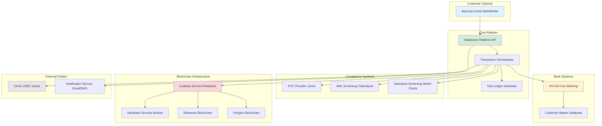
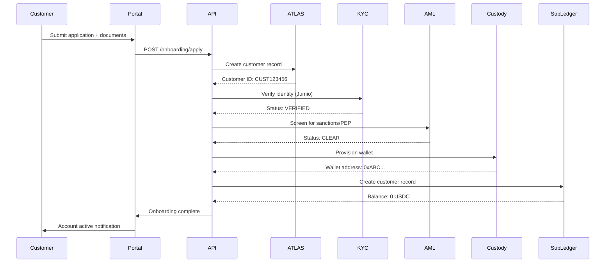
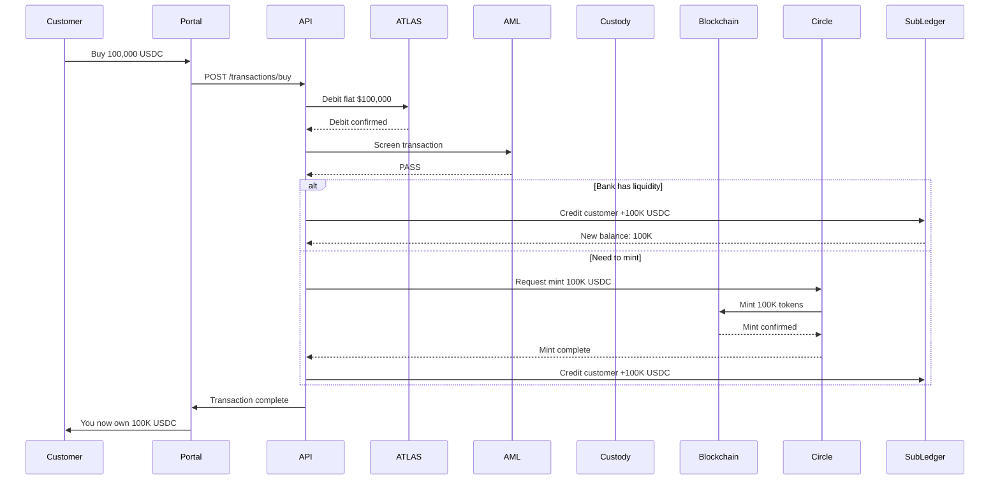
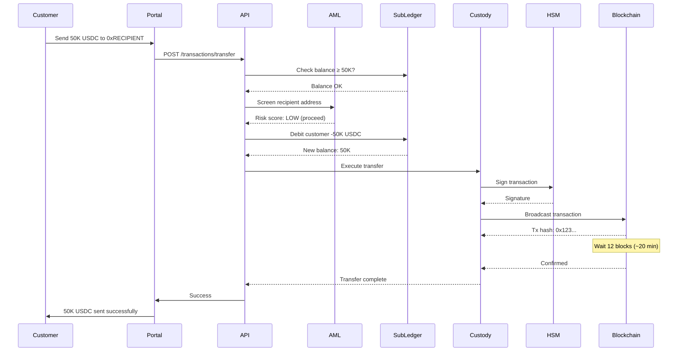
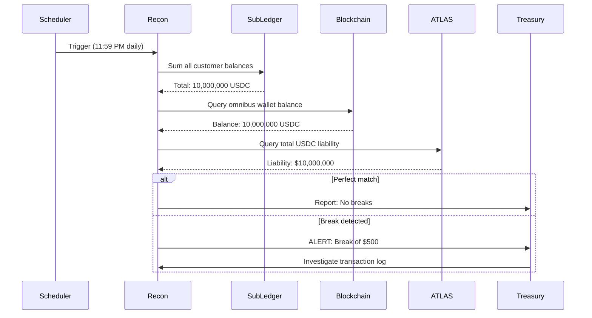
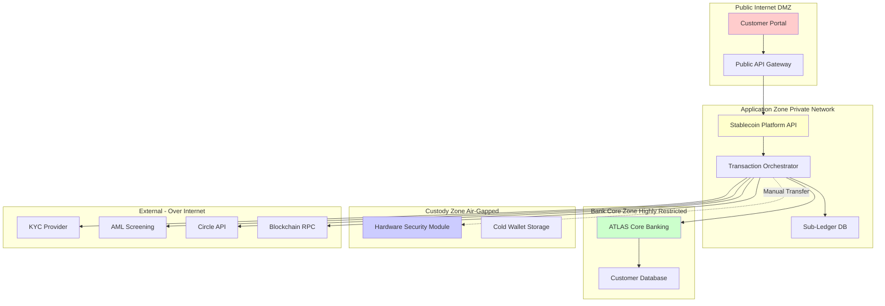

# SYSTEM INTEGRATION MAP
## Data Flow & Integration Architecture

**Last Updated:** February 2026

---

## 📖 PURPOSE

This document visualizes **how all systems connect** and **what data flows between them** in our stablecoin platform.

---

## 🏗️ HIGH-LEVEL SYSTEM ARCHITECTURE

---

## 🔄 DATA FLOWS BY PROCESS

### 1. CUSTOMER ONBOARDING FLOW

**Key Data Exchanged:**
- **To ATLAS:** Customer name, address, entity type, tax ID
- **To KYC:** ID document images, selfie, date of birth
- **To AML:** Full customer profile + source of funds
- **To Custody:** Customer ID (receives wallet address)
- **To Sub-Ledger:** Customer ID, wallet address, initial balance (0)

---

### 2. BUY STABLECOIN FLOW

**Key Data Exchanged:**
- **To ATLAS:** Debit instruction (customer ID, amount, idempotency key)
- **To AML:** Transaction details (amount, customer, purpose)
- **To Circle (if mint needed):** Mint amount, bank's omnibus wallet address
- **To Sub-Ledger:** Credit entry (customer ID, amount, timestamp, transaction ID)

---

### 3. TRANSFER (ON-CHAIN) FLOW

**Key Data Exchanged:**
- **To AML:** Recipient address, amount, customer info (Travel Rule if >$1K)
- **To Sub-Ledger:** Debit entry (customer ID, amount, recipient, tx hash)
- **To Custody:** Transfer instruction (amount, recipient address, gas limit)
- **To Blockchain:** Signed transaction (from omnibus wallet, to recipient, amount)

---

### 4. DAILY RECONCILIATION FLOW

**Key Data Exchanged:**
- **From Sub-Ledger:** Sum of all customer balances, transaction log
- **From Blockchain:** Omnibus wallet balance, transaction history (last 24h)
- **From ATLAS:** Total USDC liability account balance
- **To Treasury:** Reconciliation report (PDF), break alerts (if any)

---

## 🔌 INTEGRATION SPECIFICATIONS

### ATLAS (Core Banking) Integration

**Protocol:** REST API over HTTPS
**Authentication:** Mutual TLS + API Key
**Endpoints Used:**

| Endpoint | Purpose | Data Sent | Data Received |
|----------|---------|-----------|---------------|
| `POST /accounts/debit` | Debit fiat when customer buys USDC | Customer ID, amount, idempotency key | Transaction ID, new balance |
| `POST /accounts/credit` | Credit fiat when customer sells USDC | Customer ID, amount, idempotency key | Transaction ID, new balance |
| `GET /accounts/balance` | Check customer fiat balance | Customer ID | Available balance, currency |
| `POST /customers/create` | Create new customer record | Full customer profile | Customer ID |

**Error Handling:**
- Network timeout: 30 seconds, retry 3 times with exponential backoff
- Idempotency: All requests include unique key to prevent duplicates
- Circuit breaker: If 5 consecutive failures, pause 5 minutes

---

### KYC Provider (Jumio) Integration

**Protocol:** REST API over HTTPS
**Authentication:** API Secret Key
**Endpoints Used:**

| Endpoint | Purpose | Data Sent | Data Received |
|----------|---------|-----------|---------------|
| `POST /verifications` | Initiate ID verification | Customer email, redirect URL | Verification ID |
| `GET /verifications/{id}` | Check verification status | Verification ID | Status (PENDING/SUCCESS/FAILED), extracted data |
| `Webhook /callbacks/jumio` | Receive real-time updates | (Jumio sends to us) | Status change notifications |

**Data Received:**
- Full name (from ID document)
- Date of birth
- Document number
- Expiry date
- Verification status
- Fraud risk score

---

### AML Screening (Chainalysis) Integration

**Protocol:** REST API over HTTPS
**Authentication:** API Key
**Endpoints Used:**

| Endpoint | Purpose | Data Sent | Data Received |
|----------|---------|-----------|---------------|
| `POST /v2/entities` | Register customer entity | Name, address, DOB | Entity ID |
| `POST /v2/transfers` | Screen transaction | Amount, sender, recipient address | Risk score (0-100), risk factors |
| `GET /v2/addresses/{address}` | Check address risk | Blockchain address | Risk category (LOW/MEDIUM/HIGH/SEVERE) |

**Risk Thresholds:**
- 0-30: LOW (auto-approve)
- 31-70: MEDIUM (manual review)
- 71-90: HIGH (compliance approval required)
- 91-100: SEVERE (auto-block)

---

### Custody Service (Fireblocks) Integration

**Protocol:** REST API over HTTPS
**Authentication:** API Key + Signature (using private key)
**Endpoints Used:**

| Endpoint | Purpose | Data Sent | Data Received |
|----------|---------|-----------|---------------|
| `POST /v1/vaults/accounts` | Create new vault | Account name | Vault ID, deposit addresses |
| `POST /v1/transactions` | Initiate transfer | Amount, recipient, asset (USDC), gas fee | Transaction ID |
| `GET /v1/transactions/{id}` | Check transaction status | Transaction ID | Status (SUBMITTED/CONFIRMED/FAILED) |
| `GET /v1/vault/accounts/{id}` | Get vault balance | Vault ID | Balance by asset |

**Security:**
- All API calls signed with bank's private key
- HSM approval required for transactions >$1M
- Fireblocks MPC (multi-party computation) prevents single point of failure

---

### Circle (USDC Issuer) Integration

**Protocol:** REST API over HTTPS
**Authentication:** API Key + Bearer Token
**Endpoints Used:**

| Endpoint | Purpose | Data Sent | Data Received |
|----------|---------|-----------|---------------|
| `POST /v1/mints` | Request USDC mint | Amount, blockchain, destination wallet | Mint ID, estimated time |
| `POST /v1/redemptions` | Request USDC redemption | Amount, blockchain, bank account details | Redemption ID, settlement date |
| `GET /v1/mints/{id}` | Check mint status | Mint ID | Status (PENDING/COMPLETE), tx hash |
| `GET /v1/balances` | Check our USDC holdings | (none) | Balance by wallet |

**Settlement:**
- Mints: T+0 (same day if requested before 3 PM ET)
- Redemptions: T+1 (next business day fiat settlement)

---

## 📊 DATA STORAGE MATRIX

### What Data Lives Where

| Data Type | Stored In | Why | Retention |
|-----------|-----------|-----|-----------|
| **Customer PII** (name, address, DOB) | ATLAS + Customer DB | Source of truth | 7 years post-closure |
| **USDC Balances** | Sub-Ledger | Real-time tracking | 10 years |
| **Fiat Balances** | ATLAS | Core banking system | 10 years |
| **Transaction History** | Sub-Ledger + ATLAS | Dual record for reconciliation | 10 years |
| **Blockchain Transactions** | Ethereum/Polygon (immutable) | Public record | Forever (immutable) |
| **KYC Documents** | Encrypted storage (AWS S3) | Compliance requirement | 7 years post-closure |
| **AML Screening Results** | Compliance Database | Audit trail | 7 years |
| **Wallet Private Keys** | HSM (Fireblocks) | Security | Until wallet retired |
| **API Logs** | Logging Service (Splunk) | Troubleshooting | 1 year |
| **Reconciliation Reports** | Treasury Database | Operational control | 10 years |

---

## 🔐 SECURITY ZONES

**Access Control:**
- **DMZ → Application Zone:** API Gateway with rate limiting, WAF
- **Application → Core Banking:** Dedicated private link, mutual TLS
- **Application → Custody:** Manual approval for transactions >$1M
- **Custody → Cold Wallet:** Physical presence required (2 authorized personnel)

---

## 🔗 INTEGRATION PATTERNS

### Pattern 1: Synchronous (Real-Time)
**Used for:** Balance checks, AML screening, fiat debit/credit
**Behavior:** API call → Wait for response → Return to customer
**Timeout:** 30 seconds max

### Pattern 2: Asynchronous (Background)
**Used for:** Blockchain transactions, KYC verification, reconciliation
**Behavior:** Submit job → Return job ID → Poll for status
**Duration:** Minutes to hours

### Pattern 3: Event-Driven (Webhooks)
**Used for:** Blockchain confirmations, KYC status updates
**Behavior:** External system calls our webhook when event occurs
**Handling:** Queue message → Process → Acknowledge

---

## 🛠️ DISASTER RECOVERY

### System Failover Strategy

| Component | Primary | Secondary | Failover Time | RPO | RTO |
|-----------|---------|-----------|---------------|-----|-----|
| **Stablecoin API** | AWS us-east-1 | AWS us-west-2 | <5 min (auto) | <1 min | <15 min |
| **Sub-Ledger DB** | Primary (master) | Read replica | <1 min (auto) | <10 sec | <5 min |
| **ATLAS** | Data center A | Data center B | Manual (30 min) | 0 | 4 hours |
| **Custody (Fireblocks)** | Multi-region | N/A (Fireblocks handles DR) | Transparent | 0 | 0 |
| **Blockchain** | Infura RPC | Alchemy RPC | <10 sec (auto) | N/A | <1 min |

**RPO:** Recovery Point Objective (max data loss)
**RTO:** Recovery Time Objective (max downtime)

---

## 📈 MONITORING & OBSERVABILITY

### Key Metrics Tracked

| Metric | Threshold | Alert Level | Action |
|--------|-----------|-------------|---------|
| **API Latency (p99)** | >5 seconds | WARNING | Investigate slow endpoints |
| **Transaction Success Rate** | <99% | CRITICAL | Check ATLAS/blockchain connectivity |
| **Reconciliation Breaks** | >$100 | CRITICAL | Immediate treasury investigation |
| **AML Screening Time** | >10 seconds | WARNING | Check Chainalysis API health |
| **Blockchain Confirmation Time** | >45 minutes | WARNING | Check gas fees, network congestion |

**Monitoring Tools:**
- Application: DataDog (APM)
- Infrastructure: AWS CloudWatch
- Blockchain: Etherscan alerts
- Security: Splunk (SIEM)

---

## 🔗 RELATED DOCUMENTS

- [Architecture Diagram](./architecture/SYSTEM_CONTEXT_DIAGRAM.md)
- [API Contracts](./contracts/ATLAS_API_CONTRACTS.md)
- [Process Flows](./flows/ALL_FLOWS_INDEX.md)

---

**Document Owner:** Enterprise Architecture Team
**Version:** 1.0
