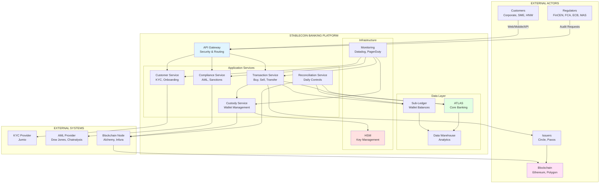

# SYSTEM CONTEXT DIAGRAM
## Stablecoin Banking Platform

**Document Type:** Architecture - System Context
**Audience:** Enterprise Architects, CTO, External Auditors
**Last Updated:** February 2026

---

## PURPOSE

This document provides a high-level view of the stablecoin banking platform and its interactions with external systems and actors.

---

## SYSTEM CONTEXT OVERVIEW

### External Actors

| Actor | Type | Interaction | Criticality |
|-------|------|-------------|-------------|
| **Customers** | Corporate, SME, HNW | Buy/Sell/Transfer stablecoins | P0 (Critical) |
| **Regulators** | FinCEN, FCA, ECB, MAS, etc. | Receive reports, conduct audits | P0 (Critical) |
| **Issuers** | Circle, Paxos | Mint/Burn stablecoins | P0 (Critical) |
| **Blockchain Networks** | Ethereum, Polygon | Store/transfer tokens | P0 (Critical) |
| **Custody Providers** | Fireblocks, BitGo | Key management | P0 (Critical) |
| **KYC/AML Vendors** | Jumio, Chainalysis | Identity verification, screening | P0 (Critical) |

---

## HIGH-LEVEL SYSTEM CONTEXT



---

## SYSTEM BOUNDARIES

### What's INSIDE Our System

| Component | Responsibility | Ownership |
|-----------|----------------|-----------|
| **API Gateway** | Authentication, rate limiting, routing | Bank (AWS API Gateway) |
| **Microservices** | Business logic (customer, transaction, compliance, custody, reconciliation) | Bank (Custom development) |
| **ATLAS** | Fiat ledger, general ledger, customer accounts | Bank (Existing core banking) |
| **Sub-Ledger** | Stablecoin wallet balances (internal tracking) | Bank (Custom PostgreSQL) |
| **HSM** | Private key storage and signing | Bank (AWS CloudHSM or Fireblocks) |
| **Monitoring** | System health, alerts, logs | Bank (Datadog, PagerDuty) |

### What's OUTSIDE Our System

| External System | Responsibility | Dependency Level |
|----------------|----------------|------------------|
| **Circle (Issuer)** | Mint/burn USDC, hold reserves | Critical (cannot operate without) |
| **Ethereum Mainnet** | Token transfers, immutable ledger | Critical (blockchain infrastructure) |
| **Alchemy/Infura** | Blockchain node access (RPC) | High (need reliable node access) |
| **Jumio** | Identity verification (KYC) | High (required for onboarding) |
| **Chainalysis** | Blockchain analytics, AML screening | High (compliance requirement) |
| **Fireblocks** | Multi-party computation custody (optional) | Medium (can use own HSM) |

---

## DATA FLOWS

### Customer Buy Flow (Simplified)

```
Customer → API Gateway → Transaction Service → Compliance Service (AML)
                             ↓
                          ATLAS (debit USD)
                             ↓
                          Custody Service → HSM (sign) → Blockchain (allocate USDC)
                             ↓
                          Sub-Ledger (credit customer wallet)
                             ↓
                          Customer (confirmation)
```

### Daily Reconciliation Flow

```
Reconciliation Service → Sub-Ledger (query all balances)
                       → Blockchain Node (query omnibus wallet)
                       → ATLAS (query fiat accounts)
                       → Compare & Generate Report
                       → Alert if mismatch
```

---

## INTEGRATION POINTS

### Inbound Integrations (Systems Calling Us)

| System | Protocol | Frequency | Purpose |
|--------|----------|-----------|---------|
| **Customer Portal** | HTTPS (REST) | Real-time | Buy/Sell/Transfer requests |
| **Corporate API Clients** | HTTPS (REST + OAuth2) | Real-time | Programmatic transactions |
| **ATLAS** | SOAP/REST | Real-time + Batch | Fiat account notifications |
| **Issuers (Circle)** | Webhook (HTTPS) | Event-driven | Mint/Burn confirmations |

### Outbound Integrations (We Call External Systems)

| System | Protocol | Frequency | Purpose |
|--------|----------|-----------|---------|
| **ATLAS** | SOAP/REST | Real-time + Daily batch | Debit/credit accounts, GL posting |
| **Jumio** | REST API | Per onboarding | Identity verification |
| **Chainalysis** | REST API | Real-time + Daily batch | AML screening, wallet risk scoring |
| **Circle API** | REST API | On-demand | Request mint/burn |
| **Blockchain Node** | JSON-RPC (HTTPS) | Real-time | Query balances, send transactions |
| **Regulators** | SFTP / Portal Upload | Quarterly | SAR, CTR, regulatory reports |

---

## SECURITY ZONES

### DMZ (Demilitarized Zone)
- **API Gateway** (public-facing)
- **Web Application Firewall (WAF)**
- **DDoS Protection (Cloudflare)**

### Application Zone (Private Subnet)
- **Microservices** (not directly accessible from internet)
- **Internal APIs**

### Data Zone (Highly Restricted)
- **ATLAS** (access via application zone only)
- **Sub-Ledger DB** (encrypted at rest)
- **HSM** (separate security domain)

### External Zone
- **Blockchain** (public, but read-only queries)
- **Third-party SaaS** (Jumio, Chainalysis - HTTPS only)

---

## DISASTER RECOVERY

### RTO/RPO Targets

| Component | RTO (Recovery Time) | RPO (Recovery Point) | DR Strategy |
|-----------|---------------------|----------------------|-------------|
| **API Gateway** | 5 minutes | 0 (stateless) | Multi-region (AWS) |
| **Microservices** | 15 minutes | 0 (stateless) | Kubernetes auto-healing |
| **ATLAS** | 1 hour | 15 minutes | Active-active data centers |
| **Sub-Ledger** | 30 minutes | 15 minutes | PostgreSQL streaming replication |
| **HSM** | 1 hour | 0 (keys backed up) | Multi-HSM cluster (3-of-5) |

### Failover Procedures

**Scenario: AWS US-East-1 Region Outage**
1. DNS failover to US-West-2 (automatic, 2 minutes)
2. Kubernetes pods start in backup region (5 minutes)
3. Sub-Ledger promotes read replica to primary (5 minutes)
4. Resume customer transactions (Total: 12 minutes)

---

## CAPACITY PLANNING

### Current Capacity (Phase-1)

| Metric | Current | Phase-1 Target | Phase-2 Target |
|--------|---------|----------------|----------------|
| **Customers** | 0 | 50 (corporate) | 500 (corporate + SME) |
| **Transactions/day** | 0 | 1,000 | 10,000 |
| **AUM (Assets Under Management)** | $0 | $500M | $5B |
| **API Requests/sec** | 0 | 100 | 1,000 |
| **Database Size** | 0 GB | 50 GB | 500 GB |

### Scalability Strategy

- **Horizontal Scaling:** Add more Kubernetes pods (auto-scaling based on CPU/memory)
- **Database Scaling:** Read replicas for queries, sharding if >1TB
- **Caching:** Redis for hot data (wallet balances, FX rates)
- **CDN:** Cloudflare for static assets (web portal)

---

## COMPLIANCE & AUDIT

### Audit Trail

**All system interactions logged:**
- API calls (who, what, when, from where)
- Database changes (before/after values)
- HSM signing operations (transaction hash, signers)
- Compliance decisions (approved/rejected, reasoning)

**Log Retention:** 7 years (immutable, AWS S3 Glacier)

**Log Analysis:** ElasticSearch (searchable, alerting)

---

## DEPENDENCIES & ASSUMPTIONS

### Critical Dependencies

1. **Circle remains solvent** → Can mint/burn USDC
2. **Ethereum mainnet operational** → Can process transactions
3. **Alchemy/Infura available** → Can query blockchain
4. **ATLAS integration functional** → Can debit/credit fiat

### Key Assumptions

1. **Regulatory approval obtained** (FinCEN MSB, State MTLs)
2. **Audit completed** (SOC2 Type 2, financial audit)
3. **Insurance in place** (custody, cyber, E&O)
4. **Staff trained** (blockchain, compliance, customer support)

---

## NEXT STEPS

- **Detailed architecture:** See `LOGICAL_ARCHITECTURE.md`
- **Component design:** See `COMPONENT_DESIGN.md`
- **Integration specs:** See `../contracts/` folder

---

**Document Owner:** Enterprise Architecture Team
**Review Frequency:** Quarterly or upon major changes
**Version:** 1.0
