# CUSTOMER ONBOARDING FLOW
## From Application to Wallet Provisioning

**Document Type:** Business Process Flow
**Last Updated:** February 2026

---

## OVERVIEW

**Process:** New customer applies for stablecoin services
**Duration:** 1-10 days (depending on customer type and risk)
**Actors:** Customer, KYC Team, Compliance, Treasury, System

---

## FLOW DIAGRAM

```mermaid
sequenceDiagram
    participant C as Customer
    participant Portal as Banking Portal
    participant CustSvc as Customer Service
    participant KYC as KYC Provider<br/>(Jumio)
    participant AML as AML System<br/>(Dow Jones)
    participant Compliance as Compliance Team
    participant ATLAS as ATLAS<br/>Core Banking
    participant Custody as Custody Service
    participant SubLedger as Sub-Ledger

    Note over C,SubLedger: PHASE 1: APPLICATION SUBMISSION (Day 0)

    C->>Portal: 1. Navigate to "Apply for Stablecoin Services"
    Portal->>C: 2. Display application form
    C->>Portal: 3. Submit application<br/>(Company details, documents)
    Portal->>CustSvc: 4. Create application record
    CustSvc->>ATLAS: 5. Check if existing customer
    ATLAS-->>CustSvc: 6. Customer found (existing banking customer)
    CustSvc->>CustSvc: 7. Generate Application ID: APP-12345
    CustSvc-->>Portal: 8. Confirmation
    Portal-->>C: 9. "Application received. ID: APP-12345"

    Note over C,SubLedger: PHASE 2: IDENTITY VERIFICATION (Day 0-1)

    CustSvc->>KYC: 10. Initiate KYC check
    KYC->>KYC: 11. Verify documents<br/>(Passport, Business registration)
    KYC->>KYC: 12. Facial recognition / Liveness check

    alt Documents Valid
        KYC-->>CustSvc: 13. KYC APPROVED ✅
    else Documents Invalid
        KYC-->>CustSvc: 13. KYC REJECTED ❌<br/>"Document not readable"
        CustSvc-->>C: Request re-submission
        Note over C: Customer resubmits → Loop to step 10
    end

    Note over C,SubLedger: PHASE 3: AML SCREENING (Day 1)

    CustSvc->>AML: 14. Screen customer
    AML->>AML: 15a. Check sanctions lists (OFAC, UN, EU)
    AML->>AML: 15b. PEP screening
    AML->>AML: 15c. Adverse media check
    AML->>AML: 15d. Country risk assessment

    alt Low Risk
        AML-->>CustSvc: 16. Risk Score: LOW (15/100) ✅
        Note over CustSvc: Auto-approve (no manual review)
    else Medium Risk
        AML-->>CustSvc: 16. Risk Score: MEDIUM (55/100) ⚠️
        CustSvc->>Compliance: 17. Queue for manual review
        Compliance->>Compliance: 18. Review customer profile
        alt Approve
            Compliance-->>CustSvc: 19. APPROVED ✅
        else Reject
            Compliance-->>CustSvc: 19. REJECTED ❌
            CustSvc-->>C: Decline notification
            Note over C: END FLOW (Application declined)
        end
    else High Risk
        AML-->>CustSvc: 16. Risk Score: HIGH (85/100) 🔴
        AML-->>CustSvc: Sanctions hit: OFAC-SDN match
        CustSvc->>Compliance: 17. ESCALATE to senior compliance
        Compliance-->>CustSvc: 19. REJECTED ❌ (Sanctions)
        Compliance->>Compliance: File SAR
        CustSvc-->>C: "Application cannot be approved"
        Note over C: END FLOW (Sanctions rejection)
    end

    Note over C,SubLedger: PHASE 4: ACCOUNT SETUP (Day 1-2)

    CustSvc->>ATLAS: 20. Link stablecoin services to customer
    ATLAS->>ATLAS: 21. Create sub-account<br/>"USDC Services"
    ATLAS-->>CustSvc: 22. Account linked

    CustSvc->>Custody: 23. Provision wallet
    Custody->>Custody: 24. Generate key pair (HSM)
    Custody->>SubLedger: 25. Register wallet<br/>Customer: CUST123456<br/>Wallet: 0xABC...DEF
    SubLedger-->>Custody: 26. Wallet registered
    Custody-->>CustSvc: 27. Wallet provisioned

    Note over C,SubLedger: PHASE 5: CUSTOMER NOTIFICATION (Day 2)

    CustSvc->>Portal: 28. Activate customer account
    CustSvc->>C: 29. Email: "Account approved!<br/>You can now buy/sell stablecoins"
    CustSvc->>C: 30. SMS: "Stablecoin account active"

    C->>Portal: 31. Log in
    Portal-->>C: 32. Display dashboard<br/>Balance: 0 USDC<br/>Status: Active ✅

    Note over C,SubLedger: ✅ ONBOARDING COMPLETE
```



---

## DETAILED STEPS

### Phase 1: Application Submission (Day 0)

**Step 1-3: Customer Applies**
- Customer navigates to stablecoin services page
- Fills out application form:
  - Company name, registration number, address
  - Beneficial owners (if >25% ownership)
  - Purpose of stablecoin use
  - Expected monthly volume
  - Upload documents: Certificate of incorporation, board resolution, passport scans

**Step 4-9: Application Created**
- System validates form (all required fields present)
- Creates application record in CRM
- Checks if customer already banks with us (expedited if yes)
- Generates unique Application ID
- Sends confirmation email

---

### Phase 2: Identity Verification (Day 0-1)

**Step 10-13: KYC Check**
- System sends documents to Jumio (KYC provider)
- Jumio performs:
  - Document authenticity check (tamper detection)
  - OCR extraction (name, DOB, document number)
  - Facial recognition (if individual)
  - Liveness detection (photo is recent, not fake)

**Outcomes:**
- ✅ **Approved:** Documents valid, face matches, no tampering
- ❌ **Rejected:** Document blurry, expired, tampered, face mismatch
- ⏳ **Manual Review:** Edge case (Jumio confidence <90%)

---

### Phase 3: AML Screening (Day 1)

**Step 14-16: Automated Screening**
- Query sanctions databases:
  - OFAC SDN (US)
  - UN Consolidated List
  - EU Sanctions List
  - UK HMT List
- PEP check (Politically Exposed Person)
- Adverse media (negative news articles)
- Country risk (is customer from high-risk jurisdiction?)

**Risk Scoring:**
| Score | Risk Level | Action |
|-------|------------|--------|
| 0-30 | Low | Auto-approve |
| 31-70 | Medium | Manual review (4-24 hours) |
| 71-100 | High | Senior compliance review OR auto-reject |

**Step 17-19: Manual Review (If Medium/High Risk)**
- Compliance analyst reviews:
  - Why is customer flagged? (PEP, high-risk country, large expected volume?)
  - Business rationale (legitimate use case?)
  - Supporting documents (contracts, invoices)
- Decision:
  - **Approve:** Legitimate business, acceptable risk
  - **Approve with EDD:** Require Enhanced Due Diligence (quarterly reviews, transaction monitoring)
  - **Reject:** Unacceptable risk (sanctions, no legitimate use case)

---

### Phase 4: Account Setup (Day 1-2)

**Step 20-22: ATLAS Integration**
- Create stablecoin sub-account in ATLAS
- Link to customer's existing banking relationship
- Set up fee billing (monthly custody fee, transaction fees)

**Step 23-27: Wallet Provisioning**
- Custody service generates new Ethereum key pair
- Private key stored in HSM (Hardware Security Module)
- Public address registered in sub-ledger
- Map: Customer ID ↔ Wallet Address (stored off-chain, deletable per GDPR)

**Example:**
```
Customer ID: CUST123456
Wallet Address: 0xABCDEF1234567890ABCDEF1234567890ABCDEF12
Initial Balance: 0 USDC
Status: Active
```

---

### Phase 5: Customer Notification (Day 2)

**Step 28-32: Go-Live**
- Account activated in all systems
- Customer receives:
  - **Email:** Welcome, instructions, T&Cs link, support contact
  - **SMS:** Short confirmation with portal link
- Customer logs in → Sees active account, 0 USDC balance

---

## TIMING BY CUSTOMER TYPE

| Customer Type | Typical Duration | Factors |
|---------------|------------------|---------|
| **Corporate (Existing)** | 1-2 days | Already KYC'd as banking customer |
| **Corporate (New)** | 5-7 days | Full KYC + AML + EDD |
| **SME** | 3-5 days | Simpler structure, faster |
| **High-Risk (PEP, High-Risk Country)** | 10-15 days | Enhanced due diligence |

---

## FAILURE SCENARIOS

### Scenario 1: Sanctions Hit

**Detection:** Step 16 (AML screening returns OFAC match)

**Action:**
1. Immediately REJECT application
2. Do NOT onboard customer
3. File SAR (Suspicious Activity Report) within 30 days
4. Notify senior compliance + legal
5. Send generic rejection to customer: "Unable to approve at this time"
6. Do NOT explain reason (legal requirement)

---

### Scenario 2: Customer Unresponsive

**Detection:** Step 13 (KYC rejected, customer asked to resubmit, no response after 7 days)

**Action:**
1. Send reminder email (Day 7, Day 14)
2. If no response after 30 days → Close application
3. Notify customer: "Application expired due to inactivity"
4. Customer can reapply (starts from scratch)

---

### Scenario 3: Document Fraud Detected

**Detection:** Step 12 (Jumio detects tampered passport)

**Action:**
1. REJECT application immediately
2. Flag customer in CRM (do not allow reapplication)
3. File SAR
4. Potential: Report to law enforcement (if serious fraud)

---

## COMPLIANCE CHECKLIST

**Regulator Requirements Met:**
- ✅ CIP (Customer Identification Program) - US Bank Secrecy Act
- ✅ Beneficial Ownership Rule (FinCEN) - For corporates >25% ownership
- ✅ PEP Screening - FATF Recommendation 12
- ✅ Sanctions Screening - OFAC, UN, EU
- ✅ Risk-Based Approach - FATF Recommendation 10
- ✅ Recordkeeping - 7 years (application, KYC docs, decisions)

---

## TESTING SCENARIOS

### Test Case 1: Happy Path (Low-Risk Corporate)
- **Given:** Existing banking customer, low-risk country (USA)
- **When:** Submits application with valid documents
- **Then:** Approved in 1-2 days, wallet provisioned

### Test Case 2: Medium-Risk (PEP)
- **Given:** Customer is PEP (government official's family member)
- **When:** AML screening flags PEP
- **Then:** Manual review, EDD required, approved after 5 days

### Test Case 3: High-Risk (Sanctions Hit)
- **Given:** Customer on OFAC SDN list
- **When:** AML screening detects match
- **Then:** Auto-reject, SAR filed, no onboarding

### Test Case 4: Document Rejection
- **Given:** Customer submits blurry passport photo
- **When:** Jumio rejects document
- **Then:** Customer notified, asked to resubmit, approval continues after valid docs

---

## METRICS

| Metric | Target | Measurement |
|--------|--------|-------------|
| **Time to Onboard (Low-Risk)** | <2 days | Application submitted → Account active |
| **KYC Approval Rate** | >95% | Approved / Total applications |
| **False Positive Rate (AML)** | <5% | Manual reviews that result in approval / Total reviews |
| **Customer Satisfaction** | >4/5 | Post-onboarding survey |

---

**Document Owner:** Business Operations Team
**Version:** 1.0
