# DAILY RECONCILIATION FLOW
## Ensuring Sub-Ledger Matches Blockchain

**Document Type:** Operational Process Flow
**Last Updated:** February 2026

---

## OVERVIEW

**Process:** Daily reconciliation to ensure internal records match on-chain reality
**Frequency:** Hourly (monitoring) + Daily (formal report)
**Actors:** Reconciliation Service, Treasury Team
**Critical:** Detects discrepancies before they become material

---

## FLOW DIAGRAM

```mermaid
sequenceDiagram
    participant Scheduler as Cron Scheduler
    participant ReconSvc as Reconciliation<br/>Service
    participant SubLedger as Sub-Ledger<br/>Database
    participant Blockchain as Ethereum<br/>Mainnet
    participant ATLAS as ATLAS<br/>Core Banking
    participant Treasury as Treasury Team
    participant Ops as Operations Team

    Note over Scheduler,Ops: PHASE 1: SCHEDULED TRIGGER (Daily 11:59 PM)

    Scheduler->>ReconSvc: 1. Trigger daily reconciliation<br/>Date: 2026-02-01

    Note over Scheduler,Ops: PHASE 2: DATA COLLECTION

    par Query All Systems
        ReconSvc->>SubLedger: 2. Query all customer balances
        SubLedger-->>ReconSvc: 3. Total: 5,000,000 USDC<br/>(1,000 customers)
    and
        ReconSvc->>Blockchain: 4. Query omnibus wallet<br/>Address: 0xABC...DEF
        Blockchain-->>ReconSvc: 5. Balance: 5,000,000 USDC
    and
        ReconSvc->>ATLAS: 6. Query fiat accounts<br/>All customers
        ATLAS-->>ReconSvc: 7. Total deposits: $100M USD
    end

    Note over Scheduler,Ops: PHASE 3: COMPARISON & ANALYSIS

    ReconSvc->>ReconSvc: 8. Compare balances

    alt ✅ PERFECT MATCH
        ReconSvc->>ReconSvc: 9. Sub-Ledger = Blockchain<br/>5,000,000 = 5,000,000 ✅
        ReconSvc->>ReconSvc: 10. Generate PASS report
        ReconSvc->>Treasury: 11. Email: "Daily recon PASSED"<br/>Attachment: report.pdf
        Note over Treasury: No action needed
    end

    alt ⚠️ MINOR BREAK (<$100)
        ReconSvc->>ReconSvc: 9. Sub-Ledger: 5,000,000.50 USDC<br/>Blockchain: 5,000,000.00 USDC<br/>Difference: 0.50 USDC ($0.50)
        ReconSvc->>ReconSvc: 10. Auto-resolve (rounding)
        ReconSvc->>ReconSvc: Adjust sub-ledger -0.50 USDC
        ReconSvc->>Treasury: 11. Email: "Minor break auto-resolved"
        Note over Treasury: Review report (informational)
    end

    alt 🔴 MATERIAL BREAK (>$100)
        ReconSvc->>ReconSvc: 9. Sub-Ledger: 5,010,000 USDC<br/>Blockchain: 5,000,000 USDC<br/>🚨 Difference: 10,000 USDC ($10,000)

        ReconSvc->>ReconSvc: 10. CRITICAL ALERT triggered

        par Immediate Actions
            ReconSvc->>Treasury: 11a. 🔴 URGENT: Recon break $10K
            ReconSvc->>Ops: 11b. Page on-call engineer
            ReconSvc->>ReconSvc: 11c. Log to incident system
        end

        Note over Scheduler,Ops: PHASE 4: INVESTIGATION (Within 4 Hours)

        Treasury->>ReconSvc: 12. Query transaction logs<br/>Last 24 hours
        ReconSvc-->>Treasury: 13. Transaction list (CSV)

        Treasury->>Treasury: 14. Analyze discrepancy

        alt ROOT CAUSE: Failed On-Chain TX
            Treasury->>Treasury: 15. Found: TX-12345 debited sub-ledger<br/>but blockchain TX failed
            Treasury->>SubLedger: 16. Manual adjustment<br/>Credit +10,000 USDC to customer
            SubLedger-->>Treasury: 17. Adjusted ✅
            Treasury->>ReconSvc: 18. Re-run reconciliation
            ReconSvc->>ReconSvc: 19. Now matches ✅
            Treasury->>Treasury: 20. Document resolution<br/>(Case file, root cause, fix)
        end

        alt ROOT CAUSE: Unauthorized TX
            Treasury->>Treasury: 15. Found: Unknown on-chain TX<br/>10K USDC left omnibus wallet
            Treasury->>Treasury: 16. 🚨 SECURITY INCIDENT
            Treasury->>Ops: 17. ESCALATE: Possible hack
            Ops->>Ops: 18. Activate incident response
            Note over Ops: Freeze hot wallet, investigate
        end
    end

    Note over Scheduler,Ops: PHASE 5: REPORTING

    ReconSvc->>ReconSvc: 21. Generate daily report
    ReconSvc->>Treasury: 22. Email report (PDF + CSV)
    Treasury->>Treasury: 23. Review & sign off
    Treasury->>ATLAS: 24. Archive report (7 years retention)

    Note over Scheduler,Ops: ✅ RECONCILIATION COMPLETE
```



---

## DETAILED RECONCILIATION CHECKS

### Check 1: Sub-Ledger vs. Blockchain (Primary)

**Query Sub-Ledger:**
```sql
SELECT SUM(usdc_balance) AS total_usdc
FROM customer_wallets
WHERE status = 'active' AND currency = 'USDC';

Result: 5,000,000.00 USDC
```

**Query Blockchain:**
```javascript
const balance = await usdcContract.methods.balanceOf(OMNIBUS_WALLET_ADDRESS).call();
const balanceUSDC = balance / 1e6; // USDC has 6 decimals

Result: 5,000,000.00 USDC
```

**Comparison:**
```
Sub-Ledger: 5,000,000.00 USDC
Blockchain:  5,000,000.00 USDC
Difference:  0.00 USDC ✅ PASS
```

---

### Check 2: Customer-Level Reconciliation

**Purpose:** Ensure no individual customer has incorrect balance

**Process:**
```sql
-- For each customer, compare:
SELECT
  c.customer_id,
  c.wallet_balance_subledger,
  b.wallet_balance_blockchain,
  (c.wallet_balance_subledger - b.wallet_balance_blockchain) AS difference
FROM customer_wallets c
LEFT JOIN blockchain_balances b ON c.wallet_address = b.address
WHERE ABS(difference) > 0.01;

-- If any rows returned → Investigate those customers
```

---

### Check 3: Transaction Count Reconciliation

**Sub-Ledger Count:**
```sql
SELECT COUNT(*) FROM transactions WHERE date = '2026-02-01';
Result: 1,234 transactions
```

**Blockchain Count:**
```javascript
// Count on-chain transfers from/to omnibus wallet today
Result: 1,234 transactions
```

**Match?** ✅ Yes (expected)

---

### Check 4: ATLAS Fiat vs. Sub-Ledger USDC

**Purpose:** Ensure total customer assets (fiat + USDC) are reasonable

**Query:**
```sql
-- Sum all customer fiat balances
SELECT SUM(usd_balance) FROM atlas_accounts WHERE account_type = 'STABLECOIN_CUSTOMER';
Result: $50,000,000

-- Sum all customer USDC balances (convert to USD equivalent)
SELECT SUM(usdc_balance * 1.00) FROM customer_wallets;
Result: $5,000,000 (equivalent)

-- Total customer assets: $55M
-- Does this match our expectations? (Check historical trends)
```

---

## BREAK SEVERITY LEVELS

| Difference | Severity | Response Time | Action |
|------------|----------|---------------|--------|
| **$0 - $10** | None | N/A | Auto-pass, no action |
| **$10 - $100** | Minor | Review by EOD | Auto-resolve (rounding), log for review |
| **$100 - $10K** | Medium | Within 4 hours | Investigate, manual adjustment, document |
| **$10K - $100K** | High | Within 1 hour | URGENT investigation, freeze transactions if needed |
| **>$100K** | Critical | Immediate | EMERGENCY: Halt all operations, CEO notification |

---

## ROOT CAUSE ANALYSIS (Common Scenarios)

### Scenario 1: Failed On-Chain Transaction

**Symptoms:**
- Sub-ledger shows 5,010,000 USDC
- Blockchain shows 5,000,000 USDC
- Difference: 10,000 USDC (sub-ledger higher)

**Investigation:**
```sql
-- Find transactions that updated sub-ledger but not blockchain
SELECT * FROM transactions
WHERE status = 'COMPLETED'
  AND blockchain_tx_hash IS NULL
  AND amount = 10000;

Result: TX-12345 (Customer withdrawal)
```

**Root Cause:**
- Customer initiated withdrawal of 10K USDC
- Sub-ledger debited 10K (balance: 90K → 80K)
- Blockchain transaction was broadcasted BUT failed (due to gas spike)
- System marked as "COMPLETED" prematurely

**Fix:**
1. Re-credit customer's sub-ledger (+10,000 USDC)
2. Retry blockchain transaction OR notify customer of delay
3. **Process Improvement:** Don't mark "COMPLETED" until blockchain confirms

---

### Scenario 2: Duplicate Credit

**Symptoms:**
- Sub-ledger shows 5,010,000 USDC (higher)
- Blockchain shows 5,000,000 USDC

**Investigation:**
```sql
-- Find duplicate transactions
SELECT customer_id, amount, COUNT(*)
FROM transactions
WHERE date = '2026-02-01' AND type = 'BUY'
GROUP BY customer_id, amount
HAVING COUNT(*) > 1;

Result: Customer CUST123, 10,000 USDC, Count: 2
```

**Root Cause:**
- Customer's buy order was processed twice (idempotency failure)
- Fiat was debited once ($10K)
- USDC was credited twice (20K total instead of 10K)

**Fix:**
1. Debit customer's sub-ledger (-10,000 USDC, remove duplicate)
2. Verify fiat was only charged once (ATLAS check)
3. **Process Improvement:** Enforce idempotency keys strictly

---

### Scenario 3: Unauthorized Transaction (Security Incident)

**Symptoms:**
- Sub-ledger shows 5,000,000 USDC
- Blockchain shows 4,990,000 USDC (lower)
- Difference: 10,000 USDC missing from blockchain

**Investigation:**
```sql
-- Check blockchain for unknown transactions
SELECT * FROM blockchain_transactions
WHERE from_address = OMNIBUS_WALLET
  AND transaction_id NOT IN (SELECT blockchain_tx_hash FROM transactions);

Result: TxHash 0xUNKNOWN... sent 10,000 USDC to 0xHACKER...
```

**Root Cause:**
- 🚨 **SECURITY BREACH:** Unauthorized transaction from omnibus wallet
- Hot wallet private key may be compromised

**Fix:**
1. **IMMEDIATE:** Pause all transactions
2. Transfer remaining funds from hot wallet to cold wallet (emergency sweep)
3. Rotate all keys (generate new hot wallet)
4. Notify CFO, CTO, CISO, legal
5. File incident report with regulators (if material)
6. Contact insurance provider (custody insurance claim)
7. **Process Improvement:** Implement transaction signing approval (multi-sig for large amounts)

---

## AUTOMATION & MONITORING

### Hourly Monitoring (Proactive)

**Cron Job:** Runs every hour (1 AM, 2 AM, ..., 11 PM)

```python
# Pseudo-code
def hourly_recon_check():
    subledger_total = query_subledger_total()
    blockchain_total = query_omnibus_wallet()
    difference = abs(subledger_total - blockchain_total)

    if difference > 1000:  # $1,000 threshold
        alert_treasury_team(f"⚠️ Recon drift detected: ${difference}")
        log_to_dashboard(difference)
    else:
        log_to_dashboard(difference)  # Normal fluctuation
```

**Benefit:** Detect breaks within 1 hour (instead of waiting for EOD)

---

### Real-Time Alerts

**Triggers:**
- Any transaction >$100K → Immediate recon check after transaction
- Omnibus wallet balance drops >5% in 1 hour → Alert
- Sub-ledger balance increases without corresponding blockchain TX → Alert

---

## REGULATORY REQUIREMENTS

**SOX Compliance (US):**
- Daily reconciliation required (internal control)
- Breaks >$10K must be documented and resolved within 24 hours
- Quarterly: External auditor reviews reconciliation procedures

**MiCA (EU):**
- Reserve attestation required (monthly or quarterly depending on volume)
- Must demonstrate 1:1 backing at all times
- Breaks >€1M must be reported to regulator within 48 hours

**Internal Audit:**
- Annual review of reconciliation process
- Test 20 random days (recon reports)
- Verify all breaks were investigated and documented

---

## TESTING SCENARIOS

### Test 1: Perfect Match
- **Setup:** All systems synced
- **Expected:** Recon passes, report generated, treasury team notified (no action needed)

### Test 2: Rounding Error (<$10)
- **Setup:** Sub-ledger has 0.50 USDC extra (due to rounding in calculations)
- **Expected:** Auto-resolve, adjust sub-ledger, pass

### Test 3: Material Break ($10K)
- **Setup:** Simulate failed blockchain TX
- **Expected:** CRITICAL alert, treasury investigates within 4 hours, documents resolution

### Test 4: Unauthorized TX (Security Test)
- **Setup:** Simulate unknown blockchain transaction
- **Expected:** EMERGENCY alert, incident response activated, operations halted

---

## METRICS

| Metric | Target | Measurement |
|--------|--------|-------------|
| **Recon Pass Rate** | >99% | Days passed / Total days |
| **Break Resolution Time** | <4 hours | Time from detection to resolution |
| **Unresolved Breaks** | 0 | Open breaks at month-end |
| **False Positive Rate** | <1% | Alerts that were not real breaks |

---

**Document Owner:** Treasury Operations Team
**Version:** 1.0
