# ON-CHAIN TRANSFER FLOW
## Customer Sends Stablecoin to External Wallet

**Document Type:** Business Process Flow
**Last Updated:** February 2026

---

## OVERVIEW

**Process:** Customer transfers stablecoin to external blockchain address (not our customer)
**Duration:** 15-30 minutes
**Actors:** Customer, Portal, Compliance, Custody, Blockchain, External Wallet

---

## FLOW DIAGRAM

```mermaid
sequenceDiagram
    participant C as Customer
    participant Portal as Banking Portal
    participant TxSvc as Transaction Service
    participant Compliance as Compliance Service
    participant TravelRule as Travel Rule System<br/>(Notabene)
    participant Custody as Custody Service
    participant HSM as HSM<br/>Key Signing
    participant Blockchain as Ethereum<br/>Mainnet
    participant Analytics as Blockchain Analytics<br/>(Chainalysis)
    participant ExtWallet as External Wallet<br/>(Recipient)

    Note over C,ExtWallet: PHASE 1: INITIATION (Customer Input)

    C->>Portal: 1. Navigate to "Send USDC"
    Portal->>C: 2. Display send form
    C->>Portal: 3. Enter details<br/>To: 0x789...XYZ<br/>Amount: 50,000 USDC<br/>Note: "Payment for goods"
    Portal->>Portal: 4. Validate address format (checksum)

    alt Invalid Address
        Portal-->>C: ❌ "Invalid Ethereum address"
        Note over C: Customer corrects → Retry
    end

    Portal->>TxSvc: 5. Create transfer request<br/>TX-2026-02-01-555

    Note over C,ExtWallet: PHASE 2: BALANCE & LIMIT CHECKS

    TxSvc->>TxSvc: 6. Check customer balance<br/>Current: 100,000 USDC<br/>Requested: 50,000 USDC

    alt Insufficient Balance
        TxSvc-->>Portal: ❌ "Insufficient balance"
        Portal-->>C: "You have 100K USDC, cannot send 150K"
        Note over C: END FLOW (Rejected)
    end

    TxSvc->>TxSvc: 7. Check daily limit<br/>Limit: 250K USDC<br/>Today's sent: 50K<br/>This tx: 50K<br/>Total: 100K (OK ✅)

    alt Daily Limit Exceeded
        TxSvc-->>Portal: ❌ "Daily limit exceeded"
        Portal-->>C: "Daily limit: 250K, used: 50K, requested: 250K"
        Note over C: END FLOW (Rejected)
    end

    Note over C,ExtWallet: PHASE 3: RECIPIENT SCREENING

    TxSvc->>Analytics: 8. Screen recipient address<br/>0x789...XYZ
    Analytics->>Analytics: 9. Check against known entities<br/>- Sanctioned addresses<br/>- Mixers/Tumblers<br/>- Darknet markets<br/>- Ransomware addresses

    alt High-Risk Address (Sanctioned)
        Analytics-->>TxSvc: 🔴 RISK: HIGH (95/100)<br/>"Address on OFAC SDN list"
        TxSvc->>Compliance: 10. BLOCK transaction
        Compliance->>Compliance: File SAR
        TxSvc-->>Portal: ❌ "Transaction blocked"
        Portal-->>C: "Unable to complete transfer"
        Note over C: END FLOW (Blocked)
    end

    alt Medium-Risk (Mixer)
        Analytics-->>TxSvc: ⚠️ RISK: MEDIUM (65/100)<br/>"Address associated with mixer"
        TxSvc->>Compliance: 10. Queue for manual review
        Note over Compliance: Analyst reviews within 4 hours
        alt Compliance Approves
            Compliance-->>TxSvc: ✅ Approved (customer provided explanation)
        else Compliance Rejects
            Compliance-->>TxSvc: ❌ Rejected
            TxSvc-->>C: "Transfer declined"
            Note over C: END FLOW (Rejected)
        end
    end

    alt Low-Risk Address
        Analytics-->>TxSvc: ✅ RISK: LOW (10/100)<br/>"Unknown address, no flags"
        Note over TxSvc: Proceed to next phase
    end

    Note over C,ExtWallet: PHASE 4: TRAVEL RULE (If >$1,000)

    alt Amount > $1,000 (Travel Rule Applies)
        TxSvc->>Portal: 11. Request recipient details
        Portal->>C: 12. "Please provide recipient info:<br/>- Full name<br/>- Address<br/>- Reason for transfer"
        C->>Portal: 13. Enter recipient info<br/>Name: John Smith<br/>Address: 456 Oak St, NYC
        Portal->>TxSvc: 14. Submit recipient info

        TxSvc->>TravelRule: 15. Identify recipient VASP<br/>Query: Who owns 0x789...XYZ?
        TravelRule->>TravelRule: 16. Blockchain analysis + VASP registry

        alt Recipient VASP Found
            TravelRule-->>TxSvc: 17. VASP: Coinbase<br/>Contact: travel-rule@coinbase.com
            TxSvc->>TravelRule: 18. Send Travel Rule message<br/>Sender: ABC Corp<br/>Recipient: John Smith<br/>Amount: 50,000 USDC
            TravelRule->>ExtWallet: 19. Forward to Coinbase
            ExtWallet-->>TravelRule: 20. Acknowledged ✅
            TravelRule-->>TxSvc: 21. Travel Rule compliant ✅
        else Recipient VASP Unknown
            TravelRule-->>TxSvc: 17. ⚠️ Cannot identify recipient VASP
            TxSvc->>Compliance: 18. Risk-based decision
            Note over Compliance: Small amount (<$10K): Approve<br/>Large amount (>$50K): Reject or require proof
            alt Approved
                Compliance-->>TxSvc: ✅ Approve (below threshold)
            else Rejected
                Compliance-->>TxSvc: ❌ Reject (no VASP identified)
                TxSvc-->>C: "Cannot complete transfer"
                Note over C: END FLOW (Rejected)
            end
        end
    else Amount ≤ $1,000
        Note over TxSvc: Travel Rule does not apply (skip to Phase 5)
    end

    Note over C,ExtWallet: PHASE 5: EXECUTION (Blockchain Transaction)

    TxSvc->>Custody: 22. Prepare transaction<br/>From: Omnibus Wallet<br/>To: 0x789...XYZ<br/>Amount: 50,000 USDC
    Custody->>Custody: 23. Debit customer sub-ledger<br/>Balance: 100K → 50K USDC
    Custody->>Custody: 24. Construct Ethereum transaction

    Custody->>HSM: 25. Sign transaction
    HSM->>HSM: 26. Retrieve private key (secure)
    HSM->>HSM: 27. Sign with ECDSA
    HSM-->>Custody: 28. Signed transaction

    Custody->>Blockchain: 29. Broadcast transaction<br/>TxHash: 0xABC123...
    Blockchain->>Blockchain: 30. Pending in mempool
    Blockchain->>Blockchain: 31. Miner includes in block
    Blockchain->>Blockchain: 32. Block confirmed (1/12)

    Note over Blockchain: Wait for 12 confirmations (≈3 minutes)

    Blockchain->>Blockchain: 33. Block confirmed (12/12) ✅
    Blockchain-->>Custody: 34. Transaction confirmed

    Custody->>ExtWallet: 35. 50,000 USDC transferred
    Custody-->>TxSvc: 36. Transfer complete
    TxSvc-->>Portal: 37. Update status: COMPLETED

    Portal->>C: 38. Email: "Transfer successful"<br/>TxHash: 0xABC123...<br/>View on Etherscan
    Portal->>C: 39. SMS: "50K USDC sent"

    Note over C,ExtWallet: PHASE 6: RECONCILIATION (End-of-Day)

    Note over TxSvc: Daily batch job reconciles:<br/>- Customer balances (sub-ledger)<br/>- Omnibus wallet (on-chain)<br/>- Ensures match

    Note over C,ExtWallet: ✅ TRANSFER COMPLETE
```



---

## DETAILED STEPS

### Phase 1: Initiation (Seconds)

**Customer Input:**
- Recipient address: `0x789...XYZ` (42-character Ethereum address)
- Amount: 50,000 USDC
- Optional note: "Payment for goods" (internal, not on-chain)

**Address Validation:**
- Checksum validation (EIP-55): Ensures address is valid Ethereum address
- Format check: Must start with 0x, 42 characters total
- **If invalid:** Immediate rejection, customer corrects

---

### Phase 2: Balance & Limit Checks (Seconds)

**Balance Check:**
```
Customer Balance: 100,000 USDC
Requested Transfer: 50,000 USDC
Remaining After: 50,000 USDC ✅
```

**Daily Limit Check:**
```
Daily Limit: 250,000 USDC
Already Sent Today: 50,000 USDC
This Transaction: 50,000 USDC
Total: 100,000 USDC (OK, under 250K) ✅
```

**If Exceeded:**
- Option 1: Reject transaction
- Option 2: Request manager approval (for corporate accounts)
- Option 3: Queue for next day (if customer agrees)

---

### Phase 3: Recipient Screening (2-5 seconds)

**Blockchain Analytics Query:**

Chainalysis API returns:
```json
{
  "address": "0x789...XYZ",
  "risk_score": 10,
  "risk_level": "LOW",
  "entities": [],
  "flags": []
}
```

**Risk Categories:**

| Risk Score | Level | Examples | Action |
|------------|-------|----------|--------|
| 0-30 | Low | Unknown address, no activity | ✅ Auto-approve |
| 31-70 | Medium | Exchange, high-volume trader, mixer user | ⚠️ Manual review |
| 71-100 | High | Sanctioned, darknet market, ransomware | 🔴 Block + SAR |

**Sanctioned Address Example:**
```json
{
  "address": "0xBAD...123",
  "risk_score": 95,
  "risk_level": "SEVERE",
  "entities": ["OFAC SDN List"],
  "flags": ["Sanctions", "Terrorism Financing"]
}
```

**Action:** Immediate block, file SAR, notify senior compliance

---

### Phase 4: Travel Rule (If >$1,000)

**FATF Travel Rule Requirement:**
- **Threshold:** $1,000 USD equivalent
- **Required Info:** Sender name, address, recipient name, address
- **Sharing:** Must share with recipient VASP (if identifiable)

**Travel Rule Flow:**

1. **Identify Recipient VASP:**
   - Query blockchain analytics: Which exchange/bank controls 0x789...XYZ?
   - Check VASP registry (Notabene, Sygna)

2. **If VASP Found (e.g., Coinbase):**
   - Send Travel Rule message:
     ```json
     {
       "sender": {
         "name": "ABC Manufacturing Inc.",
         "address": "123 Main St, New York, NY 10001",
         "vasp": "Our Bank"
       },
       "recipient": {
         "name": "John Smith",
         "address": "456 Oak St, New York, NY 10002",
         "vasp": "Coinbase"
       },
       "amount": "50000 USDC",
       "timestamp": "2026-02-01T14:30:00Z"
     }
     ```
   - Wait for acknowledgment from Coinbase (typically <1 minute)
   - If acknowledged → Proceed
   - If rejected by Coinbase → Stop transaction, investigate

3. **If VASP Unknown:**
   - **Low Amount (<$10K):** Approve with warning to customer
   - **High Amount (>$50K):** Reject OR require customer to provide proof of recipient identity

**Exemptions:**
- Amount ≤ $1,000 → Travel Rule does NOT apply
- Transfers to whitelisted addresses (pre-approved by compliance)

---

### Phase 5: Execution (15-30 minutes)

**Blockchain Transaction Construction:**

```javascript
// Pseudo-code
const tx = {
  from: OMNIBUS_WALLET_ADDRESS,  // 0xABC...DEF (bank's wallet)
  to: USDC_CONTRACT_ADDRESS,     // 0xA0b86991... (USDC smart contract)
  data: usdcContract.methods.transfer(
    '0x789...XYZ',  // Recipient
    50000000000     // 50,000 USDC (6 decimals)
  ).encodeABI(),
  gas: 65000,       // Gas limit
  gasPrice: 20000000000,  // 20 gwei
  nonce: 123        // Transaction count for omnibus wallet
};
```

**Signing:**
- HSM retrieves private key (stored securely, never exposed)
- Signs transaction using ECDSA (Elliptic Curve Digital Signature Algorithm)
- Returns signed transaction (ready to broadcast)

**Broadcasting:**
- Send to Ethereum network via Alchemy/Infura
- Transaction enters mempool (pending pool)
- Miner picks up transaction (pays gas fee)
- Included in next block (2-15 seconds)

**Confirmations:**
- Block 1: Transaction in blockchain (not yet final)
- Block 12: Considered final (12 confirmations ≈ 3 minutes)
- Why 12? Protects against chain reorganizations (rare but possible)

**Gas Fee:**
- Typical: $5-20 (depends on network congestion)
- Paid by: Bank (absorbed as operational cost in Phase-1) OR Customer (charged separately in Phase-2)

---

### Phase 6: Post-Transaction (Immediate + Daily)

**Immediate:**
- Update customer's transaction history
- Send confirmation (email, SMS, push notification)
- Provide Etherscan link: `https://etherscan.io/tx/0xABC123...`

**End-of-Day Reconciliation:**
```
Sub-Ledger (Sum all customer balances): 5,000,000 USDC
Omnibus Wallet (On-chain query): 5,000,000 USDC
✅ Match → Generate report
```

---

## FAILURE SCENARIOS

### Scenario 1: Network Congestion (High Gas Fees)

**Detection:** Blockchain reports gas price spike (500 gwei vs normal 20 gwei)

**Action:**
```
Portal displays:
"⚠️ Network congestion detected.
 Estimated fee: $150 (usually $10).

 Options:
 1. Proceed with $150 fee
 2. Wait for lower fees (may take hours)
 3. Cancel transaction"
```

**Customer Choice:**
- Proceed → Pay higher fee, transaction confirms in 3 minutes
- Wait → Queue transaction, execute when gas <50 gwei
- Cancel → Refund, no fee charged

---

### Scenario 2: Transaction Stuck (Low Gas Fee)

**Detection:** Transaction pending for >30 minutes (not confirming)

**Action:**
1. **Speed Up:** Broadcast replacement transaction with higher gas fee (same nonce)
2. **Customer notified:** "Transaction delayed, attempting to speed up"
3. If still stuck after 2 hours → Cancel, refund customer

---

### Scenario 3: Smart Contract Rejection

**Detection:** Transaction reverts on-chain (USDC contract rejects)

**Possible Reasons:**
- Recipient address is blacklisted by Circle (issuer)
- Recipient address is contract without proper receive function

**Action:**
1. Transaction fails, funds remain in omnibus wallet
2. Re-credit customer's sub-ledger (+50,000 USDC)
3. Notify customer: "Transfer failed. Recipient address may be restricted."
4. Investigate: Contact issuer (Circle) if blacklisted

---

## COMPLIANCE & REPORTING

**Recordkeeping (7 years):**
- Transaction details (from, to, amount, timestamp)
- Travel Rule data (sender/recipient names, addresses)
- Risk screening results (Chainalysis report)
- Blockchain transaction hash (immutable proof)

**Suspicious Activity Reporting:**
- If recipient is high-risk (mixer, darknet) → File SAR
- If customer's pattern is suspicious (rapid in-out, structuring) → File SAR

---

## TESTING SCENARIOS

### Test 1: Happy Path (Low-Risk, No Travel Rule)
- **Amount:** $500 USDC
- **Recipient:** Unknown address, no flags
- **Expected:** Approved in 2 seconds, on-chain in 15 minutes

### Test 2: Travel Rule (Amount >$1,000)
- **Amount:** 50,000 USDC
- **Recipient:** Coinbase wallet (VASP identified)
- **Expected:** Customer provides recipient info, Travel Rule message sent, approved in 1 minute

### Test 3: High-Risk Recipient (Blocked)
- **Amount:** 10,000 USDC
- **Recipient:** Address on OFAC SDN list
- **Expected:** Immediate rejection, SAR filed, customer notified (generic message)

### Test 4: Network Congestion
- **Scenario:** Gas price spikes to 500 gwei
- **Expected:** Customer offered choice (pay high fee, wait, or cancel)

---

## METRICS

| Metric | Target | Measurement |
|--------|--------|-------------|
| **Success Rate** | >99% | Completed / Total attempted |
| **Average Completion Time** | <20 minutes | From initiation to 12 confirmations |
| **False Positive Rate (Risk Screening)** | <3% | Blocked transactions later approved |
| **Travel Rule Compliance** | 100% | All >$1K transfers have Travel Rule data |

---

**Document Owner:** Blockchain Operations Team
**Version:** 1.0
