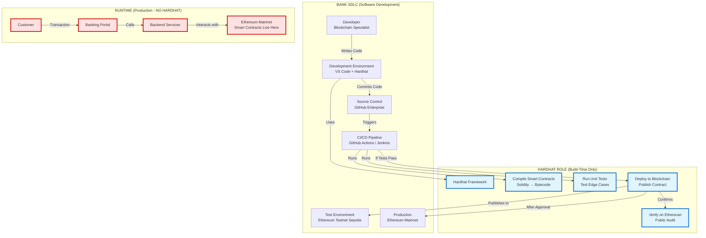
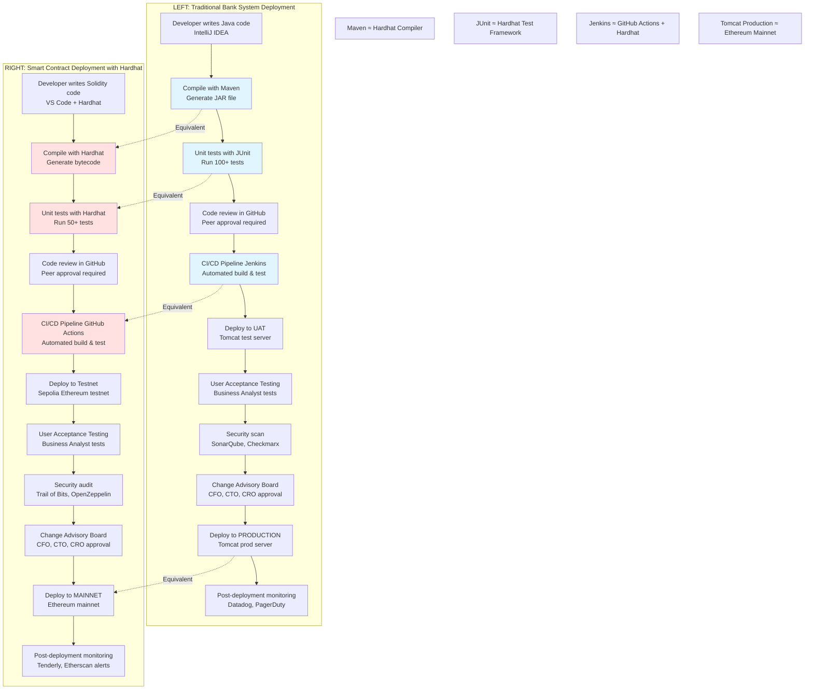

# HARDHAT VISUAL GUIDE FOR BANKING PROFESSIONALS
## A Non-Technical Introduction with Diagrams

**Audience:** Enterprise Architects, Risk Officers, Compliance, Internal Audit, Regulators
**Purpose:** Understand what Hardhat is, where it fits, and what it does NOT do
**Classification:** Internal Education Material
**Date:** February 2026

---

## DOCUMENT OVERVIEW

This guide uses **visual diagrams** to explain Hardhat in banking terms.

**Key Messages:**
1. Hardhat is a **development tool**, NOT a production system
2. Hardhat is NEVER in the customer transaction path
3. Hardhat is like traditional bank SDLC tools (Jenkins, Maven, Visual Studio)
4. Hardhat helps developers BUILD smart contracts, not RUN them

---

## PREREQUISITE: WHAT IS A SMART CONTRACT?

### Banking Analogy

| Traditional Banking | Blockchain |
|---------------------|------------|
| **Stored Procedure** (in Oracle, SQL Server) | **Smart Contract** (on Ethereum) |
| Code that runs inside the database | Code that runs on the blockchain |
| Updates ledger (account balances) | Updates blockchain state (token balances) |
| Triggered by application (Java, .NET) | Triggered by transaction |
| Examples: Calculate interest, apply fees | Examples: Transfer tokens, check balance |

**Simple Definition:**
> A **smart contract** is a program stored on a blockchain that executes automatically when triggered by a transaction.

**Example:**
```solidity
// Smart Contract (Solidity language)
contract USDC {
    mapping(address => uint256) public balances;

    function transfer(address to, uint256 amount) public {
        require(balances[msg.sender] >= amount, "Insufficient balance");
        balances[msg.sender] -= amount;
        balances[to] += amount;
    }
}
```

**This is like:**
```sql
-- Stored Procedure (SQL)
CREATE PROCEDURE transfer_funds(from_account, to_account, amount)
BEGIN
    IF balance[from_account] >= amount THEN
        UPDATE accounts SET balance = balance - amount WHERE id = from_account;
        UPDATE accounts SET balance = balance + amount WHERE id = to_account;
    END IF;
END;
```

**Key Difference:**
- Stored Procedure runs on **your bank's database server** (private, controlled)
- Smart Contract runs on **public blockchain** (decentralized, immutable)

---

<a name="diagram-1"></a>
## DIAGRAM 1 — WHAT HARDHAT IS (MENTAL MODEL)

### Conceptual Explanation (Before Diagram)

**Question:** "Where does Hardhat fit in our bank's systems?"

**Answer:** Hardhat is a **Software Development Lifecycle (SDLC) tool**, not an operational system.

**Banking Analogy:**

| Traditional Bank Software Development | Blockchain Smart Contract Development |
|---------------------------------------|---------------------------------------|
| Developer writes Java code in **IntelliJ IDEA** | Developer writes Solidity code in **Hardhat** |
| Code compiled by **Maven** | Code compiled by **Hardhat Compiler** |
| Unit tests run in **JUnit** | Unit tests run in **Hardhat Test Suite** |
| Code deployed to UAT by **Jenkins** | Code deployed to testnet by **Hardhat Deploy** |
| Code deployed to Production by **Jenkins** | Code deployed to Ethereum by **Hardhat Deploy** |
| **Jenkins NEVER handles customer transactions** | **Hardhat NEVER handles customer transactions** |

**→ Hardhat = The "Jenkins + Maven + JUnit" of blockchain development**

---

### Visual Representation



### Diagram Explanation (Plain English)

**LEFT SIDE (SDLC - Development Time):**
1. **Developer** writes smart contract code (like writing Java for a new payment feature)
2. **Hardhat** compiles the code (turns Solidity → bytecode that blockchain understands)
3. **Hardhat** runs tests (like JUnit tests: "Does transfer() work? What if balance is insufficient?")
4. **CI/CD Pipeline** (GitHub Actions) automatically runs Hardhat tests on every commit
5. If tests pass → Deploy to **Testnet** (Sepolia - a "sandbox" Ethereum network, no real money)
6. After manual approval → Deploy to **Mainnet** (Production Ethereum)

**RIGHT SIDE (Runtime - Customer Transactions):**
- Customers use the **Banking Portal** (web/mobile app)
- Portal calls **Backend Services** (Java microservices)
- Backend interacts with **Ethereum Mainnet** (reads balances, sends transactions)
- **HARDHAT IS NOT INVOLVED** (just like Jenkins is not involved in processing wire transfers)

**Key Insight:**
- **Hardhat = Build Tool** (like Maven compiles Java)
- **Ethereum = Runtime** (like Tomcat runs Java applications)
- Hardhat is ONLY used by developers during development, NEVER by customers

---

<a name="diagram-2"></a>
## DIAGRAM 2 — WHAT HARDHAT IS NOT

### Common Misconceptions (Address These Explicitly)

❌ **Misconception 1:** "Hardhat processes customer transactions"
✅ **Truth:** Hardhat only helps BUILD smart contracts; Ethereum processes transactions

❌ **Misconception 2:** "Hardhat stores customer data"
✅ **Truth:** Hardhat has no database; data is on blockchain (Ethereum) or our database (ATLAS)

❌ **Misconception 3:** "If Hardhat goes down, customers can't transact"
✅ **Truth:** Hardhat going down = developers can't deploy NEW code, but existing system runs fine

❌ **Misconception 4:** "Hardhat is a third-party vendor we depend on"
✅ **Truth:** Hardhat is open-source software (like Linux, Apache); we run it on OUR laptops/servers

---

### Visual Representation: Runtime Flow (NO HARDHAT)

```mermaid
sequenceDiagram
    participant C as Customer<br/>(Corporate Treasury)
    participant UI as Banking Portal<br/>(React.js)
    participant API as API Gateway<br/>(Kong)
    participant TxSvc as Transaction Service<br/>(Java Spring Boot)
    participant Comp as Compliance Engine<br/>(Python)
    participant ATLAS as ATLAS<br/>(Core Banking)
    participant Adapter as Blockchain Adapter<br/>(Node.js)
    participant ETH as Ethereum Mainnet<br/>(Smart Contract)

    Note over C,ETH: CUSTOMER BUYS 10,000 USDC (Runtime Flow)

    C->>UI: Click "Buy 10,000 USDC"
    UI->>API: POST /transactions/buy
    API->>TxSvc: Create Buy Order
    TxSvc->>Comp: Screen Transaction (AML)
    Comp-->>TxSvc: Approved ✅
    TxSvc->>ATLAS: Debit $10,000 USD
    ATLAS-->>TxSvc: Debit Successful
    TxSvc->>Adapter: Allocate 10,000 USDC
    Adapter->>ETH: Query Balance, Update Sub-Ledger
    ETH-->>Adapter: Balance Updated
    Adapter-->>TxSvc: Allocation Complete
    TxSvc-->>UI: Transaction Complete
    UI-->>C: Success! 10,000 USDC in wallet

    Note over C,ETH: ⚠️ HARDHAT IS NOT IN THIS FLOW ⚠️<br/>Hardhat was used MONTHS AGO to build the smart contract<br/>Now the smart contract is LIVE on Ethereum

    style Comp fill:#fff4e1
    style ATLAS fill:#e1ffe1
    style ETH fill:#ffe1f5
```

### Diagram Explanation

**This diagram shows:**
- A customer buying 10,000 USDC
- The transaction flows through:
  1. Banking Portal (customer-facing UI)
  2. API Gateway (security, routing)
  3. Transaction Service (business logic)
  4. Compliance Engine (AML screening)
  5. ATLAS (debit customer's USD account)
  6. Blockchain Adapter (interact with Ethereum)
  7. **Ethereum Mainnet** (where the smart contract lives)

**HARDHAT IS NOWHERE IN THIS FLOW.**

**Why?**
- The smart contract was deployed to Ethereum **3 months ago** (using Hardhat)
- Now it's live, running 24/7 on Ethereum
- Hardhat's job is done (until we need to deploy an update, which is rare)

**Banking Analogy:**
- You used **Visual Studio** to write your wire transfer processing code (Java)
- You deployed that code to **Tomcat** (production server) 3 months ago
- Now customers are sending wires
- **Visual Studio is not involved** in processing those wires (only Tomcat is)
- Same here: **Hardhat is not involved** in processing stablecoin transactions (only Ethereum is)

---

<a name="diagram-3"></a>
## DIAGRAM 3 — HARDHAT IN A BANK POC (END-TO-END)

### Scenario: Bank Develops Custom Smart Contract

**Context:**
In Phase-2, the bank wants to add a feature: **"Transaction Limits"**
- Customers can set daily spending limits (e.g., max $50K/day)
- Smart contract enforces this on-chain (even if bank's backend is hacked, limit still applies)

**This requires deploying a NEW smart contract.**

---

### Visual Representation: Development to Deployment

```mermaid
sequenceDiagram
    participant Dev as Developer<br/>(Blockchain Team)
    participant Hardhat as Hardhat<br/>(Local Laptop)
    participant Test as Hardhat Local Node<br/>(Simulated Ethereum)
    participant CI as GitHub Actions<br/>(CI/CD)
    participant Testnet as Sepolia Testnet<br/>(Public Test Network)
    participant Audit as External Auditor<br/>(Trail of Bits)
    participant Mainnet as Ethereum Mainnet<br/>(Production)
    participant Etherscan as Etherscan<br/>(Blockchain Explorer)

    Note over Dev,Etherscan: PHASE 1: DEVELOPMENT (Week 1-2)
    Dev->>Hardhat: Write smart contract<br/>(TransactionLimits.sol)
    Hardhat->>Hardhat: Compile Solidity → Bytecode
    Dev->>Hardhat: Write unit tests<br/>(test edge cases)
    Hardhat->>Test: Deploy to local blockchain
    Test-->>Hardhat: Contract deployed (instant)
    Hardhat->>Test: Run 50 test cases
    Test-->>Hardhat: All tests pass ✅

    Note over Dev,Etherscan: PHASE 2: CI/CD (Automated)
    Dev->>CI: git push (commit code)
    CI->>Hardhat: npm install hardhat
    CI->>Hardhat: npx hardhat compile
    Hardhat-->>CI: Compilation successful
    CI->>Hardhat: npx hardhat test
    Hardhat->>Test: Run tests in CI
    Test-->>Hardhat: All 50 tests pass ✅
    Hardhat-->>CI: Tests passed
    CI-->>Dev: ✅ Build succeeded

    Note over Dev,Etherscan: PHASE 3: TESTNET DEPLOYMENT (Week 3)
    Dev->>Hardhat: npx hardhat deploy --network sepolia
    Hardhat->>Testnet: Deploy contract (cost: ~$5 in test ETH)
    Testnet-->>Hardhat: Contract deployed at 0xABC...
    Dev->>Hardhat: npx hardhat verify --network sepolia
    Hardhat->>Etherscan: Submit source code for verification
    Etherscan-->>Hardhat: Verified ✅

    Note over Dev,Etherscan: PHASE 4: AUDIT (Week 4-8)
    Dev->>Audit: Send source code + audit request
    Audit->>Audit: Manual review (4 weeks)
    Audit-->>Dev: Audit report (3 findings: 2 low, 1 medium)
    Dev->>Hardhat: Fix issues
    Hardhat->>Test: Re-test
    Test-->>Hardhat: Tests pass
    Dev->>Audit: Request re-audit
    Audit-->>Dev: Approved ✅

    Note over Dev,Etherscan: PHASE 5: MAINNET DEPLOYMENT (Week 9)
    Dev->>Dev: Get CFO + CTO + Compliance sign-off
    Dev->>Hardhat: npx hardhat deploy --network mainnet
    Hardhat->>Mainnet: Deploy contract (cost: ~$500 in real ETH)
    Mainnet-->>Hardhat: Contract live at 0xDEF...
    Hardhat->>Etherscan: Verify on mainnet
    Etherscan-->>Hardhat: Verified ✅
    Dev->>Dev: Audit log: Contract deployed, signed off

    Note over Dev,Etherscan: 🎉 CONTRACT IS NOW LIVE 🎉<br/>Hardhat's job is done<br/>(until next update, which may be 6-12 months later)

    style Hardhat fill:#e1f5ff,stroke:#0066cc,stroke-width:3px
    style Test fill:#fff4e1
    style Testnet fill:#ffe1e1
    style Mainnet fill:#ffcccc,stroke:#cc0000,stroke-width:3px
```

### Diagram Explanation

**PHASE 1: Development (Developer's Laptop)**
- Developer writes smart contract code in Solidity
- **Hardhat compiles** it (turns code into bytecode)
- **Hardhat runs tests** on a **local simulated blockchain** (instant, free, no real blockchain involved)
  - Example tests: "What if customer tries to spend $60K but limit is $50K?" → Should reject
- All tests pass → Code is ready for next phase

**PHASE 2: Continuous Integration (GitHub Actions, Automated)**
- Developer commits code to GitHub
- **CI/CD pipeline automatically runs:**
  - `hardhat compile` (ensure code compiles)
  - `hardhat test` (run all 50 tests)
- If tests fail → Build fails, developer is notified
- If tests pass → Build succeeds

**PHASE 3: Testnet Deployment (Public Test Environment)**
- Developer uses Hardhat to deploy to **Sepolia** (a public Ethereum testnet)
  - Testnet = Free, fake ETH (no real money)
  - Purpose: Test in environment that mimics production
- Hardhat deploys contract, returns address (0xABC...)
- Developer verifies contract on **Etherscan** (so others can see the code is legitimate)
- Internal team tests contract on testnet (1 week of UAT)

**PHASE 4: External Audit (Security Review)**
- Send code to **Trail of Bits** (top blockchain security firm)
- They manually review for bugs (4 weeks)
- They find 3 issues (2 low-severity, 1 medium)
- Developer fixes issues, re-tests with Hardhat
- Re-audit confirms fixes → **Audit approved**

**PHASE 5: Mainnet Deployment (Production)**
- Get executive approvals (CFO, CTO, Chief Compliance Officer)
- Developer uses Hardhat to deploy to **Ethereum Mainnet**
  - Cost: ~$500 in gas fees (real ETH)
- Contract is now **LIVE** (customers can use it)
- Verify on Etherscan (public transparency)
- **Hardhat is no longer needed** (contract runs autonomously on Ethereum)

---

### Why This Satisfies Bank Governance

| Governance Requirement | How This Process Meets It |
|------------------------|---------------------------|
| **Code Review** | All code in GitHub, peer-reviewed before merge |
| **Testing** | 50+ unit tests, automated in CI/CD |
| **UAT (User Acceptance Testing)** | 1 week on testnet with internal users |
| **External Audit** | Trail of Bits security audit (4 weeks) |
| **Approval Chain** | CFO, CTO, CCO sign-off required |
| **Audit Trail** | Git commits, CI/CD logs, deployment transaction hash (on Etherscan) |
| **Rollback Plan** | If bug found post-deployment, can deploy fixed version (smart contract upgrade mechanism) |
| **Change Management** | Follows bank's SDLC (Design → Build → Test → UAT → Audit → Approval → Deploy) |

**→ This is equivalent to deploying a new payment processing module in traditional banking systems.**

---

<a name="diagram-4"></a>
## DIAGRAM 4 — BUY STABLECOIN FLOW (NO HARDHAT)

### Scenario: Customer Buys 100,000 USDC (Production Transaction)

**Key Point to Prove:** Hardhat is NOT involved in this flow.

---

### Visual Representation

```mermaid
sequenceDiagram
    participant Customer as Corporate Customer<br/>(ABC Manufacturing)
    participant Portal as Banking Portal<br/>(Web App)
    participant API as API Gateway<br/>(Authentication & Routing)
    participant TxSvc as Transaction Service<br/>(Business Logic)
    participant Compliance as Compliance Service<br/>(AML / Sanctions)
    participant ATLAS as ATLAS<br/>(Core Banking - Fiat)
    participant SubLedger as Sub-Ledger<br/>(Stablecoin Balances)
    participant Adapter as Blockchain Adapter<br/>(Web3 Library)
    participant Ethereum as Ethereum Mainnet<br/>(USDC Smart Contract)

    Note over Customer,Ethereum: CUSTOMER INITIATES BUY ORDER
    Customer->>Portal: 1. Login (MFA)
    Portal->>API: 2. Authenticate
    API-->>Portal: Token valid ✅
    Customer->>Portal: 3. Click "Buy 100,000 USDC"
    Portal->>API: 4. POST /buy {amount: 100000, currency: USDC}
    API->>TxSvc: 5. Create Transaction

    Note over TxSvc,Compliance: VALIDATION & COMPLIANCE
    TxSvc->>TxSvc: 6. Validate (customer active, no holds)
    TxSvc->>Compliance: 7. Screen transaction
    Compliance->>Compliance: 8a. AML rules check
    Compliance->>Compliance: 8b. Sanctions screening (OFAC)
    Compliance-->>TxSvc: 9. Approved ✅

    Note over TxSvc,ATLAS: FIAT PROCESSING
    TxSvc->>ATLAS: 10. Debit $100,250 (includes $250 fee)
    ATLAS->>ATLAS: 11. Update customer USD account
    ATLAS-->>TxSvc: 12. Debit successful ✅

    Note over TxSvc,Ethereum: STABLECOIN ALLOCATION (No On-Chain TX in Phase-1)
    TxSvc->>SubLedger: 13. Credit 100,000 USDC to customer wallet
    SubLedger->>SubLedger: 14. Update customer balance (internal DB)
    SubLedger-->>TxSvc: 15. Balance updated ✅

    Note over TxSvc,Ethereum: OPTIONAL: Verify On-Chain Balance (Read-Only)
    TxSvc->>Adapter: 16. Query omnibus wallet balance
    Adapter->>Ethereum: 17. eth_call (balanceOf)
    Ethereum-->>Adapter: 18. 5,000,000 USDC (omnibus total)
    Adapter-->>TxSvc: 19. Verified ✅

    Note over TxSvc,Portal: CONFIRMATION
    TxSvc-->>Portal: 20. Transaction complete
    Portal-->>Customer: 21. "100,000 USDC credited! View balance"

    Note over Customer,Ethereum: ⚠️ WHERE IS HARDHAT? ⚠️<br/>HARDHAT IS NOT IN THIS FLOW.<br/>Smart contract was deployed MONTHS AGO using Hardhat.<br/>Now it runs autonomously on Ethereum.

    rect rgb(255, 240, 240)
        Note over Customer,Ethereum: KEY INSIGHT:<br/>Hardhat = Jenkins (build tool)<br/>Ethereum = Tomcat (runtime)<br/><br/>Jenkins doesn't process wire transfers.<br/>Hardhat doesn't process stablecoin transactions.
    end

    style Compliance fill:#fff4e1
    style ATLAS fill:#e1ffe1
    style Ethereum fill:#ffe1f5
```

### Diagram Explanation

**Step-by-Step:**

1-5. **Customer places order** (via web portal → API Gateway → Transaction Service)

6-9. **Compliance checks:**
   - AML screening (is this a suspicious pattern?)
   - Sanctions screening (is customer on OFAC list?)
   - Result: Approved

10-12. **Fiat debit** (Transaction Service tells ATLAS to debit $100,250 from customer's USD account)

13-15. **Stablecoin credit** (Sub-Ledger credits customer's internal wallet with 100,000 USDC)
   - NOTE: In Phase-1 (omnibus model), this is an **internal database update**, NOT an on-chain transaction
   - The omnibus wallet already has USDC; we're just allocating a portion to this customer

16-19. **Verification** (optional): Query Ethereum to confirm omnibus wallet has sufficient USDC

20-21. **Confirmation** (customer sees "Transaction complete")

**WHERE IS HARDHAT?**
- **NOT in steps 1-21** (Hardhat is not running)
- Hardhat was used **3 months ago** to deploy the USDC smart contract
- The smart contract is now **live on Ethereum**, running 24/7
- Hardhat's job is **done** (until the next smart contract update, which may be months or years later)

---

<a name="diagram-5"></a>
## DIAGRAM 5 — COMPARISON: BANK SYSTEMS vs. SMART CONTRACTS

### Side-by-Side Comparison



### Comparison Table

| Step | Traditional Banking System | Smart Contract (Hardhat) | Key Similarity |
|------|----------------------------|--------------------------|----------------|
| **1. Write Code** | Java (IntelliJ IDEA) | Solidity (VS Code + Hardhat) | Developer writes business logic |
| **2. Compile** | Maven (JAR file) | **Hardhat Compiler** (bytecode) | Turn source code into executable |
| **3. Unit Test** | JUnit (Java tests) | **Hardhat Test** (JavaScript tests) | Automated testing (50-100 tests) |
| **4. Code Review** | GitHub Pull Request | GitHub Pull Request | Peer review before merge |
| **5. CI/CD** | Jenkins (automated pipeline) | GitHub Actions + **Hardhat** | Automated build on every commit |
| **6. Deploy to UAT** | Tomcat (test server) | Sepolia Testnet (via **Hardhat**) | Test in non-production environment |
| **7. UAT** | Business Analyst tests | Business Analyst tests | Manual testing by users |
| **8. Security** | SonarQube, Checkmarx | Trail of Bits audit | Third-party security review |
| **9. Approval** | Change Advisory Board | Change Advisory Board | Executive sign-off required |
| **10. Deploy to Prod** | Tomcat (production) | Ethereum Mainnet (via **Hardhat**) | Go-live to customers |
| **11. Monitoring** | Datadog, PagerDuty | Tenderly, Etherscan alerts | 24/7 monitoring |

---

### Key Takeaways (For Regulators & Auditors)

✅ **Governance is equivalent:**
- Smart contract deployment follows same rigor as traditional banking systems
- Code review, testing, UAT, audit, approval chain all present

✅ **Hardhat = Build tool (not runtime):**
- Hardhat compiles code (like Maven)
- Hardhat runs tests (like JUnit)
- Hardhat deploys code (like Jenkins)
- **Hardhat does NOT process customer transactions** (like Jenkins doesn't process wires)

✅ **Audit trail is stronger:**
- Every deployment transaction is on Ethereum (immutable, public)
- Etherscan shows: "Contract deployed by address 0x123... on 2026-02-01 at 10:30 AM"
- Cannot be tampered with (unlike server logs which can be deleted)

✅ **Rollback is possible:**
- Smart contracts can be upgraded (if designed with proxy pattern)
- Similar to: Deploying a hotfix to production Tomcat server

---

## FREQUENTLY ASKED QUESTIONS (FAQ)

### Q1: Is Hardhat a vendor we depend on?

**A:** No. Hardhat is **open-source software** (MIT license), like Linux or Apache Tomcat.
- We download it from npmjs.com (public repository)
- We run it on **our own laptops/servers** (not a SaaS service)
- If Hardhat project is abandoned, we can continue using it (code is public) or switch to alternatives (Foundry, Truffle)

---

### Q2: Can Hardhat access customer data?

**A:** No. Hardhat:
- Runs on **developer laptops** (not production servers)
- Has **no database** (it compiles code and runs tests)
- **Never interacts** with ATLAS, customer data, or production blockchain transactions

---

### Q3: What happens if Hardhat "goes down"?

**A:** Nothing happens to production systems.
- Hardhat going down = developers cannot compile/test NEW code
- Existing smart contracts (already deployed) continue running on Ethereum
- **Analogy:** If Maven (Java build tool) servers go down, your production Java apps still run (they're already deployed to Tomcat)

---

### Q4: Is Hardhat secure?

**A:** Hardhat itself is just a compiler and test framework (like Maven).
- Security risk is in the **smart contract code we write**, not Hardhat
- We mitigate via: Code reviews, unit tests (>90% coverage), external audits (Trail of Bits), bug bounties

---

### Q5: Can we audit Hardhat?

**A:** Yes, but unnecessary.
- Hardhat source code is public (GitHub: NomicFoundation/hardhat)
- 500+ contributors, 4.5M+ downloads/month (widely trusted)
- Alternative: Use **Foundry** (another smart contract dev tool) if you prefer
- **Better focus:** Audit the smart contracts we WRITE (that's where the risk is)

---

### Q6: How do we control what gets deployed?

**A:** Same as traditional software:
- **Access Control:** Only authorized developers (CTO, Senior Blockchain Engineers) have private keys to deploy to mainnet
- **Approval Process:** Change Advisory Board approves all mainnet deployments
- **Audit Trail:** Every deployment transaction is recorded on Ethereum (public, immutable)
- **Multi-Sig:** Deployment requires 2-of-3 signatures (e.g., CTO + CFO)

---

### Q7: What if we need to roll back a smart contract?

**A:** Two strategies:
1. **Emergency Pause:** Admin (2-of-3 multi-sig) can pause contract (stop all transactions) if bug detected
   - Gives us time to assess and deploy fix
2. **Upgrade:** Deploy new version of contract (using proxy pattern)
   - Similar to: Deploying a hotfix to production server
   - Requires same governance (approval, audit)

---

### Q8: Does Hardhat comply with SOX/GDPR/etc.?

**A:** Compliance question applies to the **system we build**, not the tool.
- **Analogy:** "Does Microsoft Word comply with GDPR?" → No, but the documents YOU create can comply
- **Hardhat** = tool (like Word, Excel, Maven)
- **Our Smart Contracts** = system (must comply with SOX, GDPR, etc.)

**How we ensure compliance:**
- SOX: Change management controls (approval chain, audit trail)
- GDPR: Don't put personal data in smart contracts (only pseudonymous data)
- AML: Implement screening in backend services (not in smart contract)

---

## CONCLUSION & RECOMMENDATIONS

### For Architects

✅ **Treat Hardhat as SDLC tool**, not production component
✅ **Architecture reviews should focus on:**
   - Smart contract logic (business rules, security)
   - Integration points (how backend calls blockchain)
   - NOT on Hardhat (it's a build tool)

---

### For Risk & Compliance

✅ **Hardhat risk = LOW** (it's a compiler/test framework, not in prod)
✅ **Smart contract risk = MEDIUM-HIGH** (requires audits, testing, governance)
✅ **Focus compliance efforts on:**
   - AML transaction monitoring (backend services)
   - KYC controls (customer onboarding)
   - NOT on Hardhat itself

---

### For Internal Audit

✅ **Audit trail is strong:**
   - Git commits (who wrote code, when)
   - CI/CD logs (all builds, tests, deployments)
   - Ethereum blockchain (immutable deployment record)
✅ **Test Hardhat usage once/year:**
   - Verify: Only authorized devs can deploy to mainnet
   - Verify: All deployments have CAB approval

---

### For Regulators (If This is Shown to Them)

✅ **Hardhat is equivalent to traditional SDLC tools** (Maven, Jenkins, JUnit)
✅ **Governance is equivalent** (code review, testing, UAT, approval, audit)
✅ **No customer data exposure** (Hardhat is dev tool, not prod system)
✅ **Audit trail is actually better** (blockchain = immutable ledger of deployments)

---

## APPENDIX: HARDHAT ALTERNATIVES (FOR COMPARISON)

| Tool | Purpose | Pros | Cons | Our Choice |
|------|---------|------|------|------------|
| **Hardhat** | Compile, test, deploy smart contracts | Most popular, large ecosystem, TypeScript support | Slower tests than Foundry | ✅ **Selected** (Phase-1) |
| **Foundry** | Compile, test, deploy (tests in Solidity) | 10x faster tests, gas optimization tools | Smaller ecosystem, steeper learning curve | Consider Phase-2 |
| **Truffle** | Compile, test, deploy (older tool) | Mature, well-documented | Less active development | ❌ Not chosen |
| **Remix** | Browser-based IDE | Beginner-friendly, no install needed | Not suitable for production/CI/CD | ❌ Prototyping only |

**Decision:** Use Hardhat for Phase-1 (industry standard), evaluate Foundry for Phase-2 (performance benefits).

---

## DOCUMENT HISTORY

| Version | Date | Author | Changes |
|---------|------|--------|---------|
| 1.0 | 2026-02-01 | Enterprise Architecture Team | Initial version |

---

**END OF HARDHAT VISUAL GUIDE**

━━━━━━━━━━━━━━━━━━━━━━━━━━━━━━━━━━━━━━━━━━━━━━━
For questions, contact: [architecture@bank.com]
━━━━━━━━━━━━━━━━━━━━━━━━━━━━━━━━━━━━━━━━━━━━━━━
